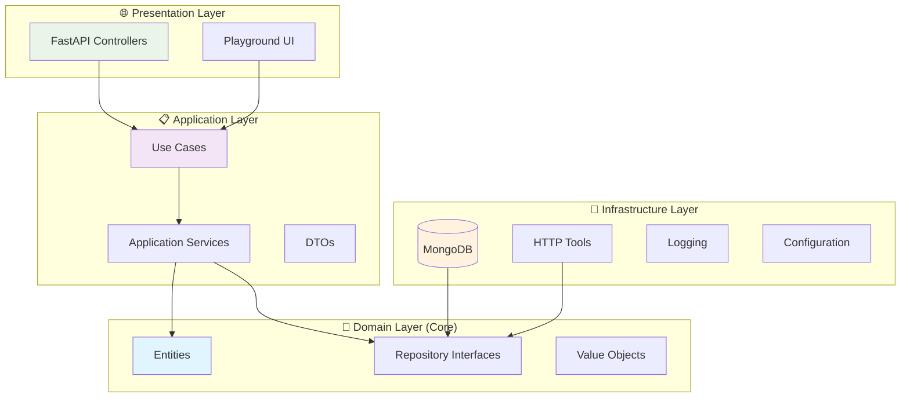
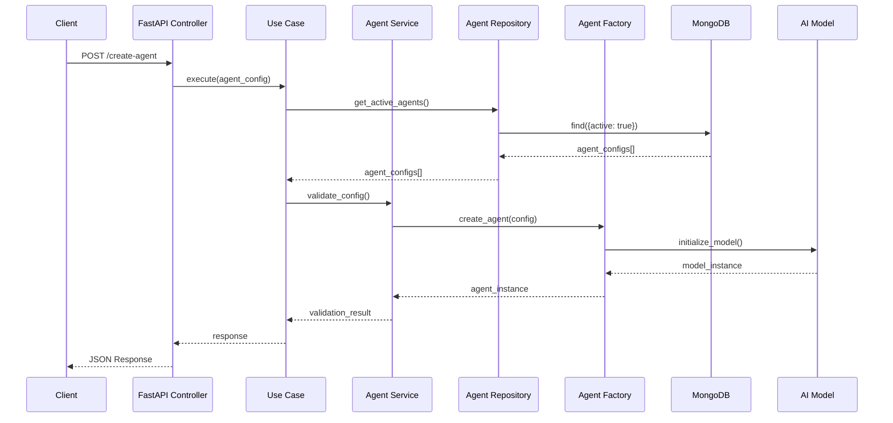

# 🤖 AI Agents Orchestrator

<div align="center">


*A robust Python application implementing an AI agents orchestrator using Onion Architecture (Clean Architecture) and Clean Code principles*

[🇧🇷 Português](#portuguese-version) | [📚 Documentation](#documentation) | [🚀 Quick Start](#quick-start)

</div>

## 📋 Table of Contents

- [Overview](#overview)
- [Architecture](#architecture)
- [Features](#features)
- [Quick Start](#quick-start)
- [Configuration](#configuration)
- [API Reference](#api-reference)
- [Testing](#testing)
- [For Developers](#for-developers)
- [Contributing](#contributing)

## 🎯 Overview

The **AI Agents Orchestrator** is an enterprise-ready application that enables the management and orchestration of multiple artificial intelligence agents. Built with a focus on scalability, maintainability, and testability, it uses Python development best practices.

### ✨ Highlights

- 🏗️ **Onion Architecture** (Clean Architecture)
- 🧪 **Clean Code** and SOLID principles
- 🔄 **Multi-Agent Support** with RAG (Retrieval-Augmented Generation)
- 🛠️ **Custom Tools Integration** via HTTP APIs
- 📊 **Multiple Model Providers** (Ollama, OpenAI, etc.)
- 🌐 **RESTful API** with FastAPI
- 🎮 **Interactive Playground** for testing
- 📝 **Comprehensive Logging** structured
- 🧰 **Dependency Injection** container

## 🏗️ Architecture

The application follows **Onion Architecture**, ensuring low coupling and high cohesion:



### 📁 Project Structure

```
src/
├── 🎯 domain/                    # Domain Layer (core)
│   ├── entities/                # Business entities
│   │   ├── agent_config.py      # Agent configuration
│   │   ├── tool.py              # Custom tools
│   │   └── rag_config.py        # RAG configuration
│   └── repositories/            # Repository contracts
│       ├── agent_config_repository.py
│       └── tool_repository.py
├── 📋 application/              # Application Layer
│   ├── services/               # Application services
│   │   ├── agent_factory_service.py
│   │   ├── model_factory_service.py
│   │   ├── http_tool_factory_service.py
│   │   └── embedder_model_factory_service.py
│   └── use_cases/             # Use cases
│       └── get_active_agents_use_case.py
├── 🔧 infrastructure/          # Infrastructure Layer
│   ├── config/                # Configurations
│   ├── database/              # Database connections
│   ├── logging/               # Logging system
│   ├── repositories/          # Concrete implementations
│   └── dependency_injection.py
└── 🌐 presentation/           # Presentation Layer
    └── controllers/           # REST controllers
        └── orquestrador_controller.py
```

## 🔄 Data Flow



## ⚡ Features

- **✅ Simple Setup**: Setup in 3 commands
- **📖 Clear Documentation**: Practical examples and tutorials
- **🔍 Detailed Logs**: Complete operation tracking
- **🧪 Tests Included**: Unit and integration testing examples


- **🏗️ Scalable Architecture**: Enterprise patterns (DDD, CQRS-ready)
- **🔧 Extensibility**: Easy addition of new models and tools
- **📊 Observability**: Metrics, health checks, and structured logging
- **🔒 Security**: Input validation and data sanitization

### 🎮 Core Features

- ✅ **Multi-Agent Management**: Management of multiple AI agents
- ✅ **RAG Integration**: Retrieval-Augmented Generation with MongoDB
- ✅ **Custom Tools**: Custom tool integration via HTTP
- ✅ **Model Flexibility**: Support for multiple providers (Ollama, OpenAI)
- ✅ **Interactive Playground**: Web interface for testing
- ✅ **REST API**: Endpoints for external integration
- ✅ **Memory Management**: Persistent memory system
- ✅ **Configuration Management**: Flexible environment configuration

## 🚀 Quick Start

### 📋 Prerequisites

- Python 3.9+
- MongoDB 4.4+
- Git

### ⚡ Quick Installation

```bash
# 1. Clone the repository
git clone https://github.com/your-username/orquestradorIAPythonArgo.git
cd orquestradorIAPythonArgo

# 2. Install dependencies
pip install -r requirements.txt

# 3. Run the application
python app.py
```

### 🐳 With Docker (Recommended)

```bash
# Clone and run with Docker Compose
git clone https://github.com/your-username/orquestradorIAPythonArgo.git
cd orquestradorIAPythonArgo
docker-compose up -d
```

### 🌐 Access

- **API**: http://localhost:7777/docs
- **Playground**: http://localhost:7777/playground
- **Health Check**: http://localhost:7777/health

## ⚙️ Configuration

### 🔧 Environment Variables

```bash
# Database Configuration
MONGO_CONNECTION_STRING=mongodb://localhost:27017
MONGO_DATABASE_NAME=agno

# Application Configuration
APP_TITLE="AI Agents Orchestrator"
APP_HOST=0.0.0.0
APP_PORT=7777

# Logging Configuration
LOG_LEVEL=INFO
LOG_FORMAT=json

# AI Models Configuration
OLLAMA_BASE_URL=http://localhost:11434
OPENAI_API_KEY=your-key-here
```

### 🗄️ MongoDB Structure

#### Collection: `agents_config`

```json
{
  "_id": ObjectId("..."),
  "id": "agent-1",
  "nome": "General Assistant",
  "model": "llama3.2:latest",
  "factoryIaModel": "ollama",
  "descricao": "A general purpose assistant",
  "prompt": "You are a helpful assistant that helps with general tasks...",
  "active": true,
  "tools_ids": ["tool-1", "tool-2"],
  "rag_config": {
    "active": true,
    "doc_name": "knowledge_base",
    "model": "text-embedding-3-small",
    "factoryIaModel": "openai"
  }
}
```

#### Collection: `tools_config`

```json
{
  "_id": ObjectId("..."),
  "id": "tool-1",
  "name": "Weather API",
  "description": "Gets weather information",
  "http_config": {
    "base_url": "https://api.weather.com",
    "method": "GET",
    "endpoint": "/current",
    "headers": {
      "API-Key": "your-key"
    },
    "parameters": [
      {
        "name": "city",
        "type": "string",
        "description": "City name",
        "required": true
      }
    ]
  }
}
```

## 🔗 API Reference

### 📊 Main Endpoints

#### **GET** `/agents`
Returns all active agents.

```bash
curl -X GET "http://localhost:7777/agents" \
     -H "accept: application/json"
```

**Response:**
```json
{
  "agents": [
    {
      "id": "agent-1",
      "nome": "General Assistant",
      "model": "llama3.2:latest",
      "descricao": "A general purpose assistant",
      "active": true
    }
  ]
}
```

#### **POST** `/agents/{agent_id}/chat`
Sends message to specific agent.

```bash
curl -X POST "http://localhost:7777/agents/agent-1/chat" \
     -H "accept: application/json" \
     -H "Content-Type: application/json" \
     -d '{
       "message": "Hello, how can you help me?",
       "session_id": "session-123"
     }'
```

#### **GET** `/health`
Checks application status.

```bash
curl -X GET "http://localhost:7777/health"
```

### 📚 Interactive Documentation

Access http://localhost:7777/docs for complete Swagger documentation.

## 🧪 Testing

### 🏃‍♂️ Running Tests

```bash
# All tests
pytest

# Unit tests only
pytest tests/unit/ -v

# Integration tests only
pytest tests/integration/ -v

# With coverage
pytest --cov=src --cov-report=html
```

### 📊 Test Coverage

```bash
# Generate coverage report
coverage run -m pytest
coverage html
```

Report will be generated at `htmlcov/index.html`.

### 🧪 Test Structure

```
tests/
├── unit/                   # Unit tests
│   ├── domain/            # Entity tests
│   ├── application/       # Service tests
│   └── infrastructure/    # Repository tests
├── integration/           # Integration tests
│   ├── api/              # API tests
│   └── database/         # Database tests
└── conftest.py           # Pytest configurations
```

## 👨‍💻 For Developers

### 🎯 For Beginner Developers

#### 🔍 Understanding the Architecture

The application uses **Onion Architecture** which separates responsibilities into layers:

1. **Domain (Core)**: Pure business rules
2. **Application**: Orchestration and use cases
3. **Infrastructure**: Technical details (DB, APIs)
4. **Presentation**: User interface

#### 📚 Important Concepts

**Dependency Injection**: Dependencies are injected automatically
```python
# ✅ Good - Injected dependency
class AgentService:
    def __init__(self, repository: IAgentRepository):
        self._repository = repository

# ❌ Bad - Hardcoded dependency
class AgentService:
    def __init__(self):
        self._repository = MongoAgentRepository()
```

**Repository Pattern**: Data access abstraction
```python
# Interface (contract)
class IAgentRepository:
    def get_active_agents(self) -> List[AgentConfig]:
        pass

# MongoDB implementation
class MongoAgentRepository(IAgentRepository):
    def get_active_agents(self) -> List[AgentConfig]:
        # Specific implementation
        pass
```

### 🚀 For Experienced Developers

#### 🏗️ Implemented Patterns

- **Domain-Driven Design (DDD)**: Rich entities and repositories
- **Command Query Responsibility Segregation (CQRS-ready)**: Clear separation of commands and queries
- **Factory Pattern**: Agent and tool creation
- **Strategy Pattern**: Multiple model providers
- **Observer Pattern**: Structured logging system

#### 🔧 Extension Points

**Adding New Model Provider:**

```python
# 1. Implement the interface
class GroqModelFactory(IModelFactory):
    def create_model(self, model_name: str) -> Any:
        # Groq implementation
        pass

# 2. Register in container
container.register("groq_factory", GroqModelFactory)

# 3. Use in configuration
{
    "factoryIaModel": "groq",
    "model": "llama-70b"
}
```

**Adding New Tool:**

```python
# 1. Define configuration
@dataclass
class DatabaseToolConfig:
    connection_string: str
    query_template: str

# 2. Implement factory
class DatabaseToolFactory:
    def create_tool(self, config: DatabaseToolConfig):
        # Implementation
        pass
```

#### 📊 Metrics and Observability

```python
# Instrumentation example
@app_logger.inject
async def create_agent(agent_config: AgentConfig):
    with app_logger.timer("agent_creation"):
        # Creation logic
        pass
```

### 🔧 Advanced Customization

#### 🎛️ Environment Configuration

```python
# src/infrastructure/config/app_config.py
class AppConfig:
    # Automatically loaded configurations
    mongo_connection_string: str = os.getenv("MONGO_CONNECTION_STRING")
    app_title: str = os.getenv("APP_TITLE", "AI Orchestrator")
    
    # Automatic validation
    def __post_init__(self):
        if not self.mongo_connection_string:
            raise ValueError("MONGO_CONNECTION_STRING is required")
```

#### 🔌 Plugin System

```python
# Register custom plugins
class CustomPlugin:
    def setup(self, container: DependencyContainer):
        container.register("custom_service", CustomService)

# In app.py
container.register_plugin(CustomPlugin())
```

## 🛠️ Troubleshooting

### ❗ Common Issues

#### MongoDB Connection Issues
```bash
# Check if MongoDB is running
mongosh --eval "db.adminCommand('ismaster')"

# Test connection
python -c "
from pymongo import MongoClient
client = MongoClient('mongodb://localhost:27017')
print(client.admin.command('ismaster'))
"
```

#### Model Provider Issues
```bash
# Test Ollama
curl http://localhost:11434/api/tags

# Test OpenAI
python -c "
import openai
openai.api_key = 'your-key'
print(openai.Model.list())
"
```

### 📝 Debug Logs

```bash
# Enable detailed logs
export LOG_LEVEL=DEBUG
python app.py
```

## 🤝 Contributing

### 🎯 How to Contribute

1. **Fork** the project
2. **Create** a feature branch (`git checkout -b feature/AmazingFeature`)
3. **Commit** your changes (`git commit -m 'Add some AmazingFeature'`)
4. **Push** to the branch (`git push origin feature/AmazingFeature`)
5. **Open** a Pull Request

### 📋 Guidelines

- Follow Clean Code principles
- Maintain test coverage > 80%
- Document public APIs
- Use conventional commits

### 🧪 Before Submitting

```bash
# Run tests
pytest

# Check linting
black . && isort . && flake8

# Check coverage
pytest --cov=src --cov-report=term-missing
```

## 📄 License

This project is licensed under the MIT License - see the [LICENSE](LICENSE) file for details.

## 🙏 Acknowledgments

- [FastAPI](https://fastapi.tiangolo.com/) for the excellent framework
- [agno](https://github.com/phidatahq/agno) for the agents framework
- [MongoDB](https://www.mongodb.com/) for the database
- Python community for the amazing libraries

---

<div align="center">

**[⬆ Back to top](#-ai-agents-orchestrator)**

Made with ❤️ by [Mateus Meireles Ribeiro](https://github.com/Mosfet04)

</div>
