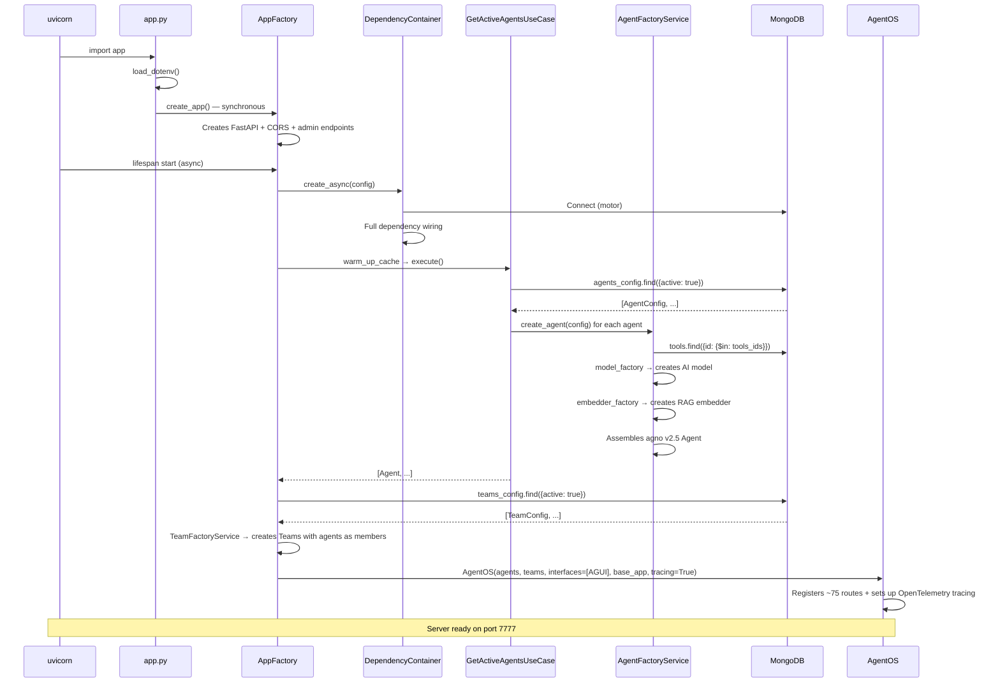
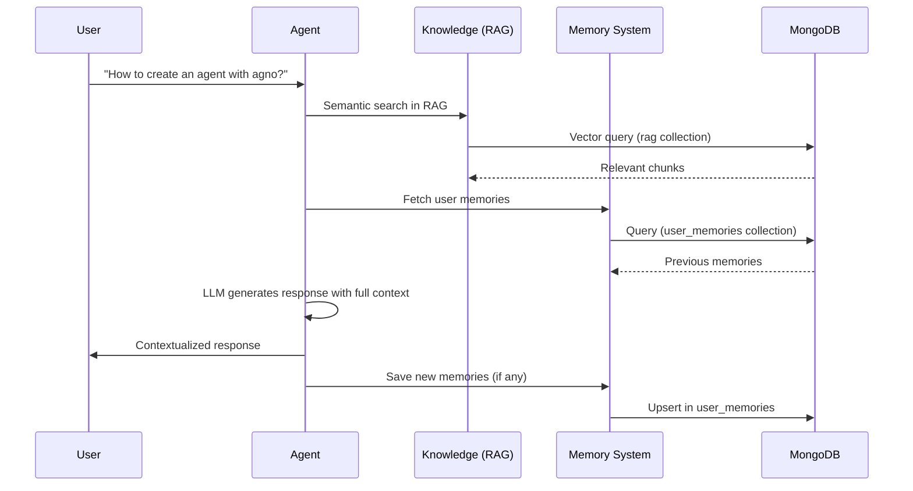

# 🤖 AI Agents Orchestrator

<div align="center">


[](https://app.codacy.com/gh/Mosfet04/orquestradorIAPythonArgo/dashboard?utm_source=gh&utm_medium=referral&utm_content=&utm_campaign=Badge_grade)
[](https://app.codacy.com/gh/Mosfet04/orquestradorIAPythonArgo/dashboard?utm_source=gh&utm_medium=referral&utm_content=&utm_campaign=Badge_coverage)


*AI agents orchestrator built with Onion Architecture (Clean Architecture), SOLID principles, and the **[agno v2.5](https://github.com/agno-agi/agno)** framework*

[🇧🇷 Português](README.pt-br.md) | [🚀 Quick Start](#-quick-start) | [📚 Architecture](#-architecture)

</div>

---

## 📋 Table of Contents

- [Overview](#-overview)
- [Quick Start](#-quick-start)
- [Architecture](#-architecture)
- [Features](#-features)
- [Configuration](#-configuration)
- [API Endpoints](#-api-endpoints)
- [Frontend (os.agno.com)](#-frontend-osagnocom)
- [Database (MongoDB)](#-database-mongodb)
- [Memory & RAG System](#-memory--rag-system)
- [Testing](#-testing)
- [Developer Guide](#-developer-guide)
- [Troubleshooting](#-troubleshooting)
- [Contributing](#-contributing)

---

## 🎯 Overview

The **AI Agents Orchestrator** manages and orchestrates multiple AI agents. Each agent, its tools, and configurations are defined **entirely in MongoDB** — no code changes needed to add agents, swap models, or attach tools.

### Key Characteristics

| Feature | Description |
|---|---|
| **Zero-Code Configuration** | Agents, teams, tools, and RAG configurable via MongoDB only |
| **Multi-Agent Teams** | Multi-agent teams with route, coordinate, broadcast, and tasks modes |
| **Multi-Provider** | Ollama, OpenAI, Anthropic, Gemini, Groq, and Azure |
| **Built-in RAG** | Retrieval-Augmented Generation with embeddings persisted in MongoDB |
| **Smart Memory** | Long-term user memory with automatic session summaries |
| **Observability via Grafana LGTM** | Traces, metrics, and logs exported to Grafana (Tempo, Loki, Prometheus) via OpenTelemetry. MongoDB is no longer used for observability. |
| **AgentOS + AG-UI** | Web interface via [os.agno.com](https://os.agno.com) with SSE streaming |
| **Clean Architecture** | Domain → Application → Infrastructure → Presentation layers |
| **179 Unit Tests** | ~88% coverage across all layers |

---

## 🚀 Quick Start

### Prerequisites

- **Python 3.11+** (recommended; 3.9+ with limitations)
- **MongoDB 4.4+** (local or Atlas)
- **Git**

### Local Installation

```bash
# 1. Clone the repository
git clone https://github.com/Mosfet04/orquestradorIAPythonArgo.git
cd orquestradorIAPythonArgo

# 2. Create and activate virtual environment
python -m venv .venv

# Windows PowerShell
.\.venv\Scripts\Activate.ps1

# Linux / macOS
source .venv/bin/activate

# 3. Install dependencies
pip install -r requirements.txt

# 4. Set up environment variables
cp .env.example .env   # or create manually (see Configuration section)

# 5. Start the application
python app.py
```

### With Docker Compose

```bash
git clone https://github.com/Mosfet04/orquestradorIAPythonArgo.git
cd orquestradorIAPythonArgo
docker-compose up -d
```

This brings up **MongoDB** (port 27017), **Ollama** (port 11434), **Grafana LGTM** (port 3000), and the **application** (port 7777).

### Verification

After starting, access:

| URL | Description |
|---|---|
| http://localhost:7777/health | Health check (native AgentOS) |
| http://localhost:7777/docs | OpenAPI / Swagger documentation |
| http://localhost:7777/config | AgentOS configuration (agents, databases) |
| http://localhost:7777/agents | Active agents list |
| http://localhost:3000 | Grafana UI (dashboards, traces, metrics, logs) |

---


## 📊 Observability (Grafana LGTM)

All observability (traces, metrics, logs) is now handled by the Grafana LGTM stack:

- **Grafana Tempo**: Traces
- **Grafana Loki**: Logs
- **Prometheus/Mimir**: Metrics
- **Grafana**: Dashboards (Datadog-style included)

OpenTelemetry SDK is used for exporting all telemetry data. MongoDB is no longer used for storing traces or logs.

---

## 🏗️ Architecture

The application follows **Onion Architecture** (also known as Clean Architecture / Hexagonal). The golden rule: **dependencies point inward** — outer layers depend on inner layers, never the reverse.

```mermaid
graph TB
    subgraph "🎯 Domain - Core"
        E["Entities<br/>(AgentConfig, TeamConfig, Tool, RagConfig)"]
        RP["Ports<br/>(ILogger, IModelFactory,<br/>IEmbedderFactory, IToolFactory)"]
        RI["Repository Interfaces<br/>(IAgentConfigRepository,<br/>ITeamConfigRepository, IToolRepository)"]
    end

    subgraph "📋 Application"
        UC["Use Cases<br/>(GetActiveAgentsUseCase,<br/>GetActiveTeamsUseCase)"]
        AS["Services<br/>(AgentFactoryService, TeamFactoryService,<br/>ModelFactory, EmbedderModelFactory)"]
    end

    subgraph "🔧 Infrastructure"
        DB["MongoDB Repositories"]
        WEB["Web - AppFactory + Middleware"]
        HTTP["HttpToolFactory"]
        LOG["Structlog Logging"]
        CACHE["ModelCacheService"]
        DI["DependencyContainer"]
    end

    subgraph "🌐 Presentation"
        CTRL["OrquestradorController"]
    end

    subgraph "🤖 External Framework"
        AGNO["agno v2.5<br/>(Agent, AgentOS, Knowledge, MongoDb)"]
        FAST["FastAPI"]
    end

    CTRL --> UC
    UC --> AS
    AS --> E
    AS --> RI
    AS --> RP
    DB -.->|implements| RI
    HTTP -.->|implements| RP
    DI --> CTRL
    DI --> AS
    DI --> DB
    WEB --> DI
    WEB --> FAST
    WEB --> AGNO

    style E fill:#e1f5fe
 | **Observability via Grafana LGTM** | Traces, metrics, and logs are now sent to Grafana (Tempo, Loki, Prometheus) using OpenTelemetry. MongoDB is no longer used for observability. |
    style RI fill:#e1f5fe
    style UC fill:#f3e5f5
    style AS fill:#f3e5f5
    style CTRL fill:#e8f5e9
    style AGNO fill:#fff3e0
```

### Directory Structure

```
orquestradorIAPythonArgo/
├── app.py                          # Entry point — creates the FastAPI app
├── requirements.txt                # Python dependencies
├── docker-compose.yml              # MongoDB + Ollama + Grafana LGTM + App
├── Dockerfile                      # Docker image build
├── .env                            # Environment variables (NOT committed)
├── docs/                           # RAG documents (e.g., basic-prog.txt)
├── mongo-init/                     # MongoDB initialization scripts
│   └── init-db.js
├── logs/                           # Application logs
│
├── src/
│   ├── domain/                     # 🎯 DOMAIN LAYER (no external dependencies)
│   │   ├── entities/
│   │   │   ├── agent_config.py     #   Entity: agent configuration
│   │   │   ├── team_config.py      #   Entity: multi-agent team configuration
│   │   │   ├── tool.py             #   Entity: HTTP tool (Tool, ToolParameter)
│   │   │   └── rag_config.py       #   Entity: RAG configuration
│   │   ├── ports/                  #   Contracts (interfaces) for adapters
│   │   │   ├── logger_port.py      #     ILogger
│   │   │   ├── model_factory_port.py #   IModelFactory
│   │   │   ├── embedder_factory_port.py # IEmbedderFactory
│   │   │   ├── tool_factory_port.py #    IToolFactory
│   │   │   └── agent_builder_port.py #   IAgentBuilder
│   │   └── repositories/          #   Repository contracts
│   │       ├── agent_config_repository.py  # IAgentConfigRepository
│   │       ├── team_config_repository.py   # ITeamConfigRepository
│   │       └── tool_repository.py          # IToolRepository
│   │
│   ├── application/                # 📋 APPLICATION LAYER (orchestration)
│   │   ├── services/
│   │   │   ├── agent_factory_service.py       # Creates agno Agents from AgentConfig
│   │   │   ├── team_factory_service.py        # Creates agno Teams from TeamConfig
│   │   │   ├── model_factory_service.py       # Model factory (Ollama, OpenAI, etc.)
│   │   │   └── embedder_model_factory_service.py # Embedder factory for RAG
│   │   └── use_cases/
│   │       ├── get_active_agents_use_case.py  # Fetches active configs and creates agents
│   │       └── get_active_teams_use_case.py   # Fetches active configs and creates teams
│   │
│   ├── infrastructure/             # 🔧 INFRASTRUCTURE LAYER (implementations)
│   │   ├── config/
│   │   │   └── app_config.py       #   AppConfig — loads environment variables
│   │   ├── cache/
│   │   │   └── model_cache_service.py # Cache of instantiated models
│   │   ├── database/               #   (reserved for future connections)
│   │   ├── http/
│   │   │   └── http_tool_factory.py #   Creates agno Toolkits from HTTP configs
│   │   ├── logging/
│   │   │   ├── config.py           #   Configures structlog
│   │   │   ├── structlog_logger.py #   Logger implementation
│   │   │   ├── logger_adapter.py   #   Adapter: structlog → ILogger
│   │   │   ├── secure_logger.py    #   Sensitive data sanitization
│   │   │   └── decorators.py       #   Logging decorators
│   │   ├── repositories/
│   │   │   ├── mongo_base.py       #   MongoDB repository base class
│   │   │   ├── mongo_agent_config_repository.py  # IAgentConfigRepository → MongoDB
│   │   │   ├── mongo_team_config_repository.py   # ITeamConfigRepository → MongoDB
│   │   │   └── mongo_tool_repository.py          # IToolRepository → MongoDB
│   │   ├── web/
│   │   │   └── app_factory.py      #   AppFactory — creates FastAPI + AgentOS + AGUI
│   │   └── dependency_injection.py #   DependencyContainer — Composition Root
│   │
│   └── presentation/               # 🌐 PRESENTATION LAYER
│       └── controllers/
│           └── orquestrador_controller.py # Smart agent cache + warm-up
│
└── tests/
    ├── conftest.py                 # Shared fixtures (pytest)
    └── unit/                       # 179 unit tests
        ├── test_agent_config.py
        ├── test_agent_factory_service.py
        ├── test_app_config.py
        ├── test_app_factory.py
        ├── test_app_integration.py
        ├── test_embedder_model_factory_service.py
        ├── test_get_active_agents_use_case.py
        ├── test_http_tool_factory.py
        ├── test_logging_config.py
        ├── test_logging_decorators.py
        ├── test_model_cache_service.py
        ├── test_model_factory_service.py
        ├── test_mongo_agent_config_repository.py
        ├── test_mongo_tool_repository_extended.py
        ├── test_orquestrador_controller.py
        ├── test_secure_logger.py
        ├── test_structlog_logger.py
        └── test_tool.py
```

### Initialization Flow


```mermaid
sequenceDiagram
    participant U as uvicorn
    participant A as app.py
    participant F as AppFactory
    participant DI as DependencyContainer
    participant UC as GetActiveAgentsUseCase
    participant AF as AgentFactoryService
    participant MDB as MongoDB
    participant OS as AgentOS

    U->>A: import app
    A->>A: load_dotenv()
    A->>F: create_app() — synchronous
    F->>F: Creates FastAPI + CORS + admin endpoints
    U->>F: lifespan start (async)
    F->>DI: create_async(config)
    DI->>MDB: Connect (motor)
    DI->>DI: Full dependency wiring
    F->>UC: warm_up_cache → execute()
    UC->>MDB: agents_config.find({active: true})
    MDB-->>UC: [AgentConfig, ...]
    UC->>AF: create_agent(config) for each agent
    AF->>MDB: tools.find({id: {$in: tools_ids}})
    AF->>AF: model_factory → creates AI model
    AF->>AF: embedder_factory → creates RAG embedder
    AF->>AF: Assembles agno v2.5 Agent
    UC-->>F: [Agent, ...]
    F->>MDB: teams_config.find({active: true})
    MDB-->>F: [TeamConfig, ...]
    F->>F: TeamFactoryService → creates Teams with agents as members
    F->>OS: AgentOS(agents, teams, interfaces=[AGUI], base_app, tracing=True)
    OS->>OS: Registers ~75 routes + sets up OpenTelemetry tracing
    Note over U,OS: Server ready on port 7777
```

---

## ⚡ Features

### Core Features

- ✅ **Multi-Agent** — Multiple AI agents running simultaneously, each with its own model, tools, and RAG
- ✅ **Multi-Agent Teams** — Teams with `route` (smart routing), `coordinate` (coordination), `broadcast` (send to all), and `tasks` (assigned tasks) modes
- ✅ **Zero-Code Configuration** — Add agents, teams, tools, and RAG knowledge bases via MongoDB only
- ✅ **Multi-Provider** — Ollama, OpenAI, Anthropic, Gemini, Groq, and Azure OpenAI
- ✅ **RAG (Retrieval-Augmented Generation)** — Documents in `docs/` are embedded and persisted in MongoDB
- ✅ **Smart Memory** — User long-term memory and automatic session summaries (per-agent/team configurable)
- ✅ **Observability via Grafana LGTM** — Traces, metrics, and logs exported to Grafana (Tempo, Loki, Prometheus) via OpenTelemetry
- ✅ **Custom HTTP Tools** — Integrate any HTTP API as an agent tool
- ✅ **AgentOS + AG-UI** — Web interface via [os.agno.com](https://os.agno.com) with real-time SSE streaming
- ✅ **Agent Cache** — 5-minute TTL with stale-cache fallback on errors
- ✅ **Detailed Health Check** — MongoDB connectivity, system memory, response time
- ✅ **Structured Logging** — Structlog with sensitive data sanitization
- ✅ **Docker Compose** — MongoDB + Ollama + Grafana LGTM + App in one command

---

## ⚙️ Configuration

### Environment Variables

Create a `.env` file at the project root:

```bash
# ═══ Required ═══
MONGO_CONNECTION_STRING=mongodb://localhost:27017/?directConnection=true
MONGO_DATABASE_NAME=agno

# ═══ Application ═══
APP_TITLE="AI Agents Orchestrator"
APP_HOST=127.0.0.1
APP_PORT=7777
LOG_LEVEL=INFO

# ═══ Model Providers (configure as needed) ═══
OLLAMA_BASE_URL=http://localhost:11434

# Only if using OpenAI:
# OPENAI_API_KEY=sk-...

# Only if using Gemini:
# GEMINI_API_KEY=AI...

# Only if using Anthropic:
# ANTHROPIC_API_KEY=sk-ant-...

# Only if using Groq:
# GROQ_API_KEY=gsk_...

# Only if using Azure OpenAI:
# AZURE_API_KEY=...
# AZURE_ENDPOINT=https://xxx.openai.azure.com/
# AZURE_VERSION=2024-02-01

# ═══ OpenTelemetry (optional) ═══
OTEL_ENABLED=true
OTEL_EXPORTER_OTLP_ENDPOINT=http://localhost:4317   # Docker: http://grafana-lgtm:4317
OTEL_SERVICE_NAME=orquestrador-ia
# AGNO_TELEMETRY=false
```

> **API Key Convention**: The orchestrator automatically looks for `{PROVIDER}_API_KEY` in the environment. For example, for `factoryIaModel: "gemini"`, it looks for `GEMINI_API_KEY`.

---

## 🔗 API Endpoints

After AgentOS mounts its routes, the application exposes ~75 endpoints. The main ones:

### Native AgentOS Routes

| Method | Route | Description |
|--------|-------|-------------|
| `GET` | `/` | API info (name, ID, version) |
| `GET` | `/health` | AgentOS health check (`{"status":"ok","instantiated_at":"..."}`) |
| `GET` | `/config` | Full configuration (agents, databases, interfaces) |
| `GET` | `/agents` | Lists all active agents |
| `GET` | `/agents/{agent_id}` | Agent details |
| `POST` | `/agents/{agent_id}/runs` | **Run the agent** (SSE streaming response) |
| `GET` | `/teams` | Lists all active teams |
| `GET` | `/teams/{team_id}` | Team details |
| `POST` | `/teams/{team_id}/runs` | **Run the team** (SSE streaming response) |
| `GET` | `/sessions` | Lists sessions |
| `GET` | `/sessions/{session_id}` | Session details (message history) |
| `GET` | `/knowledge/content` | Lists indexed RAG content |
| `POST` | `/knowledge/search` | Semantic search in the knowledge base |
| `GET` | `/memories` | Lists user memories |
| `GET` | `/models` | Lists available models |

### AG-UI Interface (for os.agno.com)

| Method | Route | Description |
|--------|-------|-------------|
| `GET` | `/status` | Interface status (`{"status":"available"}`) |
| `POST` | `/agui` | Runs agent via AG-UI protocol (SSE streaming) |

### Administrative Routes (custom)

| Method | Route | Description |
|--------|-------|-------------|
| `GET` | `/admin/health` | Detailed health check (MongoDB + system memory) |
| `GET` | `/metrics/cache` | Agent cache statistics |
| `POST` | `/admin/refresh-cache` | Force agent reload from MongoDB |

### Interactive Documentation

Access **http://localhost:7777/docs** for the full Swagger documentation with all routes.

---

## 🌐 Frontend (os.agno.com)

The application is designed to work with the **[os.agno.com](https://os.agno.com)** frontend by Agno.

### Setup

1. Start the local server (`python app.py`)
2. Go to [os.agno.com](https://os.agno.com)
3. In **Settings**, configure:
   - **AgentOS Name**: any name (e.g., `coding_agent`)
   - **Endpoint URL**: `http://localhost:7777`
4. The frontend connects automatically and shows available agents

### How It Works

- The frontend calls `GET /health` and `GET /status` to verify the server is active
- Agents are listed via `GET /config` and `GET /agents`
- Messages are sent via `POST /agents/{agent_id}/runs` (native SSE streaming) or `POST /agui` (AG-UI protocol)
- Sessions are managed via `GET/DELETE /sessions/{session_id}`

---

## 🗄️ Database (MongoDB)

MongoDB is the configuration heart. All collections are in the database defined by `MONGO_DATABASE_NAME` (default: `agno`).

### Collections

| Collection | Managed by | Description |
|---|---|---|
| `agents_config` | **You** (manual) | Each agent's configuration |
| `teams_config` | **You** (manual) | Each multi-agent team's configuration |
| `tools` | **You** (manual) | HTTP tool definitions |
| `rag` | **agno** (automatic) | Embedded document chunks for RAG |
| `agno_sessions` | **agno** (automatic) | Sessions, run history |
| `agno_memories` | **agno** (automatic) | Long-term memories per user |
| `agno_traces` | **agno** (automatic) | Agent execution traces (agno internal, not OTel) |
| `agno_spans` | **agno** (automatic) | Agent operation spans (agno internal, not OTel) |

### Collection: `agents_config`

This is the collection you manage. Each document defines an agent:

```json
{
  "id": "coding_agent",
  "nome": "Coding Agent",
  "factoryIaModel": "gemini",
  "model": "gemini-3-flash-preview",
  "descricao": "AI programming assistant using Agno.",
  "prompt": [
    "You must act as an AI assistant helping with AI Agents and Agno."
  ],
  "tools_ids": ["get-python-package-info"],
  "rag_config": {
    "active": true,
    "doc_name": "basic-prog.txt",
    "model": "gemini-embedding-001",
    "factoryIaModel": "gemini"
  },
  "user_memory_active": false,
  "summary_active": false,
  "active": true
}
```

**Fields:**

| Field | Type | Required | Description |
|---|---|---|---|
| `id` | string | ✅ | Unique agent identifier |
| `nome` | string | ✅ | Display name |
| `factoryIaModel` | string | ✅ | Model provider: `ollama`, `openai`, `anthropic`, `gemini`, `groq`, `azure` |
| `model` | string | ✅ | Model ID (e.g., `gpt-4`, `llama3.2:latest`, `gemini-3-flash-preview`) |
| `descricao` | string | ✅ | Agent description (visible in the frontend) |
| `prompt` | string[] | ✅ | System instructions (accepts array of strings) |
| `tools_ids` | string[] | ❌ | IDs of linked tools (from the `tools` collection) |
| `rag_config` | object | ❌ | RAG configuration (see below) |
| `user_memory_active` | bool | ❌ | Enables long-term user memory |
| `summary_active` | bool | ❌ | Enables automatic session summaries |
| `active` | bool | ✅ | If `false`, agent is ignored at startup |

**`rag_config`:**

| Field | Description |
|---|---|
| `active` | `true` to enable RAG |
| `doc_name` | Filename in the `docs/` folder (e.g., `basic-prog.txt`) |
| `model` | Embedding model (e.g., `gemini-embedding-001`, `text-embedding-3-small`) |
| `factoryIaModel` | Embedder provider: `gemini`, `openai`, `ollama`, `azure` |

### Collection: `tools`

Each document defines an HTTP tool that agents can use:

```json
{
  "id": "get-python-package-info",
  "name": "Get Python Package Info",
  "description": "Fetches information about a Python package from PyPI",
  "route": "https://pypi.org/pypi/{package_name}/json",
  "http_method": "GET",
  "parameters": [
    {
      "name": "package_name",
      "type": "string",
      "description": "Python package name",
      "required": true
    }
  ],
  "instructions": "Use this tool to look up information about Python packages.",
  "headers": {},
  "active": true
}
```

### Collection: `teams_config`

Each document defines a multi-agent team:

```json
{
  "id": "doubt_router",
  "nome": "Doubt Router",
  "factoryIaModel": "ollama",
  "model": "qwen3",
  "descricao": "Team that routes questions to the most suitable specialist agent.",
  "prompt": "Analyze the user's question and delegate to the most appropriate member. Use hyphenated member_id (e.g., coding-agent).",
  "member_ids": ["coding_agent", "general_assistant"],
  "mode": "route",
  "user_memory_active": true,
  "summary_active": false,
  "active": true
}
```

**Fields:**

| Field | Type | Required | Description |
|---|---|---|---|
| `id` | string | ✅ | Unique team identifier |
| `nome` | string | ✅ | Display name |
| `factoryIaModel` | string | ✅ | Leader model provider: `ollama`, `openai`, `gemini`, etc. |
| `model` | string | ✅ | Leader model ID (e.g., `qwen3`, `gpt-4`) |
| `descricao` | string | ✅ | Team description (visible in the frontend) |
| `prompt` | string | ❌ | System instructions for the team leader |
| `member_ids` | string[] | ✅ | IDs of member agents (from the `agents_config` collection) |
| `mode` | string | ✅ | Operating mode: `route`, `coordinate`, `broadcast`, `tasks` |
| `user_memory_active` | bool | ❌ | Enables long-term memory |
| `summary_active` | bool | ❌ | Enables automatic session summaries |
| `active` | bool | ✅ | If `false`, team is ignored at startup |

**Team Modes:**

| Mode | Description |
|---|---|
| `route` | The leader analyzes the question and delegates to the most suitable member |
| `coordinate` | The leader coordinates multiple members to solve the task |
| `broadcast` | The message is sent to all members simultaneously |
| `tasks` | Each member receives a specific task assigned by the leader |

> **⚠️ Note on IDs**: agno converts underscores to hyphens in IDs internally. If an agent has `id: "coding_agent"`, use `coding-agent` in the team prompt when delegating.

### Adding a New Agent (zero code)

```javascript
// In MongoDB Shell or Compass
db.agents_config.insertOne({
  "id": "python-expert",
  "nome": "Python Expert",
  "factoryIaModel": "openai",
  "model": "gpt-4",
  "descricao": "Python expert with 10+ years of experience",
  "prompt": ["You are a Python expert. Answer clearly with code examples."],
  "tools_ids": [],
  "active": true,
  "user_memory_active": true,
  "summary_active": true
});
```

Then force a reload:
```bash
curl -X POST http://localhost:7777/admin/refresh-cache
```

The agent appears immediately in the frontend and API.

---

## 🧠 Memory & RAG System

### RAG (Retrieval-Augmented Generation)

RAG allows agents to query a knowledge base before answering.

**How it works:**
1. Place a text file in the `docs/` folder (e.g., `docs/basic-prog.txt`)
2. In `agents_config`, set `rag_config` with `active: true` and `doc_name: "basic-prog.txt"`
3. At startup, the document is embedded and persisted in the `rag` MongoDB collection
4. On each message, the agent retrieves relevant chunks to compose the answer

**Supported embedders:** Ollama, OpenAI, Gemini, Azure

### Smart Memory

When enabled (`user_memory_active: true`), memory:

- **Extracts**: Relevant user information mentioned in conversations (name, profession, preferences)
- **Persists**: In the `user_memories` collection, associated with `user_id`
- **Retrieves**: On each new conversation, accumulated context is injected into agent instructions

When enabled (`summary_active: true`), summaries:

- **Summarize**: Each session is automatically summarized at the end
- **Persist**: In the `storage` collection, within `memory.summaries`
- **Contextualize**: Future sessions receive context from previous ones

### Memory Flow


```mermaid
sequenceDiagram
    participant U as User
    participant A as Agent
    participant K as Knowledge (RAG)
    participant M as Memory System
    participant DB as MongoDB

    U->>A: "How to create an agent with agno?"
    A->>K: Semantic search in RAG
    K->>DB: Vector query (rag collection)
    DB-->>K: Relevant chunks
    A->>M: Fetch user memories
    M->>DB: Query (user_memories collection)
    DB-->>M: Previous memories
    A->>A: LLM generates response with full context
    A->>U: Contextualized response
    A->>M: Save new memories (if any)
    M->>DB: Upsert in user_memories
```

---

## 🧪 Testing

### Running Tests

```bash
# All tests
pytest

# Verbose output
pytest -v

# Unit tests only
pytest tests/unit/ -v

# Specific test
pytest tests/unit/test_agent_factory_service.py -v

# With coverage
pytest --cov=src --cov-report=html
# Report at htmlcov/index.html
```

### Test Structure

Tests are organized mirroring the `src/` structure:

```
tests/
├── conftest.py                            # Shared fixtures
└── unit/
    ├── test_agent_config.py               # Domain: AgentConfig validation
    ├── test_team_config.py                # Domain: TeamConfig validation
    ├── test_tool.py                       # Domain: Tool/ToolParameter validation
    ├── test_agent_factory_service.py      # Application: agent creation
    ├── test_team_factory_service.py       # Application: team creation
    ├── test_model_factory_service.py      # Application: model factory
    ├── test_model_factory_extended.py     # Application: model factory (extended)
    ├── test_embedder_model_factory_service.py # Application: embedder factory
    ├── test_embedder_factory_extended.py   # Application: embedder factory (extended)
    ├── test_get_active_agents_use_case.py # Application: agents use case
    ├── test_get_active_teams_use_case.py  # Application: teams use case
    ├── test_app_config.py                 # Infrastructure: configuration
    ├── test_app_factory.py                # Infrastructure: AppFactory
    ├── test_app_integration.py            # Infrastructure: FastAPI integration
    ├── test_dependency_injection.py       # Infrastructure: DI container
    ├── test_http_tool_factory.py          # Infrastructure: HTTP tools
    ├── test_http_tool_factory_extended.py  # Infrastructure: HTTP tools (extended)
    ├── test_model_cache_service.py        # Infrastructure: cache
    ├── test_mongo_agent_config_repository.py # Infrastructure: agent repo
    ├── test_mongo_team_config_repository.py  # Infrastructure: team repo
    ├── test_mongo_tool_repository_extended.py # Infrastructure: tool repo
    ├── test_mongo_base.py                 # Infrastructure: MongoDB base repo
    ├── test_logging_config.py             # Infrastructure: logging
    ├── test_logging_decorators.py         # Infrastructure: logging decorators
    ├── test_logging_decorators_extended.py # Infrastructure: logging (extended)
    ├── test_logger_adapter.py             # Infrastructure: logger adapter
    ├── test_secure_logger.py              # Infrastructure: sanitization
    ├── test_structlog_logger.py           # Infrastructure: structlog
    └── test_orquestrador_controller.py    # Presentation: controller
```

---

## 👨‍💻 Developer Guide

### How the Application Works (Summary)

1. **`app.py`** loads `.env` and calls `create_app()` (synchronous)
2. **`AppFactory.create_app()`** creates FastAPI with CORS and admin endpoints
3. On **lifespan** (async), `DependencyContainer` is created — it connects to MongoDB and wires all dependencies
4. `OrquestradorController.warm_up_cache()` runs `GetActiveAgentsUseCase`, which:
   - Fetches active agent configs from MongoDB
   - For each config, `AgentFactoryService` creates an `agno.Agent` with model, tools, knowledge, and memory
   - Then `GetActiveTeamsUseCase` fetches active team configs and `TeamFactoryService` creates `agno.Team` with agents as members
5. Created agents and teams are passed to `AgentOS(agents, teams, interfaces=[AGUI(...)], base_app, tracing=True)` which registers ~75 REST + SSE routes on FastAPI and sets up OpenTelemetry tracing
6. Server is ready on port 7777

### Implemented Patterns

| Pattern | Where | Purpose |
|---|---|---|
| **Onion Architecture** | Entire application | Layer-based separation of concerns |
| **Dependency Injection** | `dependency_injection.py` | Composition Root — all dependencies created and injected in one place |
| **Repository Pattern** | `domain/repositories/` → `infrastructure/repositories/` | Data access abstraction (interface → MongoDB impl) |
| **Factory Pattern** | `ModelFactory`, `EmbedderModelFactory`, `AgentFactoryService`, `TeamFactoryService` | Complex object creation without exposing construction logic |
| **Strategy Pattern** | `ModelFactory._IMPORT_SPECS` | Each model provider is an interchangeable strategy |
| **Ports & Adapters** | `domain/ports/` | Interfaces that infrastructure implements |
| **Cache-Aside** | `OrquestradorController` | Agent cache with TTL + stale fallback |

### Adding a New Model Provider

1. Edit `src/application/services/model_factory_service.py`
2. Add the entry in `_IMPORT_SPECS`:

```python
_IMPORT_SPECS = {
    ...
    "new_provider": ("agno.models.new.chat", "NewChat", "pip-package", "New Provider"),
}
```

3. Add the provider to `get_supported_models()`:

```python
@staticmethod
def get_supported_models() -> List[str]:
    return [..., "new_provider"]
```

4. Make sure the API key is in `.env` as `NEW_PROVIDER_API_KEY`

For **embedders**, the process is identical in `embedder_model_factory_service.py`.

### Adding a New Tool (zero code)

Just insert into MongoDB:

```javascript
db.tools.insertOne({
  "id": "my-tool",
  "name": "My Tool",
  "description": "Does something useful",
  "route": "https://api.example.com/endpoint",
  "http_method": "GET",
  "parameters": [
    { "name": "query", "type": "string", "description": "Search text", "required": true }
  ],
  "active": true
});
```

Then link it to an agent:
```javascript
db.agents_config.updateOne(
  { "id": "my-agent" },
  { $push: { "tools_ids": "my-tool" } }
);
```

### VS Code: Local Debugging

The project includes a debug configuration in `.vscode/launch.json`. Press **F5** to start the debugger (uses `debugpy` + `uvicorn`).

> **Note**: Debug mode doesn't use `--reload` (incompatible with debugger). For development with hot-reload, use the terminal: `python app.py`.

---

## 🛠️ Troubleshooting

### Common Issues

#### Port 7777 in use
```powershell
# Windows — find and kill process on port
Get-NetTCPConnection -LocalPort 7777 | ForEach-Object { Stop-Process -Id $_.OwningProcess -Force }
```
```bash
# Linux/macOS
lsof -ti:7777 | xargs kill -9
```

#### MongoDB connection failed
```bash
# Check if MongoDB is running
mongosh --eval "db.adminCommand('ping')"

# Test the .env connection string
python -c "
from pymongo import MongoClient
client = MongoClient('YOUR_CONNECTION_STRING')
print(client.admin.command('ping'))
"
```

#### Model provider not working
- Verify the API key is in `.env` with the correct name (`{PROVIDER}_API_KEY`)
- For Ollama, check if the server is running: `curl http://localhost:11434/api/tags`
- Check logs in `logs/` or the terminal for detailed error messages

#### os.agno.com shows "AgentOS not active"
- Verify the server is running: `curl http://localhost:7777/health`
- Response should be: `{"status":"ok","instantiated_at":"..."}`
- Verify `GET /status` returns: `{"status":"available"}`
- Check that the Endpoint URL in os.agno.com is correct (`http://localhost:7777`)

#### 429 Error (Rate Limit)
- Providers like Gemini/OpenAI have requests-per-minute limits
- Wait a few minutes and try again
- Consider using a local model (Ollama) for development

### Debug Logs

```bash
# Enable detailed logging
LOG_LEVEL=DEBUG python app.py
```

---

## 🤝 Contributing

1. **Fork** the project
2. **Create** a branch: `git checkout -b feature/my-feature`
3. **Commit** with conventional commits: `git commit -m 'feat: add Mistral support'`
4. **Push**: `git push origin feature/my-feature`
5. Open a **Pull Request**

### Before Submitting

```bash
# Run tests (179 should pass)
pytest

# Check coverage
pytest --cov=src --cov-report=term-missing
```

### Guidelines

- Follow the Onion Architecture — don't import infrastructure in the domain
- Maintain test coverage > 80%
- Document public functions with docstrings
- Use conventional commits (`feat:`, `fix:`, `refactor:`, `docs:`)

---

## 📄 License

MIT — see [LICENSE](LICENSE).

---

<div align="center">

Made with ❤️ by [Mateus Meireles Ribeiro](https://github.com/Mosfet04)

</div>
