# 🤖 AI Agents Orchestrator

<div align="center">


*A robust Python application implementing an AI agents orchestrator using Onion Architecture (Clean Architecture) and Clean Code principles*

[🇧🇷 Português](README.pt-br.md) | [📚 Documentation](#api-reference) | [🚀 Quick Start](#quick-start)

</div>

## 📋 Table of Contents

- [Overview](#overview)
- [Architecture](#architecture)
- [Features](#features)
- [Quick Start](#quick-start)
- [Configuration](#configuration)
- [API Reference](#api-reference)
- [Testing](#testing)
- [For Developers](#for-developers)
- [Contributing](#contributing)

## 🎯 Overview

The **AI Agents Orchestrator** is an enterprise-ready application that enables the management and orchestration of multiple artificial intelligence agents. Built with a focus on scalability, maintainability, and testability, it uses Python development best practices and the powerful **[agno](https://github.com/agno-agi/agno/tree/main)** framework for agent orchestration.

### ✨ Highlights

- 🏗️ **Onion Architecture** (Clean Architecture)
- 🧪 **Clean Code** and SOLID principles
- 🤖 **agno Framework** for advanced agent orchestration
- 🔄 **Multi-Agent Support** with RAG (Retrieval-Augmented Generation)
- 🛠️ **Custom Tools Integration** via HTTP APIs
- 📊 **Multiple Model Providers** (Ollama, OpenAI, Azure, etc.)
- 🌐 **RESTful API** with FastAPI
- 🎮 **Interactive Playground** for testing
- 📝 **Comprehensive Logging** structured
- 🧰 **Dependency Injection** container

## 🏗️ Architecture

The application follows **Onion Architecture**, ensuring low coupling and high cohesion:


### 📁 Project Structure

```
src/
├── 🎯 domain/                    # Domain Layer (core)
│   ├── entities/                # Business entities
│   │   ├── agent_config.py      # Agent configuration
│   │   ├── tool.py              # Custom tools
│   │   └── rag_config.py        # RAG configuration
│   └── repositories/            # Repository contracts
│       ├── agent_config_repository.py
│       └── tool_repository.py
├── 📋 application/              # Application Layer
│   ├── services/               # Application services
│   │   ├── agent_factory_service.py
│   │   ├── model_factory_service.py
│   │   ├── http_tool_factory_service.py
│   │   └── embedder_model_factory_service.py
│   └── use_cases/             # Use cases
│       └── get_active_agents_use_case.py
├── 🔧 infrastructure/          # Infrastructure Layer
│   ├── config/                # Configurations
│   ├── database/              # Database connections
│   ├── logging/               # Logging system
│   ├── repositories/          # Concrete implementations
│   └── dependency_injection.py
└── 🌐 presentation/           # Presentation Layer
    └── controllers/           # REST controllers
        └── orquestrador_controller.py
```

## 🤖 agno Framework

This project uses **[agno](https://github.com/phidatahq/agno)**, a modern and powerful Python framework for building AI applications. agno provides:

### 🚀 agno Capabilities

- **🧠 Agent Orchestration**: Intelligent management of multiple agents
- **🔗 Tool Integration**: Flexible system for integrating HTTP and Python tools
- **💾 Memory Management**: Persistent memory system with MongoDB support
- **📚 Knowledge Bases**: RAG (Retrieval-Augmented Generation) with embeddings
- **🌐 Model Flexibility**: Native support for multiple providers (OpenAI, Ollama, Azure, etc.)
- **🔄 Async Support**: Asynchronous operations for high performance
- **📊 Storage Systems**: Integration with MongoDB, PostgreSQL and others

### 🛠️ How We Use agno

```python
from agno.agent import Agent
from agno.storage.mongodb import MongoDbStorage
from agno.memory.v2.memory import Memory
from agno.tools import Toolkit

# Example of agent creation with agno
agent = Agent(
    model=model_instance,
    storage=MongoDbStorage(connection_string=db_url),
    memory=Memory(db=memory_db),
    tools=custom_tools,
    knowledge_base=rag_knowledge_base
)
```

### 🎯 Integration Benefits

- **⚡ Rapid Development**: Intuitive and well-documented APIs
- **🔧 Extensibility**: Easy addition of new models and tools
- **📈 Scalability**: Native support for distributed operations
- **🛡️ Reliability**: Battle-tested framework in production

## 🔄 Data Flow


## ⚡ Features

- **✅ Simple Setup**: Setup in 3 commands
- **📖 Clear Documentation**: Practical examples and tutorials
- **🔍 Detailed Logs**: Complete operation tracking
- **🧪 Tests Included**: Unit and integration testing examples


- **🏗️ Scalable Architecture**: Enterprise patterns (DDD, CQRS-ready)
- **🔧 Extensibility**: Easy addition of new models and tools
- **📊 Observability**: Metrics, health checks, and structured logging
- **🔒 Security**: Input validation and data sanitization

### 🎮 Core Features

- ✅ **Multi-Agent Management**: Management of multiple AI agents
- ✅ **RAG Integration**: Retrieval-Augmented Generation with MongoDB
- ✅ **Dynamic Configuration**: 100% dynamic configuration via MongoDB - no code changes needed
- ✅ **Custom Tools Integration**: Custom HTTP API tools (configurable in MongoDB)
- ✅ **Conversation Memory**: Intelligent memory system with conversation summaries
- ✅ **User Context Tracking**: Automatic tracking of user data and preferences
- ✅ **Model Flexibility**: Support for multiple providers (Ollama, OpenAI, Azure)
- ✅ **Interactive Playground**: Web interface for testing and interaction
- ✅ **REST API**: Complete endpoints for external integration
- ✅ **Zero-Code Configuration**: Add agents, tools and configurations only in database

## 🔮 Dynamic Capabilities

### 🎛️ Zero-Code Configuration
The system allows **100% dynamic configuration** through MongoDB, with no need for code changes:

- **➕ New Agents**: Create agents by inserting documents in `agents_config` collection
- **🛠️ Custom Tools**: Add HTTP tools in `tools_config` collection
- **🔗 Automatic Linking**: Tools are automatically available to agents via `tools_ids`
- **🧠 Flexible Models**: Support for any provider through `factoryIaModel`

### 💾 Intelligent Memory System
- **📝 Automatic Summaries**: Conversations are automatically summarized and stored
- **👤 User Profiling**: Personal data mentioned is extracted and stored
- **🔄 Persistent Context**: Long-term memory across sessions
- **📊 Behavior Analysis**: Tracking of preferences and usage patterns

### 🔄 Dynamic Configuration Flow

```mermaid
graph TD
    A[📝 Insert Config in MongoDB] --> B[🔄 System Detects Changes]
    B --> C[⚡ Automatic Reload]
    C --> D[🤖 Agent Available]
    D --> E[🛠️ Tools Loaded]
    E --> F[💬 Ready to Use]
    
    style A fill:#e1f5fe
    style D fill:#f3e5f5
    style F fill:#e8f5e8
```



## 🚀 Quick Start

### 📋 Prerequisites

- Python 3.9+
- MongoDB 4.4+
- Git

### ⚡ Quick Installation

```bash
# 1. Clone the repository
git clone https://github.com/Mosfet04/orquestradorIAPythonArgo.git
cd orquestradorIAPythonArgo

# 2. Install dependencies
pip install -r requirements.txt

# 3. Run the application
python app.py
```

### 🐳 With Docker (Recommended)

```bash
# Clone and run with Docker Compose
git clone https://github.com/Mosfet04/orquestradorIAPythonArgo.git
cd orquestradorIAPythonArgo
docker-compose up -d
```

### 🌐 Access

- **API**: http://localhost:7777/docs
- **Playground**: http://localhost:7777/playground
- **Health Check**: http://localhost:7777/health

## ⚙️ Configuration

### 🔧 Environment Variables

```bash
# Database Configuration
MONGO_CONNECTION_STRING=mongodb://localhost:62659/?directConnection=true
MONGO_DATABASE_NAME=agno

# Application Configuration
APP_TITLE="AI Agents Orchestrator"
APP_HOST=0.0.0.0
APP_PORT=7777

# Logging Configuration
LOG_LEVEL=INFO
LOG_FORMAT=json

# AI Models Configuration
OLLAMA_BASE_URL=http://localhost:11434
OPENAI_API_KEY=your-key-here
```

### 🗄️ MongoDB Structure

The system uses multiple collections for dynamic configuration and data persistence:

#### Collection: `agents_config` - Agent Configuration

```json
{
  "_id": ObjectId("..."),
  "id": "agent-1",
  "nome": "General Assistant",
  "model": "llama3.2:latest",
  "factoryIaModel": "ollama",
  "descricao": "A general purpose assistant",
  "prompt": "You are a helpful assistant that helps with general tasks...",
  "active": true,
  "tools_ids": ["tool-1", "tool-2"],
  "rag_config": {
    "active": true,
    "doc_name": "knowledge_base",
    "model": "text-embedding-3-small",
    "factoryIaModel": "openai"
  }
}
```

#### Collection: `tools` - HTTP Tools

```json
{
  "_id": ObjectId("..."),
  "id": "tool-1",
  "name": "Weather API",
  "description": "Gets weather information",
  "http_config": {
    "base_url": "https://api.weather.com",
    "method": "GET",
    "endpoint": "/current",
    "headers": {
      "API-Key": "your-key"
    },
    "parameters": [
      {
        "name": "city",
        "type": "string",
        "description": "City name",
        "required": true
      }
    ]
  }
}
```
#### Collection: `rag` - Base de conhecimento RAG
```json
{
  "_id": "ef02d4c0-8170-451f-bedf-8d9056b712ad",
  "name": "basic-prog",
  "content": "contet-text is here",
  "meta_data": {
    "chunk": 1,
    "chunk_size": 4988
  },
  "embedding": [
    0.0068855467,
    0.010898234
  ]
}
```

#### Collection: `user_memories` - Base de conhecimento RAG
```json
{
  "_id": ObjectId("..."),
  "id": "ef02d4c0-8170-451f-bedf-8d9056b712ad",
  "_version": 1,
  "created_at": 1755293707,
  "memory": {
    "memory_id": "ef02d4c0-8170-451f-bedf-8d9056b712ad",
    "memory": "O nome do usuário é Mateus ",
    "topics": [
      "name"
    ],
    "last_updated": "2025-08-15T18:35:07.646696",
    "input": "O nome do usuário é Mateus, ele tem 28 anos e é desenvolvedor de IA. Ele está construindo um orquestrador de agentes de IA."
  },
  "updated_at": 1755293707,
  "user_id": "mateusmr4_e3d5"
}
```
#### Collection: `storage` - Base de conhecimento RAG
```json
{
    "_id": {
      "$oid": "66c14b2d1d2d935413a4c3f2"
    },
    "session_id": "f8a7e3b6-5c2f-48d1-9b10-234567891234",
    "_version": 1,
    "agent_data": {
      "name": "Assistente Mock",
      "agent_id": "mock_assistant",
      "model": {
        "name": "Mock Model",
        "id": "mock-model-1.0",
        "provider": "Provider"
      }
    },
    "agent_id": "mock_assistant",
    "created_at": 1755365800,
    "extra_data": null,
    "memory": {
      "summaries": {
        "user_id_mock": {
          "f8a7e3b6-5c2f-48d1-9b10-234567891234": {
            "summary": "O usuário é um desenvolvedor de IA iniciante. O assistente é um agente de programação especializado em Agno e Python. A sessão é uma introdução e o assistente aguarda as perguntas do usuário.",
            "topics": [
              "AI Agent Development",
              "Python",
              "Agno Framework"
            ],
            "last_updated": "2025-08-16T14:45:00.000000"
          }
        }
      },
      "memories": {
        "user_id_mock": {
          "a1b2c3d4-e5f6-7890-a1b2-c3d4e5f67890": {
            "memory_id": "b1a2c3d4-e5f6-7890-a1b2-c3d4e5f67890",
            "memory": "O usuário tem interesse em aprender sobre o Agno.",
            "topics": [
              "interesse"
            ],
            "last_updated": "2025-08-16T14:45:05.000000",
            "input": "Gostaria de saber mais sobre o Agno."
          }
        }
      },
      "runs": [
        {
          "content": "Olá! Bem-vindo. Sou o Assistente Mock e estou aqui para te ajudar com dúvidas sobre desenvolvimento de agentes de IA com o Agno. Como posso ajudar?",
          "content_type": "str",
          "metrics": {
            "input_tokens": [
              100
            ],
            "output_tokens": [
              50
            ],
            "total_tokens": [
              150
            ],
            "audio_tokens": [
              0
            ],
            "input_audio_tokens": [
              0
            ],
            "output_audio_tokens": [
              0
            ],
            "cached_tokens": [
              0
            ],
            "cache_write_tokens": [
              0
            ],
            "reasoning_tokens": [
              0
            ],
            "prompt_tokens": [
              0
            ],
            "completion_tokens": [
              0
            ],
            "time": [
              1.2345
            ],
            "time_to_first_token": [
              0.5678
            ]
          },
          "model": "mock-model-1.0",
          "model_provider": "Provider",
          "run_id": "c7d8e9f0-1a2b-3c4d-5e6f-789012345678",
          "agent_id": "mock_assistant",
          "agent_name": "Assistente Mock",
          "session_id": "f8a7e3b6-5c2f-48d1-9b10-234567891234",
          "created_at": 1755365805,
          "status": "COMPLETED",
          "events": [
            {
              "created_at": 1755365805,
              "event": "RunStarted",
              "agent_id": "mock_assistant",
              "agent_name": "Assistente Mock",
              "run_id": "c7d8e9f0-1a2b-3c4d-5e6f-789012345678",
              "session_id": "f8a7e3b6-5c2f-48d1-9b10-234567891234",
              "model": "mock-model-1.0",
              "model_provider": "Provider"
            },
            {
              "created_at": 1755365806,
              "event": "RunCompleted",
              "agent_id": "mock_assistant",
              "agent_name": "Assistente Mock",
              "run_id": "c7d8e9f0-1a2b-3c4d-5e6f-789012345678",
              "session_id": "f8a7e3b6-5c2f-48d1-9b10-234567891234",
              "content": "Olá! Bem-vindo. Sou o Assistente Mock e estou aqui para te ajudar com dúvidas sobre desenvolvimento de agentes de IA com o Agno. Como posso ajudar?",
              "content_type": "str"
            }
          ],
          "messages": [
            {
              "content": "Instrução inicial do sistema para o assistente.",
              "from_history": false,
              "stop_after_tool_call": false,
              "role": "system",
              "created_at": 1755365800
            },
            {
              "content": "Olá, tudo bem?",
              "from_history": false,
              "stop_after_tool_call": false,
              "role": "user",
              "created_at": 1755365802
            },
            {
              "content": "Olá! Bem-vindo. Sou o Assistente Mock e estou aqui para te ajudar com dúvidas sobre desenvolvimento de agentes de IA com o Agno. Como posso ajudar?",
              "from_history": false,
              "stop_after_tool_call": false,
              "role": "assistant",
              "metrics": {
                "input_tokens": 100,
                "output_tokens": 50,
                "total_tokens": 150,
                "time": 1.2345,
                "time_to_first_token": 0.5678
              },
              "created_at": 1755365805
            }
          ]
        }
      ]
    },
    "session_data": {
      "session_metrics": {
        "input_tokens": 100,
        "output_tokens": 50,
        "total_tokens": 150,
        "audio_tokens": 0,
        "input_audio_tokens": 0,
        "output_audio_tokens": 0,
        "cached_tokens": 0,
        "cache_write_tokens": 0,
        "reasoning_tokens": 0,
        "prompt_tokens": 0,
        "completion_tokens": 0,
        "prompt_tokens_details": null,
        "completion_tokens_details": null,
        "additional_metrics": null,
        "time": 1.2345,
        "time_to_first_token": 0.5678,
        "timer": null
      }
    },
    "team_session_id": null,
    "updated_at": 1755365806,
    "user_id": "user_id_mock",
    "workflow_session_id": null
  }
```

### 🔄 Dynamic Configuration

To add a new agent, simply insert a document in the `agents_config` collection:

```javascript
// Example: Add Python expert agent
db.agents_config.insertOne({
  "id": "python-expert",
  "nome": "Python Expert",
  "model": "gpt-4",
  "factoryIaModel": "openai",
  "descricao": "Expert in Python development",
  "prompt": "You are a Python expert with 10+ years of experience...",
  "active": true,
  "tools_ids": ["github-tool", "stack-overflow-tool"]
});
```

The agent will be **immediately available** without application restart!

## 🧠 Memory and Summary System

### 💭 How It Works

The system implements an **intelligent memory** that:

1. **📝 Captures Context**: Automatically extracts relevant information from conversations
2. **👤 User Profiling**: Identifies preferences, communication style, and personal data
3. **📊 Generates Summaries**: Creates automatic summaries of sessions and conversations
4. **🔄 Maintains Context**: Preserves information across sessions for continuity

### 🎯 Automatically Collected Data

**User Information:**
- Name, profession, location (when mentioned)
- Experience level on specific topics
- Communication preferences (formal/informal)
- Recurring topics of interest

**Conversation Context:**
- Summary of what was discussed
- Problems solved
- Pending actions
- General interaction sentiment

### 🔧 Memory Configuration

```javascript
// Enable memory for an agent
db.agents_config.updateOne(
  { "id": "agent-1" },
  { 
    $set: { 
      "memory_config": {
        "enabled": true,
        "max_context_length": 4000,
        "summary_frequency": "session",
        "user_profiling": true,
        "retention_days": 90
      }
    }
  }
);
```

### 📈 Memory Flow


## 🔗 API Reference

### 📊 Main Endpoints

#### **GET** `/agents`
Returns all active agents.

```bash
curl -X GET "http://localhost:7777/agents" \
     -H "accept: application/json"
```

**Response:**
```json
{
  "agents": [
    {
      "id": "agent-1",
      "nome": "General Assistant",
      "model": "llama3.2:latest",
      "descricao": "A general purpose assistant",
      "active": true
    }
  ]
}
```

#### **POST** `/agents/{agent_id}/chat`
Sends message to specific agent.

```bash
curl -X POST "http://localhost:7777/agents/agent-1/chat" \
     -H "accept: application/json" \
     -H "Content-Type: application/json" \
     -d '{
       "message": "Hello, how can you help me?",
       "session_id": "session-123"
     }'
```

#### **GET** `/health`
Checks application status.

```bash
curl -X GET "http://localhost:7777/health"
```

### 📚 Interactive Documentation

Access http://localhost:7777/docs for complete Swagger documentation.

## 🧪 Testing

### 🏃‍♂️ Running Tests

```bash
# All tests
pytest

# Unit tests only
pytest tests/unit/ -v

# Integration tests only
pytest tests/integration/ -v

# With coverage
pytest --cov=src --cov-report=html
```

### 📊 Test Coverage

```bash
# Generate coverage report
coverage run -m pytest
coverage html
```

Report will be generated at `htmlcov/index.html`.

### 🧪 Test Structure

```
tests/
├── unit/                   # Unit tests
│   ├── domain/            # Entity tests
│   ├── application/       # Service tests
│   └── infrastructure/    # Repository tests
├── integration/           # Integration tests
│   ├── api/              # API tests
│   └── database/         # Database tests
└── conftest.py           # Pytest configurations
```

## 👨‍💻 For Developers

### 🎯 For Beginner Developers

#### 🔍 Understanding the Architecture

The application uses **Onion Architecture** which separates responsibilities into layers:

1. **Domain (Core)**: Pure business rules
2. **Application**: Orchestration and use cases
3. **Infrastructure**: Technical details (DB, APIs)
4. **Presentation**: User interface

#### 📚 Important Concepts

**Dependency Injection**: Dependencies are injected automatically
```python
# ✅ Good - Injected dependency
class AgentService:
    def __init__(self, repository: IAgentRepository):
        self._repository = repository

# ❌ Bad - Hardcoded dependency
class AgentService:
    def __init__(self):
        self._repository = MongoAgentRepository()
```

**Repository Pattern**: Data access abstraction
```python
# Interface (contract)
class IAgentRepository:
    def get_active_agents(self) -> List[AgentConfig]:
        pass

# MongoDB implementation
class MongoAgentRepository(IAgentRepository):
    def get_active_agents(self) -> List[AgentConfig]:
        # Specific implementation
        pass
```

### 🚀 For Experienced Developers

#### 🏗️ Implemented Patterns

- **Domain-Driven Design (DDD)**: Rich entities and repositories
- **Command Query Responsibility Segregation (CQRS-ready)**: Clear separation of commands and queries
- **Factory Pattern**: Agent and tool creation
- **Strategy Pattern**: Multiple model providers
- **Observer Pattern**: Structured logging system

#### 🔧 Extension Points

**Adding New Model Provider:**

New providers can be implemented as the Agno framework evolves. The currently accepted providers are Ollama, OpenAI, Anthropic, Gemini, Groq, and Azure. Please note that you must insert the API key for each provider in the orchestrator's environment variables, following the naming convention of providerName_API_KEY.

To add new providers, modify the model_factory_service.py file.

Regarding embedders, the currently implemented providers are Ollama, OpenAI, Gemini, and Azure. The API key consumption follows the same pattern.

To add new embedders, modify the embedder_model_factory_service.py file.

**Adding New Tool:**

To add tools to the agent, there are no secrets or code changes required. Simply add a new document to the tools collection. Then, in the agent-config collection, find the agent that will use this new tool and add its ID to the tools_ids array.

#### 📊 Metrics and Observability

```python
# Instrumentation example
@app_logger.inject
async def create_agent(agent_config: AgentConfig):
    with app_logger.timer("agent_creation"):
        # Creation logic
        pass
```

### 🔧 Advanced Customization

#### 🎛️ Environment Configuration

```python
# src/infrastructure/config/app_config.py
class AppConfig:
    # Automatically loaded configurations
    mongo_connection_string: str = os.getenv("MONGO_CONNECTION_STRING")
    app_title: str = os.getenv("APP_TITLE", "AI Orchestrator")
    
    # Automatic validation
    def __post_init__(self):
        if not self.mongo_connection_string:
            raise ValueError("MONGO_CONNECTION_STRING is required")
```

#### 🔌 Plugin System

```python
# Register custom plugins
class CustomPlugin:
    def setup(self, container: DependencyContainer):
        container.register("custom_service", CustomService)

# In app.py
container.register_plugin(CustomPlugin())
```

## 🛠️ Troubleshooting

### ❗ Common Issues

#### MongoDB Connection Issues
```bash
# Check if MongoDB is running
mongosh --eval "db.adminCommand('ismaster')"

# Test connection
python -c "
from pymongo import MongoClient
client = MongoClient('mongodb://localhost:62659/?directConnection=true')
print(client.admin.command('ismaster'))
"
```

#### Model Provider Issues
```bash
# Test Ollama
curl http://localhost:11434/api/tags

# Test OpenAI
python -c "
import openai
openai.api_key = 'your-key'
print(openai.Model.list())
"
```

### 📝 Debug Logs

```bash
# Enable detailed logs
export LOG_LEVEL=DEBUG
python app.py
```

## 🤝 Contributing

### 🎯 How to Contribute

1. **Fork** the project
2. **Create** a feature branch (`git checkout -b feature/AmazingFeature`)
3. **Commit** your changes (`git commit -m 'Add some AmazingFeature'`)
4. **Push** to the branch (`git push origin feature/AmazingFeature`)
5. **Open** a Pull Request

### 📋 Guidelines

- Follow Clean Code principles
- Maintain test coverage > 80%
- Document public APIs
- Use conventional commits

### 🧪 Before Submitting

```bash
# Run tests
pytest

# Check linting
black . && isort . && flake8

# Check coverage
pytest --cov=src --cov-report=term-missing
```

## 📄 License

This project is licensed under the MIT License - see the [LICENSE](LICENSE) file for details.

## 🙏 Acknowledgments

- **[agno](https://github.com/agno-agi/agno/tree/main)** - Core framework for AI agent orchestration
- [FastAPI](https://fastapi.tiangolo.com/) for the excellent web framework
- [MongoDB](https://www.mongodb.com/) for the robust NoSQL database
- Python community for the amazing libraries and open source ecosystem

---

<div align="center">

**[⬆ Back to top](#ai-agents-orchestrator)**

Made with ❤️ by [Mateus Meireles Ribeiro](https://github.com/Mosfet04)

</div>
