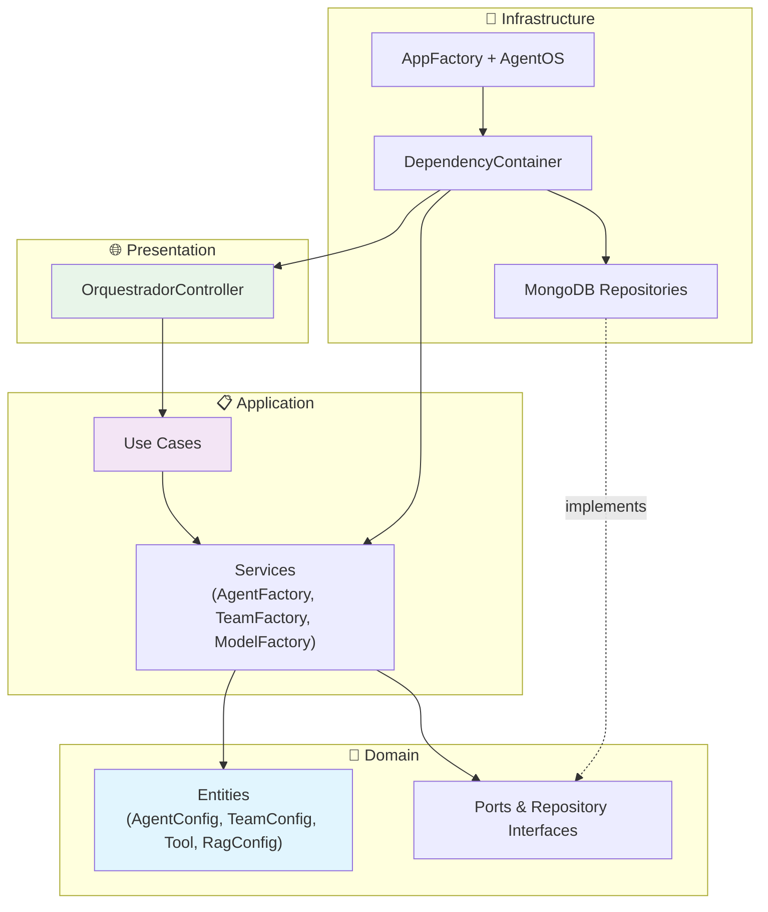

# 🤖 AI Agents Orchestrator / Orquestrador de Agentes IA

<div align="center">


[](https://app.codacy.com/gh/Mosfet04/orquestradorIAPythonArgo/dashboard?utm_source=gh&utm_medium=referral&utm_content=&utm_campaign=Badge_grade)
[](https://app.codacy.com/gh/Mosfet04/orquestradorIAPythonArgo/dashboard?utm_source=gh&utm_medium=referral&utm_content=&utm_campaign=Badge_coverage)


*AI agents orchestrator built with Onion Architecture, SOLID principles, and **[agno v2.5](https://github.com/agno-agi/agno)** — configurable entirely via MongoDB*

**📖 Full Documentation / Documentação Completa**

🇧🇷 **[Documentação em Português](README.pt-br.md)** | 🇺🇸 **[English Documentation](README.en.md)**

</div>

---

## 🚀 Quick Start

```bash
# Clone and run
git clone https://github.com/Mosfet04/orquestradorIAPythonArgo.git
cd orquestradorIAPythonArgo
python -m venv .venv && .venv\Scripts\Activate.ps1  # Windows
# source .venv/bin/activate                          # Linux/macOS
pip install -r requirements.txt
cp .env.example .env  # configure MongoDB + API keys
python app.py
```

**Or with Docker:**
```bash
docker-compose up -d
```

**Access:**
- 🌐 API Docs: http://localhost:7777/docs
- 🤖 Agents: http://localhost:7777/agents
- ❤️ Health: http://localhost:7777/health
- 🖥️ Frontend: [os.agno.com](https://os.agno.com) → Endpoint: `http://localhost:7777`

## 🏗️ Architecture



## ✨ Key Features

- 🤖 **Multi-Agent + Teams** — AI agents and multi-agent Teams with routing, coordination, and broadcast modes
- 🛠️ **Zero-Code Config** — Add agents, teams, and tools via MongoDB only
- 🧠 **6 Providers** — Ollama, OpenAI, Anthropic, Gemini, Groq, Azure
- 📚 **RAG** — Document embeddings persisted in MongoDB
- 💾 **Smart Memory** — User long-term memory + session summaries
📡 **Observability via Grafana LGTM** — Traces, metrics, and logs are now sent to Grafana (Tempo, Loki, Prometheus) using OpenTelemetry. MongoDB is no longer used for observability.
- 🌐 **AgentOS + AG-UI** — Web UI via [os.agno.com](https://os.agno.com) with SSE streaming
- 🧪 **179 Tests** — Comprehensive unit test coverage (~88%)
- 🏗️ **Onion Architecture** — Clean separation with SOLID principles
## 📊 Observability (Grafana LGTM)

All observability (traces, metrics, logs) is now handled by the Grafana LGTM stack:

- **Grafana Tempo**: Traces
- **Grafana Loki**: Logs
- **Prometheus/Mimir**: Metrics
- **Grafana**: Dashboards (Datadog-style included)

OpenTelemetry SDK is used for exporting all telemetry data. MongoDB is no longer used for storing traces or logs.

---

## 📚 Documentation
Choose your language for the complete guide (architecture, configuration, database schemas, developer guide, troubleshooting):

### 🇧🇷 Português
**[README Completo em Português](README.pt-br.md)** — Documentação detalhada incluindo arquitetura, configuração MongoDB, guia de desenvolvimento, troubleshooting e diagramas Mermaid.

### 🇺🇸 English
**[Complete English README](README.en.md)** — Full documentation including architecture, MongoDB setup, developer guide, troubleshooting, and Mermaid diagrams.

## 🤝 Contributing

1. Fork → Branch → Commit (conventional) → PR
2. Run `pytest` (179 tests must pass)
3. Follow Onion Architecture — no infrastructure imports in domain

## 📄 License

MIT — see [LICENSE](LICENSE).

---

<div align="center">

Made with ❤️ by [Mateus Meireles Ribeiro](https://github.com/Mosfet04)

</div>
