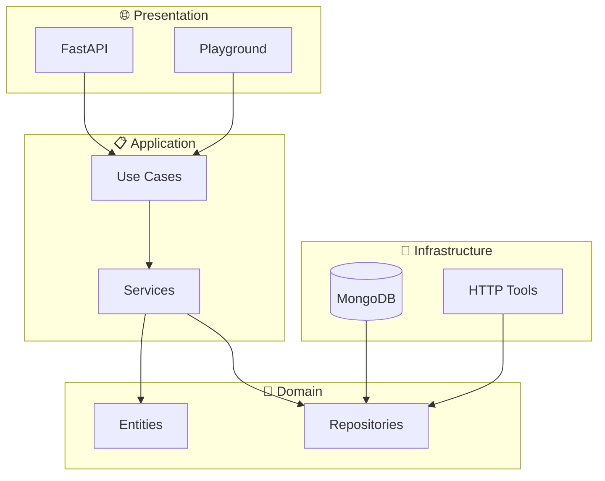

# 🤖 AI Agents Orchestrator / Orquestrador de Agentes IA

<div align="center">


*A robust Python application implementing an AI agents orchestrator using Onion Architecture (Clean Architecture), Clean Code principles, and the powerful **[agno](https://github.com/phidatahq/agno)** framework*

**📖 Full Documentation**

🇧🇷 **[Documentação em Português](README.pt-br.md)** | 🇺🇸 **[English Documentation](README.en.md)**

</div>

## 🚀 Quick Start

```bash
# Clone and run
git clone https://github.com/Mosfet04/orquestradorIAPythonArgo.git
cd orquestradorIAPythonArgo
pip install -r requirements.txt
python app.py
```

**Access:**
- 🌐 API Documentation: http://localhost:7777/docs
- 🎮 Interactive Playground: http://localhost:7777/playground
- ❤️ Health Check: http://localhost:7777/health

## 🏗️ Architecture Overview



## ✨ Key Features

- 🤖 **Multi-Agent Management** with RAG support powered by **agno**
- 🛠️ **Dynamic Configuration** - Zero-code agent and tools management via MongoDB
- 🧠 **Multiple AI Model Providers** (Ollama, OpenAI, Azure, etc.)
- 💾 **Intelligent Memory System** with conversation summaries and user profiling
- 🎮 **Interactive Web Playground** for testing and experimentation
- 🌐 **RESTful API** with comprehensive FastAPI endpoints
- 📊 **Structured Logging** and observability features
- 🧪 **Enterprise-Grade Testing** suite with high coverage
- 🏗️ **Clean Architecture** implementation following SOLID principles

## 📚 Documentation

For complete documentation, choose your language:

### 🇧🇷 Português
- **[README Completo em Português](README.pt-br.md)** - Documentação detalhada em português
- Inclui guias para desenvolvedores iniciantes e experientes
- Diagramas de arquitetura e fluxo de dados
- Exemplos práticos e configurações

### 🇺🇸 English
- **[Complete English README](README.en.md)** - Detailed documentation in English
- Includes guides for junior and senior developers
- Architecture and data flow diagrams
- Practical examples and configurations

## 🤝 Contributing

Contributions are welcome! Please read our documentation for guidelines on how to contribute to this project.

## 📄 License

This project is licensed under the MIT License - see the [LICENSE](LICENSE) file for details.

---

<div align="center">

**Made with ❤️ using Clean Architecture principles**

</div>
