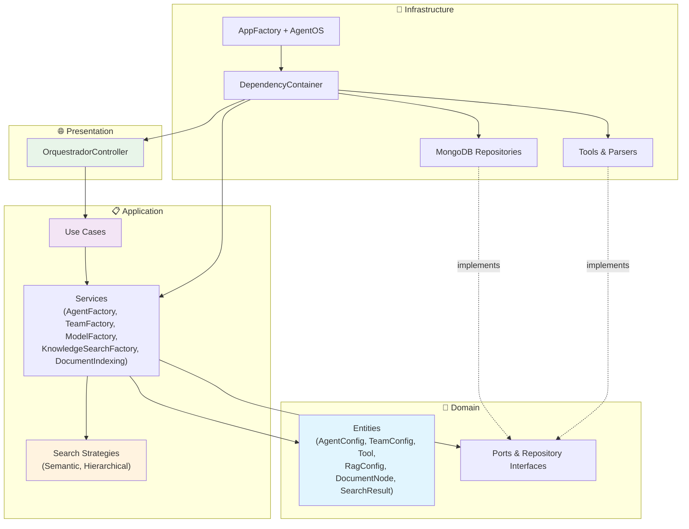

# 🤖 AI Agents Orchestrator / Orquestrador de Agentes IA

<div align="center">


[](https://app.codacy.com/gh/Mosfet04/orquestradorIAPythonArgo/dashboard?utm_source=gh&utm_medium=referral&utm_content=&utm_campaign=Badge_grade)
[](https://app.codacy.com/gh/Mosfet04/orquestradorIAPythonArgo/dashboard?utm_source=gh&utm_medium=referral&utm_content=&utm_campaign=Badge_coverage)


*AI agents orchestrator built with Onion Architecture, SOLID principles, and **[agno v2.5](https://github.com/agno-agi/agno)** — configurable entirely via MongoDB*

**📖 Full Documentation / Documentação Completa**

🇧🇷 **[Documentação em Português](README.pt-br.md)** | 🇺🇸 **[English Documentation](README.en.md)**

</div>

---

## 🚀 Quick Start

```bash
# Clone and run
git clone https://github.com/Mosfet04/orquestradorIAPythonArgo.git
cd orquestradorIAPythonArgo
python -m venv .venv && .venv\Scripts\Activate.ps1  # Windows
# source .venv/bin/activate                          # Linux/macOS
pip install --require-hashes -r requirements.lock      # runtime (pinned, hash-checked)
# pip install --require-hashes -r requirements.lock -r requirements-dev.lock  # + tests/tooling
cp .env.example .env  # configure MongoDB + API keys
python app.py
```

Dependencies are declared in `requirements.in` / `requirements-dev.in` and locked with hashes by `pip-compile` (`requirements.txt` is just `-r requirements.lock`). The lock is generated on Linux/CPython 3.12 and validated for Linux 3.11/3.12. Optional providers (`anthropic`, `groq`, `mcp`, `PyJWT`) are not installed by default. How to regenerate the lock: [CONTRIBUTING.md](CONTRIBUTING.md#dependencies-and-lock-files).

**Or with Docker** (credentials come only from `.env`):
```bash
cp .env.example .env    # fill MONGO_CONNECTION_STRING (+ MONGO_ROOT_*, MONGO_EXPRESS_* for dev)
docker compose up -d    # app only (external MongoDB/Ollama)
docker compose -f docker-compose.yml -f docker-compose.dev.yml up -d   # + local MongoDB, Ollama, mongo-express (ports on 127.0.0.1)
```
Details: [README.en.md](README.en.md#with-docker-compose).

**Access:**
- 🌐 API Docs: http://localhost:7777/docs (`ENVIRONMENT=development` or `ENABLE_DOCS=true`)
- 🤖 Agents: http://localhost:7777/agents
- ❤️ Health: http://localhost:7777/health
- 🖥️ Frontend: [os.agno.com](https://os.agno.com) → Endpoint: `http://localhost:7777`

## 🏗️ Architecture


```mermaid
graph TB
    subgraph "🎯 Domain"
        E["Entities<br/>(AgentConfig, TeamConfig, Tool,<br/>RagConfig, DocumentNode, SearchResult)"]
        P["Ports & Repository Interfaces"]
    end

    subgraph "📋 Application"
        UC["Use Cases"]
        S["Services<br/>(AgentFactory, TeamFactory, ModelFactory,<br/>KnowledgeSearchFactory, DocumentIndexing)"]
        SS["Search Strategies<br/>(Semantic, Hierarchical)"]
    end

    subgraph "🔧 Infrastructure"
        DB["MongoDB Repositories"]
        WEB["AppFactory + AgentOS"]
        DI["DependencyContainer"]
        TL["Tools & Parsers"]
    end

    subgraph "🌐 Presentation"
        CTRL["OrquestradorController"]
    end

    CTRL --> UC --> S --> E
    S --> SS
    S --> P
    DB -.->|implements| P
    TL -.->|implements| P
    DI --> CTRL & S & DB & TL
    WEB --> DI

    style E fill:#e1f5fe
    style UC fill:#f3e5f5
    style CTRL fill:#e8f5e9
    style SS fill:#fff3e0
```

## ✨ Key Features

- 🤖 **Multi-Agent + Teams** — AI agents and multi-agent Teams with routing, coordination, and broadcast modes
- 🛠️ **Zero-Code Config** — Add agents, teams, and tools via MongoDB only
- 🧠 **6 Providers** — Ollama, OpenAI, Anthropic, Gemini, Groq, Azure
- 📚 **RAG** — Document embeddings persisted in MongoDB
- 🌳 **Hierarchical RAG** — Document tree with semantic + hierarchical search (Strategy Pattern)
- 💾 **Smart Memory** — User long-term memory + session summaries
📡 **Observability via Grafana LGTM** — Traces, metrics, and logs are now sent to Grafana (Tempo, Loki, Prometheus) using OpenTelemetry. MongoDB is no longer used for observability.
- 🌐 **AgentOS + AG-UI** — Web UI via [os.agno.com](https://os.agno.com) with SSE streaming
- 🧪 **Tests** — Unit, contract and golden tests (~93% branch coverage)
- 🏗️ **Onion Architecture** — Clean separation with SOLID principles
## 📊 Observability (Grafana LGTM)

All observability (traces, metrics, logs) is now handled by the Grafana LGTM stack:

- **Grafana Tempo**: Traces
- **Grafana Loki**: Logs
- **Prometheus/Mimir**: Metrics
- **Grafana**: Dashboards (Datadog-style included)

OpenTelemetry SDK is used for exporting all telemetry data. MongoDB is no longer used for storing traces or logs.

Run metrics (`MetricsMiddleware`, only `POST /agents/{id}/runs` and `POST /teams/{id}/runs`; each request counts at most one error):

- `agent_errors_total{agent_id}` / `team_errors_total{team_id}`: failed run. Agno catches the run exception and AgentOS answers 200, so the middleware also reads the response: SSE event `RunError` (agent) or `TeamRunError` (team; a member `RunError` inside a team stream is not counted), or JSON (`stream=false`) with top-level `status == "ERROR"`. An exception escaping the route or a status >= 400 also counts. Client cancellation is not an error.
- `agent_requests_total{agent_id}` / `team_requests_total{team_id}`: run requests, with `status="error"` when the run failed (else `"success"`); a 4xx response (e.g. unknown id or invalid form) is recorded as `unknown`.
- `agents_active{agent_id}`: agent runs in progress; always released at the end of the request, including on exception or cancellation.

Failures loading agents/teams from the config store go to the log, not to these metrics.

---

## 📚 Documentation
Choose your language for the complete guide (architecture, configuration, database schemas, developer guide, troubleshooting):

### 🇧🇷 Português
**[README Completo em Português](README.pt-br.md)** — Documentação detalhada incluindo arquitetura, configuração MongoDB, guia de desenvolvimento, troubleshooting e diagramas Mermaid.

### 🇺🇸 English
**[Complete English README](README.en.md)** — Full documentation including architecture, MongoDB setup, developer guide, troubleshooting, and Mermaid diagrams.

## 🤝 Contributing

1. Fork → Branch → Commit (conventional) → PR
2. Run `pytest` (all tests must pass)
3. Follow Onion Architecture — no infrastructure imports in domain

## 📄 License

MIT — see [LICENSE](LICENSE).

---

<div align="center">

Made with ❤️ by [Mateus Meireles Ribeiro](https://github.com/Mosfet04)

</div>
