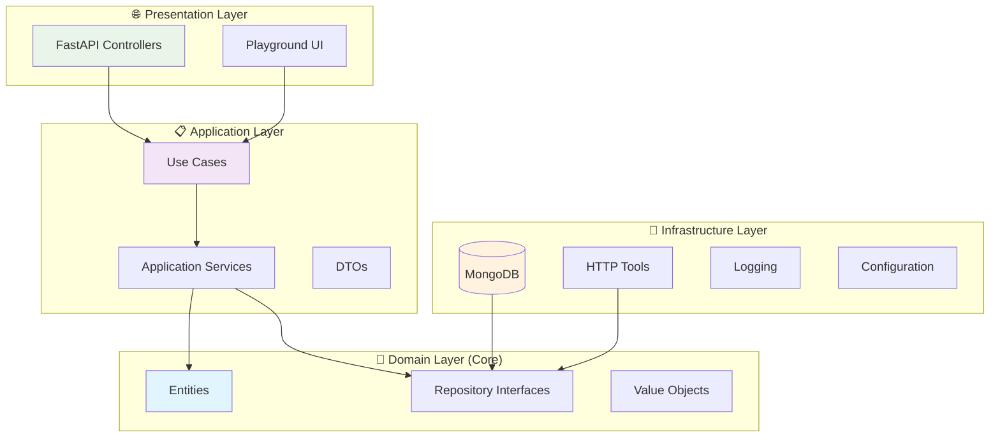
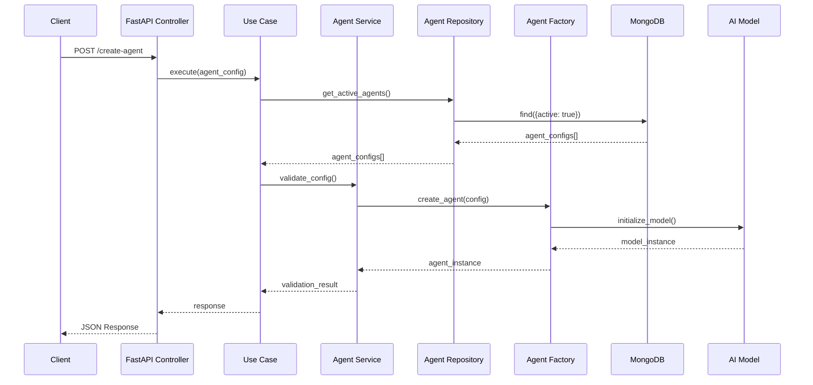

# 🤖 Orquestrador de Agentes IA

<div align="center">


*Uma aplicação Python robusta que implementa um orquestrador de agentes de IA utilizando arquitetura Onion (Clean Architecture) e princípios de Clean Code*

[🇺🇸 English](#english-version) | [📚 Documentação](#documentação) | [🚀 Início Rápido](#início-rápido)

</div>

## 📋 Índice

- [Visão Geral](#visão-geral)
- [Arquitetura](#arquitetura)
- [Funcionalidades](#funcionalidades)
- [Início Rápido](#início-rápido)
- [Configuração](#configuração)
- [API Reference](#api-reference)
- [Testes](#testes)
- [Para Desenvolvedores](#para-desenvolvedores)
- [Contribuição](#contribuição)

## 🎯 Visão Geral

O **Orquestrador de Agentes IA** é uma aplicação enterprise-ready que permite o gerenciamento e orquestração de múltiplos agentes de inteligência artificial. Construído com foco em escalabilidade, manutenibilidade e testabilidade, utiliza as melhores práticas de desenvolvimento Python.

### ✨ Destaques

- 🏗️ **Arquitetura Onion** (Clean Architecture)
- 🧪 **Clean Code** e princípios SOLID
- 🔄 **Multi-Agent Support** com RAG (Retrieval-Augmented Generation)
- 🛠️ **Custom Tools Integration** via HTTP APIs
- 📊 **Multiple Model Providers** (Ollama, OpenAI, etc.)
- 🌐 **RESTful API** com FastAPI
- 🎮 **Interactive Playground** para testes
- 📝 **Comprehensive Logging** estruturado
- 🧰 **Dependency Injection** container

## 🏗️ Arquitetura

A aplicação segue a **Arquitetura Onion**, garantindo baixo acoplamento e alta coesão:



### 📁 Estrutura do Projeto

```
src/
├── 🎯 domain/                    # Camada de Domínio (núcleo)
│   ├── entities/                # Entidades de negócio
│   │   ├── agent_config.py      # Configuração de agente
│   │   ├── tool.py              # Ferramentas personalizadas
│   │   └── rag_config.py        # Configuração RAG
│   └── repositories/            # Contratos de repositórios
│       ├── agent_config_repository.py
│       └── tool_repository.py
├── 📋 application/              # Camada de Aplicação
│   ├── services/               # Serviços de aplicação
│   │   ├── agent_factory_service.py
│   │   ├── model_factory_service.py
│   │   ├── http_tool_factory_service.py
│   │   └── embedder_model_factory_service.py
│   └── use_cases/             # Casos de uso
│       └── get_active_agents_use_case.py
├── 🔧 infrastructure/          # Camada de Infraestrutura
│   ├── config/                # Configurações
│   ├── database/              # Conexões de banco
│   ├── logging/               # Sistema de logs
│   ├── repositories/          # Implementações concretas
│   └── dependency_injection.py
└── 🌐 presentation/           # Camada de Apresentação
    └── controllers/           # Controllers REST
        └── orquestrador_controller.py
```

## 🔄 Fluxo de Dados



## ⚡ Funcionalidades

- **✅ Configuração Simples**: Setup em 3 comandos
- **📖 Documentação Clara**: Exemplos práticos e tutoriais
- **🔍 Logs Detalhados**: Rastreamento completo de operações
- **🧪 Testes Incluídos**: Exemplos de testes unitários e integração

- **🏗️ Arquitetura Escalável**: Padrões enterprise (DDD, CQRS-ready)
- **🔧 Extensibilidade**: Fácil adição de novos models e tools
- **📊 Observabilidade**: Métricas, health checks e structured logging
- **🔒 Segurança**: Validação de entrada e sanitização de dados

### 🎮 Funcionalidades Principais

- ✅ **Multi-Agent Management**: Gerenciamento de múltiplos agentes IA
- ✅ **RAG Integration**: Retrieval-Augmented Generation com MongoDB
- ✅ **Custom Tools**: Integração de ferramentas personalizadas via HTTP
- ✅ **Model Flexibility**: Suporte a múltiplos provedores (Ollama, OpenAI)
- ✅ **Interactive Playground**: Interface web para testes
- ✅ **REST API**: Endpoints para integração externa
- ✅ **Memory Management**: Sistema de memória persistente
- ✅ **Configuration Management**: Configuração flexível via ambiente

## 🚀 Início Rápido

### 📋 Pré-requisitos

- Python 3.9+
- MongoDB 4.4+
- Git

### ⚡ Instalação Rápida

```bash
# 1. Clone o repositório
git clone https://github.com/seu-usuario/orquestradorIAPythonArgo.git
cd orquestradorIAPythonArgo

# 2. Instale as dependências
pip install -r requirements.txt

# 3. Execute a aplicação
python app.py
```

### 🐳 Com Docker (Recomendado)

```bash
# Clone e execute com Docker Compose
git clone https://github.com/seu-usuario/orquestradorIAPythonArgo.git
cd orquestradorIAPythonArgo
docker-compose up -d
```

### 🌐 Acesso

- **API**: http://localhost:7777/docs
- **Playground**: http://localhost:7777/playground
- **Health Check**: http://localhost:7777/health

## ⚙️ Configuração

### 🔧 Variáveis de Ambiente

```bash
# Configuração do Banco de Dados
MONGO_CONNECTION_STRING=mongodb://localhost:27017
MONGO_DATABASE_NAME=agno

# Configuração da Aplicação
APP_TITLE="Orquestrador agno"
APP_HOST=0.0.0.0
APP_PORT=7777

# Configuração de Logs
LOG_LEVEL=INFO
LOG_FORMAT=json

# Configuração de Modelos IA
OLLAMA_BASE_URL=http://localhost:11434
OPENAI_API_KEY=sua-chave-aqui
```

### 🗄️ Estrutura do MongoDB

#### Collection: `agents_config`

```json
{
  "_id": ObjectId("..."),
  "id": "agent-1",
  "nome": "Assistente Geral",
  "model": "llama3.2:latest",
  "factoryIaModel": "ollama",
  "descricao": "Um assistente para tarefas gerais",
  "prompt": "Você é um assistente útil que ajuda com tarefas gerais...",
  "active": true,
  "tools_ids": ["tool-1", "tool-2"],
  "rag_config": {
    "active": true,
    "doc_name": "knowledge_base",
    "model": "text-embedding-3-small",
    "factoryIaModel": "openai"
  }
}
```

#### Collection: `tools_config`

```json
{
  "_id": ObjectId("..."),
  "id": "tool-1",
  "name": "Weather API",
  "description": "Obtém informações meteorológicas",
  "http_config": {
    "base_url": "https://api.weather.com",
    "method": "GET",
    "endpoint": "/current",
    "headers": {
      "API-Key": "sua-chave"
    },
    "parameters": [
      {
        "name": "city",
        "type": "string",
        "description": "Nome da cidade",
        "required": true
      }
    ]
  }
}
```

## 🔗 API Reference

### 📊 Endpoints Principais

#### **GET** `/agents`
Retorna todos os agentes ativos.

```bash
curl -X GET "http://localhost:7777/agents" \
     -H "accept: application/json"
```

**Response:**
```json
{
  "agents": [
    {
      "id": "agent-1",
      "nome": "Assistente Geral",
      "model": "llama3.2:latest",
      "descricao": "Um assistente para tarefas gerais",
      "active": true
    }
  ]
}
```

#### **POST** `/agents/{agent_id}/chat`
Envia mensagem para um agente específico.

```bash
curl -X POST "http://localhost:7777/agents/agent-1/chat" \
     -H "accept: application/json" \
     -H "Content-Type: application/json" \
     -d '{
       "message": "Olá, como você pode me ajudar?",
       "session_id": "session-123"
     }'
```

#### **GET** `/health`
Verifica o status da aplicação.

```bash
curl -X GET "http://localhost:7777/health"
```

### 📚 Documentação Interativa

Acesse http://localhost:7777/docs para a documentação Swagger completa.

## 🧪 Testes

### 🏃‍♂️ Executando Testes

```bash
# Todos os testes
pytest

# Apenas testes unitários
pytest tests/unit/ -v

# Apenas testes de integração
pytest tests/integration/ -v

# Com cobertura
pytest --cov=src --cov-report=html
```

### 📊 Cobertura de Testes

```bash
# Gerar relatório de cobertura
coverage run -m pytest
coverage html
```

O relatório será gerado em `htmlcov/index.html`.

### 🧪 Estrutura de Testes

```
tests/
├── unit/                   # Testes unitários
│   ├── domain/            # Testes de entidades
│   ├── application/       # Testes de serviços
│   └── infrastructure/    # Testes de repositórios
├── integration/           # Testes de integração
│   ├── api/              # Testes de API
│   └── database/         # Testes de banco
└── conftest.py           # Configurações pytest
```

## 👨‍💻 Para Desenvolvedores

### 🎯 Para Desenvolvedores Iniciantes

#### 🔍 Entendendo a Arquitetura

A aplicação usa **Arquitetura Onion** que separa as responsabilidades em camadas:

1. **Domain (Núcleo)**: Regras de negócio puras
2. **Application**: Orquestração e casos de uso
3. **Infrastructure**: Detalhes técnicos (BD, APIs)
4. **Presentation**: Interface com usuário

#### 📚 Conceitos Importantes

**Dependency Injection**: As dependências são injetadas automaticamente
```python
# ✅ Bom - Dependência injetada
class AgentService:
    def __init__(self, repository: IAgentRepository):
        self._repository = repository

# ❌ Ruim - Dependência hardcoded
class AgentService:
    def __init__(self):
        self._repository = MongoAgentRepository()
```

**Repository Pattern**: Abstração para acesso a dados
```python
# Interface (contrato)
class IAgentRepository:
    def get_active_agents(self) -> List[AgentConfig]:
        pass

# Implementação MongoDB
class MongoAgentRepository(IAgentRepository):
    def get_active_agents(self) -> List[AgentConfig]:
        # Implementação específica
        pass
```

### 🚀 Para Desenvolvedores Experientes

#### 🏗️ Padrões Implementados

- **Domain-Driven Design (DDD)**: Entidades ricas e repositórios
- **Command Query Responsibility Segregation (CQRS-ready)**: Separação clara de comandos e consultas
- **Factory Pattern**: Criação de agentes e ferramentas
- **Strategy Pattern**: Múltiplos provedores de modelo
- **Observer Pattern**: Sistema de logging estruturado

#### 🔧 Pontos de Extensão

**Adicionando Novo Provider de Modelo:**

```python
# 1. Implemente a interface
class GroqModelFactory(IModelFactory):
    def create_model(self, model_name: str) -> Any:
        # Implementação Groq
        pass

# 2. Registre no container
container.register("groq_factory", GroqModelFactory)

# 3. Use na configuração
{
    "factoryIaModel": "groq",
    "model": "llama-70b"
}
```

**Adicionando Nova Ferramenta:**

```python
# 1. Defina a configuração
@dataclass
class DatabaseToolConfig:
    connection_string: str
    query_template: str

# 2. Implemente o factory
class DatabaseToolFactory:
    def create_tool(self, config: DatabaseToolConfig):
        # Implementação
        pass
```

#### 📊 Métricas e Observabilidade

```python
# Exemplo de instrumentação
@app_logger.inject
async def create_agent(agent_config: AgentConfig):
    with app_logger.timer("agent_creation"):
        # Lógica de criação
        pass
```

### 🔧 Customização Avançada

#### 🎛️ Configuração de Ambiente

```python
# src/infrastructure/config/app_config.py
class AppConfig:
    # Configurações carregadas automaticamente
    mongo_connection_string: str = os.getenv("MONGO_CONNECTION_STRING")
    app_title: str = os.getenv("APP_TITLE", "Orquestrador IA")
    
    # Validação automática
    def __post_init__(self):
        if not self.mongo_connection_string:
            raise ValueError("MONGO_CONNECTION_STRING é obrigatório")
```

#### 🔌 Sistema de Plugins

```python
# Registre plugins personalizados
class CustomPlugin:
    def setup(self, container: DependencyContainer):
        container.register("custom_service", CustomService)

# No app.py
container.register_plugin(CustomPlugin())
```

## 🛠️ Troubleshooting

### ❗ Problemas Comuns

#### MongoDB Connection Issues
```bash
# Verifique se o MongoDB está rodando
mongosh --eval "db.adminCommand('ismaster')"

# Teste a conexão
python -c "
from pymongo import MongoClient
client = MongoClient('mongodb://localhost:27017')
print(client.admin.command('ismaster'))
"
```

#### Model Provider Issues
```bash
# Teste Ollama
curl http://localhost:11434/api/tags

# Teste OpenAI
python -c "
import openai
openai.api_key = 'sua-chave'
print(openai.Model.list())
"
```

### 📝 Logs de Debug

```bash
# Ative logs detalhados
export LOG_LEVEL=DEBUG
python app.py
```

## 🤝 Contribuição

### 🎯 Como Contribuir

1. **Fork** o projeto
2. **Crie** uma branch para sua feature (`git checkout -b feature/AmazingFeature`)
3. **Commit** suas mudanças (`git commit -m 'Add some AmazingFeature'`)
4. **Push** para a branch (`git push origin feature/AmazingFeature`)
5. **Abra** um Pull Request

### 📋 Guidelines

- Siga os princípios de Clean Code
- Mantenha cobertura de testes > 80%
- Documente APIs públicas
- Use conventional commits

### 🧪 Antes de Submeter

```bash
# Execute os testes
pytest

# Verifique o linting
black . && isort . && flake8

# Verifique a cobertura
pytest --cov=src --cov-report=term-missing
```

## 📄 Licença

Este projeto está licenciado sob a MIT License - veja o arquivo [LICENSE](LICENSE) para detalhes.

## 🙏 Agradecimentos

- [FastAPI](https://fastapi.tiangolo.com/) pela excelente framework
- [agno](https://github.com/phidatahq/agno) pelo framework de agentes
- [MongoDB](https://www.mongodb.com/) pelo banco de dados
- Comunidade Python pelas bibliotecas incríveis

---

<div align="center">

**[⬆ Voltar ao topo](#-orquestrador-de-agentes-ia)**

Feito com ❤️ por [Mateus Meireles Ribeiro](https://github.com/Mosfet04)

</div>
