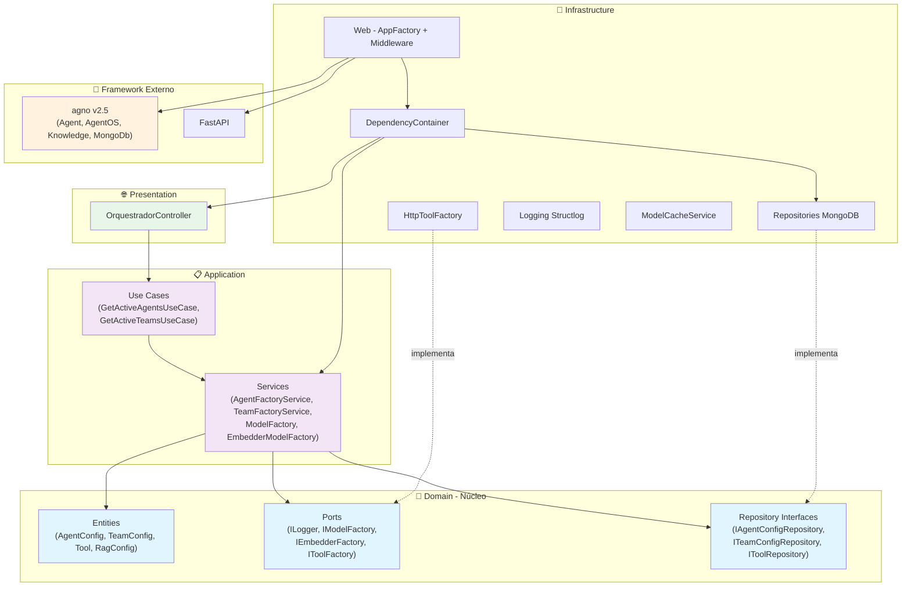
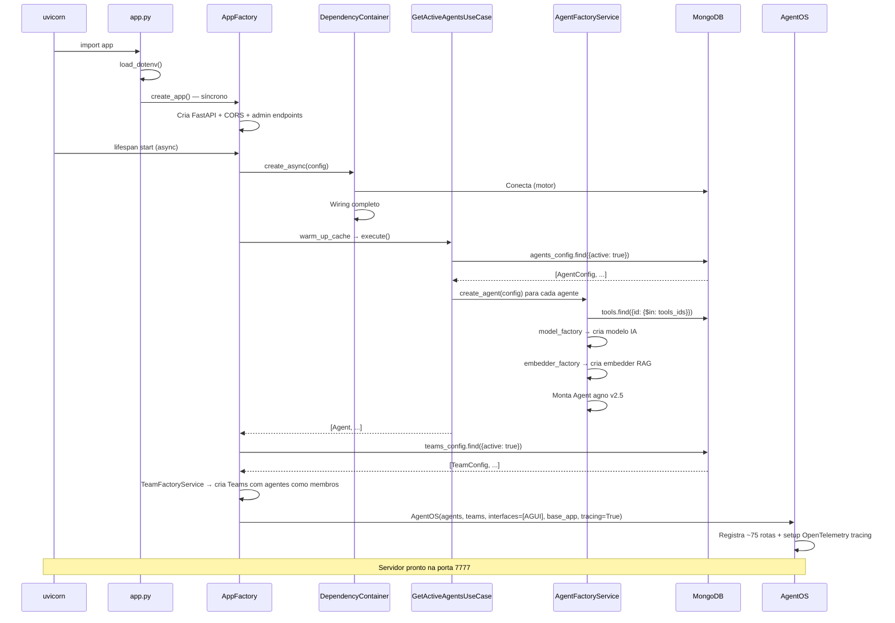
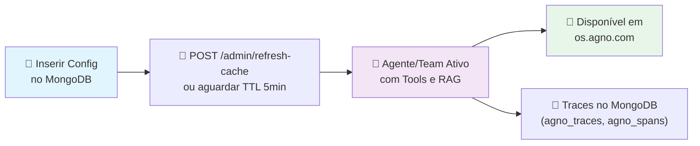
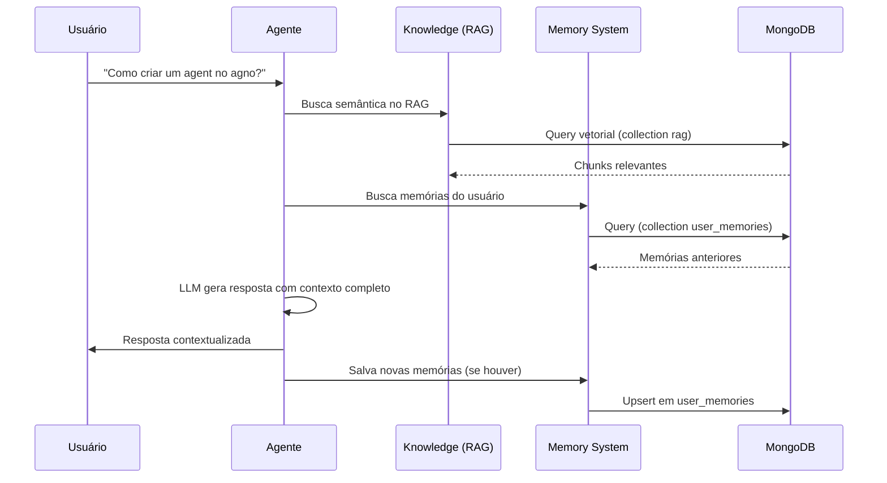

# 🤖 Orquestrador de Agentes IA

<div align="center">


[](https://app.codacy.com/gh/Mosfet04/orquestradorIAPythonArgo/dashboard?utm_source=gh&utm_medium=referral&utm_content=&utm_campaign=Badge_grade)
[](https://app.codacy.com/gh/Mosfet04/orquestradorIAPythonArgo/dashboard?utm_source=gh&utm_medium=referral&utm_content=&utm_campaign=Badge_coverage)


*Orquestrador de agentes de IA construído com arquitetura Onion (Clean Architecture), princípios SOLID e o framework **[agno v2.5](https://github.com/agno-agi/agno)***

[🇺🇸 English](README.en.md) | [🚀 Início Rápido](#-início-rápido) | [📚 Arquitetura](#-arquitetura)

</div>

---

## 📋 Índice

- [Visão Geral](#-visão-geral)
- [Início Rápido](#-início-rápido)
- [Arquitetura](#-arquitetura)
- [Funcionalidades](#-funcionalidades)
- [Configuração](#-configuração)
- [Endpoints da API](#-endpoints-da-api)
- [Frontend (os.agno.com)](#-frontend-osagnocom)
- [Banco de Dados (MongoDB)](#-banco-de-dados-mongodb)
- [Sistema de Memória e RAG](#-sistema-de-memória-e-rag)
- [Testes](#-testes)
- [Guia para Desenvolvedores](#-guia-para-desenvolvedores)
- [Troubleshooting](#-troubleshooting)
- [Contribuição](#-contribuição)

---

## 🎯 Visão Geral

O **Orquestrador de Agentes IA** é uma aplicação que gerencia e orquestra múltiplos agentes de inteligência artificial. Cada agente, suas ferramentas (tools) e configurações são definidos **exclusivamente no MongoDB** — sem alterar código para adicionar agentes, trocar modelos ou vincular ferramentas.

### Principais Características

| Característica | Descrição |
|---|---|
| **Configuração Zero-Code** | Agentes, teams, tools e RAG configuráveis apenas no MongoDB |
| **Multi-Agent Teams** | Teams multi-agente com modos route, coordinate, broadcast e tasks |
| **Multi-Provider** | Ollama, OpenAI, Anthropic, Gemini, Groq e Azure |
| **RAG integrado** | Retrieval-Augmented Generation com embeddings persistidos no MongoDB |
| **Memória inteligente** | Memória de longo prazo com sumários automáticos e perfil de usuário |
| **OpenTelemetry Tracing** | Spans e traces automáticos para agentes e teams, persistidos no MongoDB |
| **AgentOS + AG-UI** | Interface web via [os.agno.com](https://os.agno.com) com streaming SSE |
| **Arquitetura limpa** | Camadas Domain → Application → Infrastructure → Presentation |
| **179 testes unitários** | Cobertura ~88% de todas as camadas |

---

## 🚀 Início Rápido

### Pré-requisitos

- **Python 3.11+** (recomendado; 3.9+ com limitações)
- **MongoDB 4.4+** (local ou Atlas)
- **Git**

### Instalação Local

```bash
# 1. Clone o repositório
git clone https://github.com/Mosfet04/orquestradorIAPythonArgo.git
cd orquestradorIAPythonArgo

# 2. Crie e ative o ambiente virtual
python -m venv .venv

# Windows PowerShell
.\.venv\Scripts\Activate.ps1

# Linux / macOS
source .venv/bin/activate

# 3. Instale as dependências
pip install -r requirements.txt

# 4. Configure as variáveis de ambiente
cp .env.example .env   # ou crie manualmente (veja seção Configuração)

# 5. Inicie a aplicação
python app.py
```

### Com Docker Compose

```bash
git clone https://github.com/Mosfet04/orquestradorIAPythonArgo.git
cd orquestradorIAPythonArgo
docker-compose up -d
```

Isso sobe: **MongoDB** (porta 27017), **Ollama** (porta 11434), e a **aplicação** (porta 7777).

### Verificação

Após iniciar, acesse:

| URL | Descrição |
|---|---|
| http://localhost:7777/health | Health check (AgentOS nativo) |
| http://localhost:7777/docs | Documentação OpenAPI / Swagger |
| http://localhost:7777/config | Configuração do AgentOS (agentes, databases) |
| http://localhost:7777/agents | Lista de agentes ativos |

---

## 🏗️ Arquitetura

A aplicação segue a **Arquitetura Onion** (também chamada Clean Architecture / Hexagonal). A regra de ouro é: **dependências apontam para dentro** — camadas externas dependem das internas, nunca o contrário.



### Estrutura de Pastas

```
orquestradorIAPythonArgo/
├── app.py                          # Ponto de entrada — cria o FastAPI app
├── requirements.txt                # Dependências Python
├── docker-compose.yml              # MongoDB + Ollama + App
├── Dockerfile                      # Build da imagem Docker
├── .env                            # Variáveis de ambiente (NÃO commitado)
├── docs/                           # Documentos para RAG (ex: basic-prog.txt)
├── mongo-init/                     # Scripts de inicialização do MongoDB
│   └── init-db.js
├── logs/                           # Logs da aplicação
│
├── src/
│   ├── domain/                     # 🎯 CAMADA DE DOMÍNIO (sem dependências externas)
│   │   ├── entities/
│   │   │   ├── agent_config.py     #   Entidade: configuração de um agente
│   │   │   ├── team_config.py      #   Entidade: configuração de um team multi-agente
│   │   │   ├── tool.py             #   Entidade: ferramenta HTTP (Tool, ToolParameter)
│   │   │   └── rag_config.py       #   Entidade: configuração de RAG
│   │   ├── ports/                  #   Contratos (interfaces) para adaptadores
│   │   │   ├── logger_port.py      #     ILogger
│   │   │   ├── model_factory_port.py #   IModelFactory
│   │   │   ├── embedder_factory_port.py # IEmbedderFactory
│   │   │   ├── tool_factory_port.py #    IToolFactory
│   │   │   └── agent_builder_port.py #   IAgentBuilder
│   │   └── repositories/          #   Contratos de repositórios
│   │       ├── agent_config_repository.py  # IAgentConfigRepository
│   │       ├── team_config_repository.py   # ITeamConfigRepository
│   │       └── tool_repository.py          # IToolRepository
│   │
│   ├── application/                # 📋 CAMADA DE APLICAÇÃO (orquestração)
│   │   ├── services/
│   │   │   ├── agent_factory_service.py       # Cria agentes agno a partir de AgentConfig
│   │   │   ├── team_factory_service.py        # Cria teams agno a partir de TeamConfig
│   │   │   ├── model_factory_service.py       # Factory de modelos (Ollama, OpenAI, etc.)
│   │   │   └── embedder_model_factory_service.py # Factory de embedders para RAG
│   │   └── use_cases/
│   │       ├── get_active_agents_use_case.py  # Busca configs ativas e cria agentes
│   │       └── get_active_teams_use_case.py   # Busca configs ativas e cria teams
│   │
│   ├── infrastructure/             # 🔧 CAMADA DE INFRAESTRUTURA (implementações)
│   │   ├── config/
│   │   │   └── app_config.py       #   AppConfig — carrega variáveis de ambiente
│   │   ├── cache/
│   │   │   └── model_cache_service.py # Cache de modelos já instanciados
│   │   ├── database/               #   (reservado para futuras conexões)
│   │   ├── http/
│   │   │   └── http_tool_factory.py #   Cria agno Toolkits a partir de configs HTTP
│   │   ├── logging/
│   │   │   ├── config.py           #   Configura structlog
│   │   │   ├── structlog_logger.py #   Implementação do logger
│   │   │   ├── logger_adapter.py   #   Adapter: structlog → ILogger
│   │   │   ├── secure_logger.py    #   Sanitização de dados sensíveis
│   │   │   └── decorators.py       #   Decorators de logging
│   │   ├── repositories/
│   │   │   ├── mongo_base.py       #   Classe base para repos MongoDB
│   │   │   ├── mongo_agent_config_repository.py  # IAgentConfigRepository → MongoDB
│   │   │   ├── mongo_team_config_repository.py   # ITeamConfigRepository → MongoDB
│   │   │   └── mongo_tool_repository.py          # IToolRepository → MongoDB
│   │   ├── web/
│   │   │   └── app_factory.py      #   AppFactory — cria FastAPI + AgentOS + AGUI
│   │   └── dependency_injection.py #   DependencyContainer — Composition Root
│   │
│   └── presentation/               # 🌐 CAMADA DE APRESENTAÇÃO
│       └── controllers/
│       └── orquestrador_controller.py # Cache inteligente de agentes/teams + warm-up
│
└── tests/
    ├── conftest.py                 # Fixtures compartilhadas (pytest)
    └── unit/                       # 179 testes unitários
        ├── test_agent_config.py
        ├── test_agent_factory_service.py
        ├── test_app_config.py
        ├── test_app_factory.py
        ├── test_app_integration.py
        ├── test_embedder_model_factory_service.py
        ├── test_get_active_agents_use_case.py
        ├── test_http_tool_factory.py
        ├── test_logging_config.py
        ├── test_logging_decorators.py
        ├── test_model_cache_service.py
        ├── test_model_factory_service.py
        ├── test_mongo_agent_config_repository.py
        ├── test_mongo_tool_repository_extended.py
        ├── test_orquestrador_controller.py
        ├── test_secure_logger.py
        ├── test_structlog_logger.py
        └── test_tool.py
```

### Fluxo de Inicialização



---

## ⚡ Funcionalidades

### Funcionalidades Principais

- ✅ **Multi-Agent** — Vários agentes IA rodando simultaneamente, cada um com modelo, tools e RAG próprios
- ✅ **Multi-Agent Teams** — Teams com modos `route` (roteamento inteligente), `coordinate` (coordenação), `broadcast` (envio a todos) e `tasks` (tarefas atribuídas)
- ✅ **Configuração Zero-Code** — Adicione agentes, teams, tools e bases RAG apenas no MongoDB
- ✅ **Multi-Provider** — Ollama, OpenAI, Anthropic, Gemini, Groq e Azure OpenAI
- ✅ **RAG (Retrieval-Augmented Generation)** — Documentos na pasta `docs/` são embedados e persistidos no MongoDB
- ✅ **Memória Inteligente** — Memória de usuário e sumários de sessão (configurável por agente/team)
- ✅ **OpenTelemetry Tracing** — Spans e traces automáticos para agentes e teams, persistidos no MongoDB (`agno_traces`, `agno_spans`)
- ✅ **Custom HTTP Tools** — Integre qualquer API HTTP como ferramenta do agente
- ✅ **AgentOS + AG-UI** — Interface web via [os.agno.com](https://os.agno.com) com streaming SSE em tempo real
- ✅ **Cache de Agentes** — TTL de 5 minutos com fallback para cache expirado em caso de erro
- ✅ **Health Check Detalhado** — Verifica MongoDB, memória do sistema, tempo de resposta
- ✅ **Logging Estruturado** — Structlog com sanitização de dados sensíveis
- ✅ **Docker Compose** — MongoDB + Ollama + App em um comando

### Capacidades Dinâmicas



---

## ⚙️ Configuração

### Variáveis de Ambiente

Crie um arquivo `.env` na raiz do projeto:

```bash
# ═══ Obrigatório ═══
MONGO_CONNECTION_STRING=mongodb://localhost:27017/?directConnection=true
MONGO_DATABASE_NAME=agno

# ═══ Aplicação ═══
APP_TITLE="Orquestrador de Agentes IA"
APP_HOST=127.0.0.1
APP_PORT=7777
LOG_LEVEL=INFO

# ═══ Providers de Modelo (configure conforme necessário) ═══
OLLAMA_BASE_URL=http://localhost:11434

# Apenas se usar OpenAI:
# OPENAI_API_KEY=sk-...

# Apenas se usar Gemini:
# GEMINI_API_KEY=AI...

# Apenas se usar Anthropic:
# ANTHROPIC_API_KEY=sk-ant-...

# Apenas se usar Groq:
# GROQ_API_KEY=gsk_...

# Apenas se usar Azure OpenAI:
# AZURE_API_KEY=...
# AZURE_ENDPOINT=https://xxx.openai.azure.com/
# AZURE_VERSION=2024-02-01

# ═══ Telemetria agno (opcional) ═══
# AGNO_TELEMETRY=false
```

> **Convenção de API Keys**: o orquestrador busca automaticamente `{PROVIDER}_API_KEY` no ambiente. Exemplo: para `factoryIaModel: "gemini"`, busca `GEMINI_API_KEY`.

---

## 🔗 Endpoints da API

Após o AgentOS montar as rotas, a aplicação expõe ~75 endpoints. Os principais:

### Rotas Nativas do AgentOS

| Método | Rota | Descrição |
|--------|------|-----------|
| `GET` | `/` | Info da API (nome, ID, versão) |
| `GET` | `/health` | Health check AgentOS (`{"status":"ok","instantiated_at":"..."}`) |
| `GET` | `/config` | Configuração completa (agentes, databases, interfaces) |
| `GET` | `/agents` | Lista todos os agentes ativos |
| `GET` | `/agents/{agent_id}` | Detalhes de um agente |
| `POST` | `/agents/{agent_id}/runs` | **Executa o agente** (resposta SSE streaming) |
| `GET` | `/teams` | Lista todos os teams ativos |
| `GET` | `/teams/{team_id}` | Detalhes de um team |
| `POST` | `/teams/{team_id}/runs` | **Executa o team** (resposta SSE streaming) |
| `GET` | `/sessions` | Lista sessões |
| `GET` | `/sessions/{session_id}` | Detalhes de uma sessão (histórico de mensagens) |
| `GET` | `/knowledge/content` | Lista conteúdos RAG indexados |
| `POST` | `/knowledge/search` | Busca semântica na base de conhecimento |
| `GET` | `/memories` | Lista memórias de usuário |
| `GET` | `/models` | Lista modelos disponíveis |

### Interface AG-UI (para os.agno.com)

| Método | Rota | Descrição |
|--------|------|-----------|
| `GET` | `/status` | Status da interface (`{"status":"available"}`) |
| `POST` | `/agui` | Executa agente via protocolo AG-UI (SSE streaming) |

### Rotas Administrativas (customizadas)

| Método | Rota | Descrição |
|--------|------|-----------|
| `GET` | `/admin/health` | Health check detalhado (MongoDB + memória do sistema) |
| `GET` | `/metrics/cache` | Estatísticas do cache de agentes |
| `POST` | `/admin/refresh-cache` | Força recarga dos agentes do MongoDB |

### Documentação Interativa

Acesse **http://localhost:7777/docs** para a documentação Swagger completa com todas as rotas.

---

## 🌐 Frontend (os.agno.com)

A aplicação é projetada para funcionar com o frontend **[os.agno.com](https://os.agno.com)** da Agno.

### Como configurar

1. Inicie o servidor local (`python app.py`)
2. Acesse [os.agno.com](https://os.agno.com)
3. Em **Settings**, configure:
   - **AgentOS Name**: nome livre (ex: `coding_agent`)
   - **Endpoint URL**: `http://localhost:7777`
4. O frontend se conecta automaticamente e mostra os agentes disponíveis

### Como funciona

- O frontend chama `GET /health` e `GET /status` para verificar se o servidor está ativo
- Lista os agentes via `GET /config` e `GET /agents`
- Envia mensagens via `POST /agents/{agent_id}/runs` (SSE streaming nativo) ou `POST /agui` (protocolo AG-UI)
- Gerencia sessões via `GET/DELETE /sessions/{session_id}`

---

## 🗄️ Banco de Dados (MongoDB)

O MongoDB é o coração da configuração. Todas as collections estão no database definido por `MONGO_DATABASE_NAME` (padrão: `agno`).

### Collections

| Collection | Gerenciada por | Descrição |
|---|---|---|
| `agents_config` | **Você** (manual) | Configuração de cada agente |
| `teams_config` | **Você** (manual) | Configuração de cada team multi-agente |
| `tools` | **Você** (manual) | Definição de ferramentas HTTP |
| `rag` | **agno** (automático) | Chunks embedados dos documentos RAG |
| `agno_sessions` | **agno** (automático) | Sessões, histórico de runs |
| `agno_memories` | **agno** (automático) | Memórias de longo prazo por usuário |
| `agno_traces` | **agno** (automático) | Traces OpenTelemetry (execuções completas) |
| `agno_spans` | **agno** (automático) | Spans OpenTelemetry (operações individuais) |

### Collection: `agents_config`

Esta é a collection que você gerencia. Cada documento define um agente:

```json
{
  "id": "coding_agent",
  "nome": "Coding Agent",
  "factoryIaModel": "gemini",
  "model": "gemini-3-flash-preview",
  "descricao": "Assistente de programação de agentes de IA com o Agno.",
  "prompt": [
    "Você deve agir como um assistente de remoção de dúvidas sobre Agentes de IA e Agno."
  ],
  "tools_ids": ["get-python-package-info"],
  "rag_config": {
    "active": true,
    "doc_name": "basic-prog.txt",
    "model": "gemini-embedding-001",
    "factoryIaModel": "gemini"
  },
  "user_memory_active": false,
  "summary_active": false,
  "active": true
}
```

**Campos:**

| Campo | Tipo | Obrigatório | Descrição |
|---|---|---|---|
| `id` | string | ✅ | Identificador único do agente |
| `nome` | string | ✅ | Nome de exibição |
| `factoryIaModel` | string | ✅ | Provider do modelo: `ollama`, `openai`, `anthropic`, `gemini`, `groq`, `azure` |
| `model` | string | ✅ | ID do modelo (ex: `gpt-4`, `llama3.2:latest`, `gemini-3-flash-preview`) |
| `descricao` | string | ✅ | Descrição do agente (visível no frontend) |
| `prompt` | string[] | ✅ | Instruções do sistema (aceita array de strings) |
| `tools_ids` | string[] | ❌ | IDs das tools vinculadas (da collection `tools`) |
| `rag_config` | object | ❌ | Configuração de RAG (veja abaixo) |
| `user_memory_active` | bool | ❌ | Ativa memória de longo prazo do usuário |
| `summary_active` | bool | ❌ | Ativa sumários automáticos de sessão |
| `active` | bool | ✅ | Se `false`, o agente é ignorado na inicialização |

**`rag_config`:**

| Campo | Descrição |
|---|---|
| `active` | `true` para ativar RAG |
| `doc_name` | Nome do arquivo na pasta `docs/` (ex: `basic-prog.txt`) |
| `model` | Modelo de embedding (ex: `gemini-embedding-001`, `text-embedding-3-small`) |
| `factoryIaModel` | Provider do embedder: `gemini`, `openai`, `ollama`, `azure` |

### Collection: `tools`

Cada documento define uma ferramenta HTTP que agentes podem usar:

```json
{
  "id": "get-python-package-info",
  "name": "Get Python Package Info",
  "description": "Busca informações de um pacote Python no PyPI",
  "route": "https://pypi.org/pypi/{package_name}/json",
  "http_method": "GET",
  "parameters": [
    {
      "name": "package_name",
      "type": "string",
      "description": "Nome do pacote Python",
      "required": true
    }
  ],
  "instructions": "Use esta ferramenta para consultar informações de pacotes Python.",
  "headers": {},
  "active": true
}
```

### Collection: `teams_config`

Cada documento define um team multi-agente:

```json
{
  "id": "doubt_router",
  "nome": "Roteador de Dúvidas",
  "factoryIaModel": "ollama",
  "model": "qwen3",
  "descricao": "Team que roteia perguntas para o agente especialista mais adequado.",
  "prompt": "Analise a pergunta do usuário e delegue para o membro mais adequado. Use member_id com hífens (ex: coding-agent).",
  "member_ids": ["coding_agent", "general_assistant"],
  "mode": "route",
  "user_memory_active": true,
  "summary_active": false,
  "active": true
}
```

**Campos:**

| Campo | Tipo | Obrigatório | Descrição |
|---|---|---|---|
| `id` | string | ✅ | Identificador único do team |
| `nome` | string | ✅ | Nome de exibição |
| `factoryIaModel` | string | ✅ | Provider do modelo líder: `ollama`, `openai`, `gemini`, etc. |
| `model` | string | ✅ | ID do modelo líder (ex: `qwen3`, `gpt-4`) |
| `descricao` | string | ✅ | Descrição do team (visível no frontend) |
| `prompt` | string | ❌ | Instruções do sistema para o líder do team |
| `member_ids` | string[] | ✅ | IDs dos agentes membros (da collection `agents_config`) |
| `mode` | string | ✅ | Modo de operação: `route`, `coordinate`, `broadcast`, `tasks` |
| `user_memory_active` | bool | ❌ | Ativa memória de longo prazo |
| `summary_active` | bool | ❌ | Ativa sumários automáticos de sessão |
| `active` | bool | ✅ | Se `false`, o team é ignorado na inicialização |

**Modos de Team:**

| Modo | Descrição |
|---|---|
| `route` | O líder analisa a pergunta e delega para o membro mais adequado |
| `coordinate` | O líder coordena múltiplos membros para resolver a tarefa |
| `broadcast` | A mensagem é enviada para todos os membros simultaneamente |
| `tasks` | Cada membro recebe uma tarefa específica definida pelo líder |

> **⚠️ Nota sobre IDs**: O agno converte underscores para hífens nos IDs internamente. Se um agente tem `id: "coding_agent"`, no prompt do team use `coding-agent` ao delegar.

### Adicionando um Novo Agente (sem alterar código)

```javascript
// No MongoDB Shell ou Compass
db.agents_config.insertOne({
  "id": "python-expert",
  "nome": "Python Expert",
  "factoryIaModel": "openai",
  "model": "gpt-4",
  "descricao": "Especialista em Python com 10+ anos de experiência",
  "prompt": ["Você é um expert em Python. Responda de forma clara e com exemplos de código."],
  "tools_ids": [],
  "active": true,
  "user_memory_active": true,
  "summary_active": true
});
```

Depois, force a recarga:
```bash
curl -X POST http://localhost:7777/admin/refresh-cache
```

O agente aparece imediatamente no frontend e na API.

---

## 🧠 Sistema de Memória e RAG

### RAG (Retrieval-Augmented Generation)

O RAG permite que agentes consultem uma base de conhecimento antes de responder.

**Como funciona:**
1. Coloque um arquivo de texto na pasta `docs/` (ex: `docs/basic-prog.txt`)
2. No `agents_config`, configure `rag_config` com `active: true` e `doc_name: "basic-prog.txt"`
3. Na inicialização, o documento é embedado e persistido na collection `rag` do MongoDB
4. A cada mensagem, o agente busca trechos relevantes para compor a resposta

**Embedders suportados:** Ollama, OpenAI, Gemini, Azure

### Memória Inteligente

Quando ativada (`user_memory_active: true`), a memória:

- **Extrai**: Informações relevantes do usuário mencionadas nas conversas (nome, profissão, preferências)
- **Persiste**: Na collection `user_memories`, associada ao `user_id`
- **Recupera**: A cada nova conversa, o contexto acumulado é injetado nas instruções do agente

Quando ativado (`summary_active: true`), sumários:

- **Resumem**: Cada sessão é sumarizada automaticamente ao final
- **Persistem**: Na collection `storage`, dentro do campo `memory.summaries`
- **Contextualizam**: Sessões futuras recebem o contexto das anteriores

### Fluxo de Memória



---

## 🧪 Testes

### Executando Testes

```bash
# Todos os testes
pytest

# Com output verboso
pytest -v

# Apenas testes unitários
pytest tests/unit/ -v

# Teste específico
pytest tests/unit/test_agent_factory_service.py -v

# Com cobertura
pytest --cov=src --cov-report=html
# Relatório em htmlcov/index.html
```

### Estrutura de Testes

Os testes estão organizados espelhando a estrutura do `src/`:

```
tests/
├── conftest.py                            # Fixtures compartilhadas
└── unit/
    ├── test_agent_config.py               # Domain: validação de AgentConfig
    ├── test_team_config.py                # Domain: validação de TeamConfig
    ├── test_tool.py                       # Domain: validação de Tool/ToolParameter
    ├── test_agent_factory_service.py      # Application: criação de agentes
    ├── test_team_factory_service.py       # Application: criação de teams
    ├── test_model_factory_service.py      # Application: factory de modelos
    ├── test_model_factory_extended.py     # Application: factory de modelos (extended)
    ├── test_embedder_model_factory_service.py # Application: factory de embedders
    ├── test_embedder_factory_extended.py   # Application: factory de embedders (extended)
    ├── test_get_active_agents_use_case.py # Application: use case de agentes
    ├── test_get_active_teams_use_case.py  # Application: use case de teams
    ├── test_app_config.py                 # Infrastructure: configuração
    ├── test_app_factory.py                # Infrastructure: AppFactory
    ├── test_app_integration.py            # Infrastructure: integração FastAPI
    ├── test_dependency_injection.py       # Infrastructure: container DI
    ├── test_http_tool_factory.py          # Infrastructure: HTTP tools
    ├── test_http_tool_factory_extended.py  # Infrastructure: HTTP tools (extended)
    ├── test_model_cache_service.py        # Infrastructure: cache
    ├── test_mongo_agent_config_repository.py # Infrastructure: repo agentes
    ├── test_mongo_team_config_repository.py  # Infrastructure: repo teams
    ├── test_mongo_tool_repository_extended.py # Infrastructure: repo tools
    ├── test_mongo_base.py                 # Infrastructure: repo base MongoDB
    ├── test_logging_config.py             # Infrastructure: logging
    ├── test_logging_decorators.py         # Infrastructure: logging decorators
    ├── test_logging_decorators_extended.py # Infrastructure: logging (extended)
    ├── test_logger_adapter.py             # Infrastructure: logger adapter
    ├── test_secure_logger.py              # Infrastructure: sanitização
    ├── test_structlog_logger.py           # Infrastructure: structlog
    └── test_orquestrador_controller.py    # Presentation: controller
```

---

## 👨‍💻 Guia para Desenvolvedores

### Como a Aplicação Funciona (Resumo)

1. **`app.py`** carrega `.env` e chama `create_app()` (síncrono)
2. **`AppFactory.create_app()`** cria o FastAPI com CORS e endpoints admin
3. No **lifespan** (async), o `DependencyContainer` é criado — ele conecta ao MongoDB e faz o wiring de todas as dependências
4. O `OrquestradorController.warm_up_cache()` executa o `GetActiveAgentsUseCase`, que:
   - Busca no MongoDB as configs de agentes ativos
   - Para cada config, o `AgentFactoryService` cria um `agno.Agent` com modelo, tools, knowledge e memória
   - Em seguida, o `GetActiveTeamsUseCase` busca configs de teams ativos e o `TeamFactoryService` cria `agno.Team` com os agentes como membros
5. Os agentes criados são passados junto com os teams para `AgentOS(agents, teams, interfaces=[AGUI(...)], base_app, tracing=True)` que registra ~75 rotas REST + SSE no FastAPI e configura OpenTelemetry tracing
6. O servidor fica pronto na porta 7777

### Padrões Implementados

| Padrão | Onde | Propósito |
|---|---|---|
| **Onion Architecture** | Toda a aplicação | Separação de responsabilidades por camadas |
| **Dependency Injection** | `dependency_injection.py` | Composition Root — todas as dependências são criadas e injetadas em um único ponto |
| **Repository Pattern** | `domain/repositories/` → `infrastructure/repositories/` | Abstração de acesso a dados (interface → implementação MongoDB) |
| **Factory Pattern** | `ModelFactory`, `EmbedderModelFactory`, `AgentFactoryService`, `TeamFactoryService` | Criação de objetos complexos sem expor a lógica de construção |
| **Strategy Pattern** | `ModelFactory._IMPORT_SPECS` | Cada provider de modelo é uma estratégia intercambiável |
| **Ports & Adapters** | `domain/ports/` | Interfaces que a infraestrutura implementa |
| **Cache-Aside** | `OrquestradorController` | Cache de agentes com TTL + fallback |

### Adicionando um Novo Provider de Modelo

1. Edite `src/application/services/model_factory_service.py`
2. Adicione a entrada em `_IMPORT_SPECS`:

```python
_IMPORT_SPECS = {
    ...
    "novo_provider": ("agno.models.novo.chat", "NovoChat", "pip-package", "Novo Provider"),
}
```

3. Adicione o provider na lista `get_supported_models()`:

```python
@staticmethod
def get_supported_models() -> List[str]:
    return [..., "novo_provider"]
```

4. Certifique-se de que a API key está no `.env` como `NOVO_PROVIDER_API_KEY`

Para **embedders**, o processo é idêntico em `embedder_model_factory_service.py`.

### Adicionando uma Nova Tool (sem alterar código)

Basta inserir no MongoDB:

```javascript
db.tools.insertOne({
  "id": "minha-tool",
  "name": "Minha Tool",
  "description": "Faz algo útil",
  "route": "https://api.exemplo.com/endpoint",
  "http_method": "GET",
  "parameters": [
    { "name": "query", "type": "string", "description": "Texto de busca", "required": true }
  ],
  "active": true
});
```

Depois vincule ao agente:
```javascript
db.agents_config.updateOne(
  { "id": "meu-agente" },
  { $push: { "tools_ids": "minha-tool" } }
);
```

### VS Code: Debug Local

O projeto inclui configuração de debug em `.vscode/launch.json`. Pressione **F5** para iniciar o debugger (usa `debugpy` + `uvicorn`).

> **Nota**: O debug não usa `--reload` (incompatível com debugger). Para desenvolvimento com hot-reload, use o terminal: `python app.py`.

---

## 🛠️ Troubleshooting

### Problemas Comuns

#### Porta 7777 ocupada
```powershell
# Windows — encontrar e matar processo na porta
Get-NetTCPConnection -LocalPort 7777 | ForEach-Object { Stop-Process -Id $_.OwningProcess -Force }
```
```bash
# Linux/macOS
lsof -ti:7777 | xargs kill -9
```

#### MongoDB não conecta
```bash
# Verificar se o MongoDB está rodando
mongosh --eval "db.adminCommand('ping')"

# Testar a connection string do .env
python -c "
from pymongo import MongoClient
client = MongoClient('SUA_CONNECTION_STRING')
print(client.admin.command('ping'))
"
```

#### Provider de modelo não funciona
- Verifique se a API key está no `.env` com o nome correto (`{PROVIDER}_API_KEY`)
- Para Ollama, verifique se o servidor está rodando: `curl http://localhost:11434/api/tags`
- Verifique os logs em `logs/` ou no terminal para mensagens de erro detalhadas

#### os.agno.com mostra "AgentOS not active"
- Verifique se o servidor está rodando: `curl http://localhost:7777/health`
- A resposta deve ser: `{"status":"ok","instantiated_at":"..."}`
- Verifique se `GET /status` retorna: `{"status":"available"}`
- Confira se o Endpoint URL no os.agno.com está correto (`http://localhost:7777`)

#### Erro 429 (Rate Limit)
- Providers como Gemini/OpenAI têm limites de requisições por minuto
- Aguarde alguns minutos e tente novamente
- Considere usar um modelo local (Ollama) para desenvolvimento

### Logs de Debug

```bash
# Ativar logs detalhados
LOG_LEVEL=DEBUG python app.py
```

---

## 🤝 Contribuição

1. **Fork** o projeto
2. **Crie** uma branch: `git checkout -b feature/minha-feature`
3. **Commit** com conventional commits: `git commit -m 'feat: adiciona suporte a Mistral'`
4. **Push**: `git push origin feature/minha-feature`
5. Abra um **Pull Request**

### Antes de submeter

```bash
# Execute os testes (179 devem passar)
pytest

# Verifique a cobertura
pytest --cov=src --cov-report=term-missing
```

### Guidelines

- Siga a arquitetura Onion — não importe infraestrutura no domínio
- Mantenha cobertura de testes > 80%
- Documente funções públicas com docstrings
- Use conventional commits (`feat:`, `fix:`, `refactor:`, `docs:`)

---

## 📄 Licença

MIT — veja [LICENSE](LICENSE).

---

<div align="center">

Feito com ❤️ por [Mateus Meireles Ribeiro](https://github.com/Mosfet04)

</div>
