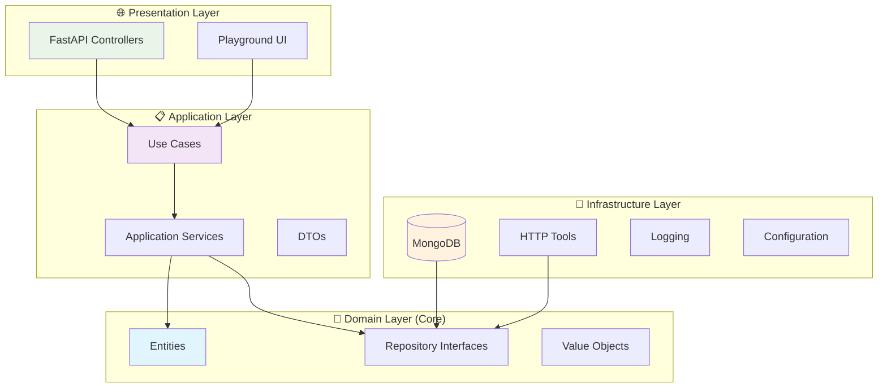
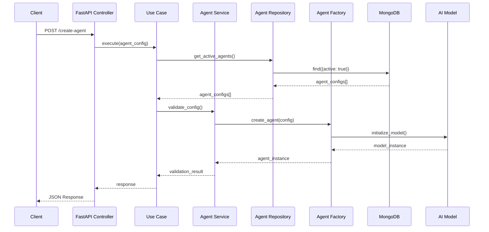
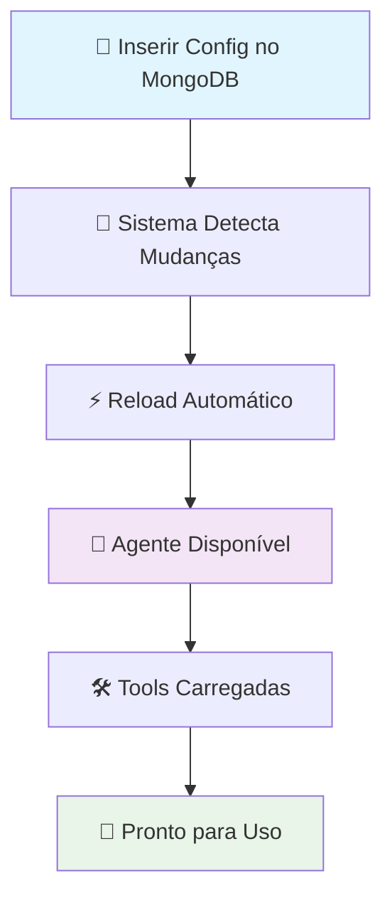
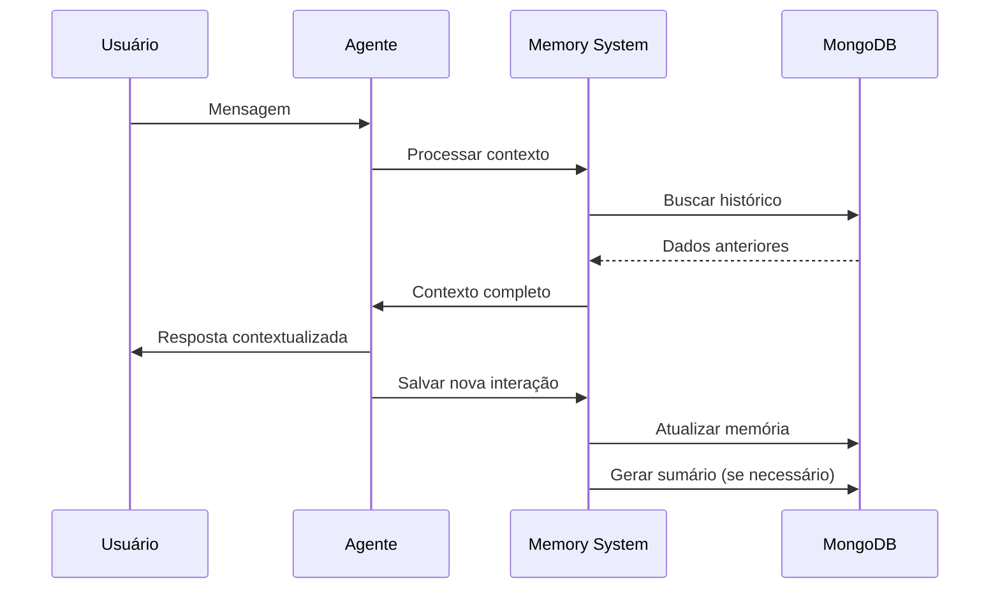

# 🤖 Orquestrador de Agentes IA

<div align="center">


*Uma aplicação Python robusta que implementa um orquestrador de agentes de IA utilizando arquitetura Onion (Clean Architecture), princípios de Clean Code e o framework **[agno](https://github.com/phidatahq/agno)***

[🇺🇸 English](README.en.md) | [📚 Documentação](#api-reference) | [🚀 Início Rápido](#início-rápido)

</div>

## 📋 Índice

- [Visão Geral](#visão-geral)
- [Arquitetura](#arquitetura)
- [Funcionalidades](#funcionalidades)
- [Início Rápido](#início-rápido)
- [Configuração](#configuração)
- [API Reference](#api-reference)
- [Testes](#testes)
- [Para Desenvolvedores](#para-desenvolvedores)
- [Contribuição](#contribuição)

## 🎯 Visão Geral

O **Orquestrador de Agentes IA** é uma aplicação enterprise-ready que permite o gerenciamento e orquestração de múltiplos agentes de inteligência artificial. Construído com foco em escalabilidade, manutenibilidade e testabilidade, utiliza as melhores práticas de desenvolvimento Python e o poderoso framework **[agno](https://github.com/agno-agi/agno/tree/main)** para orquestração de agentes.

### ✨ Destaques

- 🏗️ **Arquitetura Onion** (Clean Architecture)
- 🧪 **Clean Code** e princípios SOLID
- 🤖 **Framework agno** para orquestração avançada de agentes
- 🔄 **Multi-Agent Support** com RAG (Retrieval-Augmented Generation)
- 🛠️ **Custom Tools Integration** via HTTP APIs
- 📊 **Multiple Model Providers** (Ollama, OpenAI, Azure, etc.)
- 🌐 **RESTful API** com FastAPI
- 🎮 **Interactive Playground** para testes
- 📝 **Comprehensive Logging** estruturado
- 🧰 **Dependency Injection** container

## 🏗️ Arquitetura

A aplicação segue a **Arquitetura Onion**, garantindo baixo acoplamento e alta coesão:



### 📁 Estrutura do Projeto

```
src/
├── 🎯 domain/                    # Camada de Domínio (núcleo)
│   ├── entities/                # Entidades de negócio
│   │   ├── agent_config.py      # Configuração de agente
│   │   ├── tool.py              # Ferramentas personalizadas
│   │   └── rag_config.py        # Configuração RAG
│   └── repositories/            # Contratos de repositórios
│       ├── agent_config_repository.py
│       └── tool_repository.py
├── 📋 application/              # Camada de Aplicação
│   ├── services/               # Serviços de aplicação
│   │   ├── agent_factory_service.py
│   │   ├── model_factory_service.py
│   │   ├── http_tool_factory_service.py
│   │   └── embedder_model_factory_service.py
│   └── use_cases/             # Casos de uso
│       └── get_active_agents_use_case.py
├── 🔧 infrastructure/          # Camada de Infraestrutura
│   ├── config/                # Configurações
│   ├── database/              # Conexões de banco
│   ├── logging/               # Sistema de logs
│   ├── repositories/          # Implementações concretas
│   └── dependency_injection.py
└── 🌐 presentation/           # Camada de Apresentação
    └── controllers/           # Controllers REST
        └── orquestrador_controller.py
```

## 🤖 Framework agno

Este projeto utiliza o **[agno](https://github.com/agno-agi/agno/tree/main)**, um framework Python moderno e poderoso para construção de aplicações de IA. O agno fornece:

### 🚀 Capacidades do agno

- **🧠 Agent Orchestration**: Gerenciamento inteligente de múltiplos agentes
- **🔗 Tool Integration**: Sistema flexível para integração de ferramentas HTTP e Python
- **💾 Memory Management**: Sistema de memória persistente com suporte a MongoDB
- **📚 Knowledge Bases**: RAG (Retrieval-Augmented Generation) com embeddings
- **🌐 Model Flexibility**: Suporte nativo a múltiplos provedores (OpenAI, Ollama, Azure, etc.)
- **🔄 Async Support**: Operações assíncronas para alta performance
- **📊 Storage Systems**: Integração com MongoDB, PostgreSQL e outros

### 🛠️ Como Usamos o agno

```python
from agno.agent import Agent
from agno.storage.mongodb import MongoDbStorage
from agno.memory.v2.memory import Memory
from agno.tools import Toolkit

# Exemplo de criação de agente com agno
agent = Agent(
    model=model_instance,
    storage=MongoDbStorage(connection_string=db_url),
    memory=Memory(db=memory_db),
    tools=custom_tools,
    knowledge_base=rag_knowledge_base
)
```

### 🎯 Vantagens da Integração

- **⚡ Desenvolvimento Rápido**: APIs intuitivas e bem documentadas
- **🔧 Extensibilidade**: Fácil adição de novos modelos e ferramentas  
- **📈 Escalabilidade**: Suporte nativo a operações distribuídas
- **🛡️ Confiabilidade**: Framework battle-tested em produção

## 🔄 Fluxo de Dados



## ⚡ Funcionalidades

- **✅ Configuração Simples**: Setup em 3 comandos
- **📖 Documentação Clara**: Exemplos práticos e tutoriais
- **🔍 Logs Detalhados**: Rastreamento completo de operações
- **🧪 Testes Incluídos**: Exemplos de testes unitários e integração

- **🏗️ Arquitetura Escalável**: Padrões enterprise (DDD, CQRS-ready)
- **🔧 Extensibilidade**: Fácil adição de novos models e tools
- **📊 Observabilidade**: Métricas, health checks e structured logging
- **🔒 Segurança**: Validação de entrada e sanitização de dados

### 🎮 Funcionalidades Principais

- ✅ **Multi-Agent Management**: Gerenciamento de múltiplos agentes IA
- ✅ **RAG Integration**: Retrieval-Augmented Generation com MongoDB
- ✅ **Dynamic Configuration**: Configuração 100% dinâmica via MongoDB - sem alteração de código
- ✅ **Custom Tools Integration**: Ferramentas personalizadas via HTTP APIs (configuráveis no MongoDB)
- ✅ **Conversation Memory**: Sistema inteligente de memória e sumários de conversas
- ✅ **User Context Tracking**: Rastreamento automático de dados e preferências do usuário
- ✅ **Model Flexibility**: Suporte a múltiplos provedores (Ollama, OpenAI, Azure)
- ✅ **Interactive Playground**: Interface web para testes e interação
- ✅ **REST API**: Endpoints completos para integração externa
- ✅ **Zero-Code Configuration**: Adicione agentes, tools e configurações apenas no banco

## 🔮 Capacidades Dinâmicas

### 🎛️ Configuração Zero-Code
O sistema permite configuração **100% dinâmica** através do MongoDB, sem necessidade de alteração de código:

- **➕ Novos Agentes**: Crie agentes inserindo documentos na collection `agents_config`
- **🛠️ Ferramentas Personalizadas**: Adicione tools HTTP na collection `tools_config`
- **🔗 Vinculação Automática**: Tools são automaticamente disponibilizadas aos agentes via `tools_ids`
- **🧠 Modelos Flexíveis**: Suporte a qualquer provider através de `factoryIaModel`

### 💾 Sistema de Memória Inteligente
- **📝 Sumários Automáticos**: Conversas são automaticamente sumarizadas e armazenadas
- **👤 Perfil do Usuário**: Dados pessoais mencionados são extraídos e armazenados
- **🔄 Contexto Persistente**: Memória de longo prazo entre sessões
- **📊 Análise de Comportamento**: Tracking de preferências e padrões de uso

### 🔄 Fluxo de Configuração Dinâmica



## 🚀 Início Rápido

### 📋 Pré-requisitos

- Python 3.9+
- MongoDB 4.4+
- Git

### ⚡ Instalação Rápida

```bash
# 1. Clone o repositório
git clone https://github.com/Mosfet04/orquestradorIAPythonArgo.git
cd orquestradorIAPythonArgo

# 2. Instale as dependências
pip install -r requirements.txt

# 3. Execute a aplicação
python app.py
```

### 🐳 Com Docker (Recomendado)

```bash
# Clone e execute com Docker Compose
git clone https://github.com/Mosfet04/orquestradorIAPythonArgo.git
cd orquestradorIAPythonArgo
docker-compose up -d
```

### 🌐 Acesso

- **API**: http://localhost:7777/docs
- **Playground**: http://localhost:7777/playground
- **Health Check**: http://localhost:7777/health

## ⚙️ Configuração

### 🔧 Variáveis de Ambiente

```bash
# Configuração do Banco de Dados
MONGO_CONNECTION_STRING=mongodb://localhost:62659/?directConnection=true
MONGO_DATABASE_NAME=agno

# Configuração da Aplicação
APP_TITLE="Orquestrador agno"
APP_HOST=0.0.0.0
APP_PORT=7777

# Configuração de Logs
LOG_LEVEL=INFO
LOG_FORMAT=json

# Configuração de Modelos IA
OLLAMA_BASE_URL=http://localhost:11434
OPENAI_API_KEY=sua-chave-aqui
```

### 🗄️ Estrutura do MongoDB

O sistema utiliza múltiplas collections para configuração dinâmica e persistência de dados:

#### Collection: `agents_config` - Configuração de Agentes

```json
{
  "_id": ObjectId("..."),
  "id": "agent-1",
  "nome": "Assistente Geral",
  "model": "llama3.2:latest",
  "factoryIaModel": "ollama",
  "descricao": "Um assistente para tarefas gerais",
  "prompt": "Você é um assistente útil que ajuda com tarefas gerais...",
  "active": true,
  "tools_ids": ["tool-1", "tool-2"],
  "rag_config": {
    "active": true,
    "doc_name": "knowledge_base",
    "model": "text-embedding-3-small",
    "factoryIaModel": "openai"
  }
}
```

#### Collection: `tools` - Ferramentas HTTP

```json
{
  "_id": ObjectId("..."),
  "id": "tool-1",
  "name": "Weather API",
  "description": "Obtém informações meteorológicas",
  "http_config": {
    "base_url": "https://api.weather.com",
    "method": "GET",
    "endpoint": "/current",
    "headers": {
      "API-Key": "sua-chave"
    },
    "parameters": [
      {
        "name": "city",
        "type": "string",
        "description": "Nome da cidade",
        "required": true
      }
    ]
  }
}
```

#### Collection: `rag` - Base de conhecimento RAG
```json
{
  "_id": "ef02d4c0-8170-451f-bedf-8d9056b712ad",
  "name": "basic-prog",
  "content": "contet-text is here",
  "meta_data": {
    "chunk": 1,
    "chunk_size": 4988
  },
  "embedding": [
    0.0068855467,
    0.010898234
  ]
}
```

#### Collection: `user_memories` - Base de conhecimento RAG
```json
{
  "_id": ObjectId("..."),
  "id": "ef02d4c0-8170-451f-bedf-8d9056b712ad",
  "_version": 1,
  "created_at": 1755293707,
  "memory": {
    "memory_id": "ef02d4c0-8170-451f-bedf-8d9056b712ad",
    "memory": "O nome do usuário é Mateus ",
    "topics": [
      "name"
    ],
    "last_updated": "2025-08-15T18:35:07.646696",
    "input": "O nome do usuário é Mateus, ele tem 28 anos e é desenvolvedor de IA. Ele está construindo um orquestrador de agentes de IA."
  },
  "updated_at": 1755293707,
  "user_id": "mateusmr4_e3d5"
}
```
#### Collection: `storage` - Base de conhecimento RAG
```json
{
    "_id": {
      "$oid": "66c14b2d1d2d935413a4c3f2"
    },
    "session_id": "f8a7e3b6-5c2f-48d1-9b10-234567891234",
    "_version": 1,
    "agent_data": {
      "name": "Assistente Mock",
      "agent_id": "mock_assistant",
      "model": {
        "name": "Mock Model",
        "id": "mock-model-1.0",
        "provider": "Provider"
      }
    },
    "agent_id": "mock_assistant",
    "created_at": 1755365800,
    "extra_data": null,
    "memory": {
      "summaries": {
        "user_id_mock": {
          "f8a7e3b6-5c2f-48d1-9b10-234567891234": {
            "summary": "O usuário é um desenvolvedor de IA iniciante. O assistente é um agente de programação especializado em Agno e Python. A sessão é uma introdução e o assistente aguarda as perguntas do usuário.",
            "topics": [
              "AI Agent Development",
              "Python",
              "Agno Framework"
            ],
            "last_updated": "2025-08-16T14:45:00.000000"
          }
        }
      },
      "memories": {
        "user_id_mock": {
          "a1b2c3d4-e5f6-7890-a1b2-c3d4e5f67890": {
            "memory_id": "b1a2c3d4-e5f6-7890-a1b2-c3d4e5f67890",
            "memory": "O usuário tem interesse em aprender sobre o Agno.",
            "topics": [
              "interesse"
            ],
            "last_updated": "2025-08-16T14:45:05.000000",
            "input": "Gostaria de saber mais sobre o Agno."
          }
        }
      },
      "runs": [
        {
          "content": "Olá! Bem-vindo. Sou o Assistente Mock e estou aqui para te ajudar com dúvidas sobre desenvolvimento de agentes de IA com o Agno. Como posso ajudar?",
          "content_type": "str",
          "metrics": {
            "input_tokens": [
              100
            ],
            "output_tokens": [
              50
            ],
            "total_tokens": [
              150
            ],
            "audio_tokens": [
              0
            ],
            "input_audio_tokens": [
              0
            ],
            "output_audio_tokens": [
              0
            ],
            "cached_tokens": [
              0
            ],
            "cache_write_tokens": [
              0
            ],
            "reasoning_tokens": [
              0
            ],
            "prompt_tokens": [
              0
            ],
            "completion_tokens": [
              0
            ],
            "time": [
              1.2345
            ],
            "time_to_first_token": [
              0.5678
            ]
          },
          "model": "mock-model-1.0",
          "model_provider": "Provider",
          "run_id": "c7d8e9f0-1a2b-3c4d-5e6f-789012345678",
          "agent_id": "mock_assistant",
          "agent_name": "Assistente Mock",
          "session_id": "f8a7e3b6-5c2f-48d1-9b10-234567891234",
          "created_at": 1755365805,
          "status": "COMPLETED",
          "events": [
            {
              "created_at": 1755365805,
              "event": "RunStarted",
              "agent_id": "mock_assistant",
              "agent_name": "Assistente Mock",
              "run_id": "c7d8e9f0-1a2b-3c4d-5e6f-789012345678",
              "session_id": "f8a7e3b6-5c2f-48d1-9b10-234567891234",
              "model": "mock-model-1.0",
              "model_provider": "Provider"
            },
            {
              "created_at": 1755365806,
              "event": "RunCompleted",
              "agent_id": "mock_assistant",
              "agent_name": "Assistente Mock",
              "run_id": "c7d8e9f0-1a2b-3c4d-5e6f-789012345678",
              "session_id": "f8a7e3b6-5c2f-48d1-9b10-234567891234",
              "content": "Olá! Bem-vindo. Sou o Assistente Mock e estou aqui para te ajudar com dúvidas sobre desenvolvimento de agentes de IA com o Agno. Como posso ajudar?",
              "content_type": "str"
            }
          ],
          "messages": [
            {
              "content": "Instrução inicial do sistema para o assistente.",
              "from_history": false,
              "stop_after_tool_call": false,
              "role": "system",
              "created_at": 1755365800
            },
            {
              "content": "Olá, tudo bem?",
              "from_history": false,
              "stop_after_tool_call": false,
              "role": "user",
              "created_at": 1755365802
            },
            {
              "content": "Olá! Bem-vindo. Sou o Assistente Mock e estou aqui para te ajudar com dúvidas sobre desenvolvimento de agentes de IA com o Agno. Como posso ajudar?",
              "from_history": false,
              "stop_after_tool_call": false,
              "role": "assistant",
              "metrics": {
                "input_tokens": 100,
                "output_tokens": 50,
                "total_tokens": 150,
                "time": 1.2345,
                "time_to_first_token": 0.5678
              },
              "created_at": 1755365805
            }
          ]
        }
      ]
    },
    "session_data": {
      "session_metrics": {
        "input_tokens": 100,
        "output_tokens": 50,
        "total_tokens": 150,
        "audio_tokens": 0,
        "input_audio_tokens": 0,
        "output_audio_tokens": 0,
        "cached_tokens": 0,
        "cache_write_tokens": 0,
        "reasoning_tokens": 0,
        "prompt_tokens": 0,
        "completion_tokens": 0,
        "prompt_tokens_details": null,
        "completion_tokens_details": null,
        "additional_metrics": null,
        "time": 1.2345,
        "time_to_first_token": 0.5678,
        "timer": null
      }
    },
    "team_session_id": null,
    "updated_at": 1755365806,
    "user_id": "user_id_mock",
    "workflow_session_id": null
  }
```

### 🔄 Configuração Dinâmica

Para adicionar um novo agente, simplesmente insira um documento na collection `agents_config`:

```javascript
// Exemplo: Adicionar agente especialista em Python
db.agents_config.insertOne({
  "id": "python-expert",
  "nome": "Python Expert",
  "model": "gpt-4",
  "factoryIaModel": "openai",
  "descricao": "Especialista em desenvolvimento Python",
  "prompt": "Você é um expert em Python com 10+ anos de experiência...",
  "active": true,
  "tools_ids": ["github-tool", "stack-overflow-tool"]
});
```

O agente estará **imediatamente disponível** sem restart da aplicação!

## 🧠 Sistema de Memória e Sumários

### 💭 Como Funciona

O sistema implementa uma **memória inteligente** que:

1. **📝 Captura Contexto**: Extrai automaticamente informações relevantes das conversas
2. **👤 Perfila Usuários**: Identifica preferências, estilo de comunicação e dados pessoais
3. **📊 Gera Sumários**: Cria resumos automáticos de sessões e conversas
4. **🔄 Mantém Contexto**: Preserva informações entre sessões para continuidade

### 🎯 Dados Coletados Automaticamente

**Informações do Usuário:**
- Nome, profissão, localização (quando mencionados)
- Nível de experiência em tópicos específicos
- Preferências de comunicação (formal/informal)
- Tópicos de interesse recorrentes

**Contexto da Conversa:**
- Resumo do que foi discutido
- Problemas resolvidos
- Ações pendentes
- Sentimento geral da interação

### 🔧 Configuração da Memória

```javascript
// Habilitar memória para um agente
db.agents_config.updateOne(
  { "id": "agent-1" },
  { 
    $set: { 
      "memory_config": {
        "enabled": true,
        "max_context_length": 4000,
        "summary_frequency": "session",
        "user_profiling": true,
        "retention_days": 90
      }
    }
  }
);
```

### 📈 Fluxo de Memória



## 🔗 API Reference

### 📊 Endpoints Principais

#### **GET** `/agents`
Retorna todos os agentes ativos.

```bash
curl -X GET "http://localhost:7777/agents" \
     -H "accept: application/json"
```

**Response:**
```json
{
  "agents": [
    {
      "id": "agent-1",
      "nome": "Assistente Geral",
      "model": "llama3.2:latest",
      "descricao": "Um assistente para tarefas gerais",
      "active": true
    }
  ]
}
```

#### **POST** `/agents/{agent_id}/chat`
Envia mensagem para um agente específico.

```bash
curl -X POST "http://localhost:7777/agents/agent-1/chat" \
     -H "accept: application/json" \
     -H "Content-Type: application/json" \
     -d '{
       "message": "Olá, como você pode me ajudar?",
       "session_id": "session-123"
     }'
```

#### **GET** `/health`
Verifica o status da aplicação.

```bash
curl -X GET "http://localhost:7777/health"
```

### 📚 Documentação Interativa

Acesse http://localhost:7777/docs para a documentação Swagger completa.

## 🧪 Testes

### 🏃‍♂️ Executando Testes

```bash
# Todos os testes
pytest

# Apenas testes unitários
pytest tests/unit/ -v

# Apenas testes de integração
pytest tests/integration/ -v

# Com cobertura
pytest --cov=src --cov-report=html
```

### 📊 Cobertura de Testes

```bash
# Gerar relatório de cobertura
coverage run -m pytest
coverage html
```

O relatório será gerado em `htmlcov/index.html`.

### 🧪 Estrutura de Testes

```
tests/
├── unit/                   # Testes unitários
│   ├── domain/            # Testes de entidades
│   ├── application/       # Testes de serviços
│   └── infrastructure/    # Testes de repositórios
├── integration/           # Testes de integração
│   ├── api/              # Testes de API
│   └── database/         # Testes de banco
└── conftest.py           # Configurações pytest
```

## 👨‍💻 Para Desenvolvedores

### 🎯 Para Desenvolvedores Iniciantes

#### 🔍 Entendendo a Arquitetura

A aplicação usa **Arquitetura Onion** que separa as responsabilidades em camadas:

1. **Domain (Núcleo)**: Regras de negócio puras
2. **Application**: Orquestração e casos de uso
3. **Infrastructure**: Detalhes técnicos (BD, APIs)
4. **Presentation**: Interface com usuário

#### 📚 Conceitos Importantes

**Dependency Injection**: As dependências são injetadas automaticamente
```python
# ✅ Bom - Dependência injetada
class AgentService:
    def __init__(self, repository: IAgentRepository):
        self._repository = repository

# ❌ Ruim - Dependência hardcoded
class AgentService:
    def __init__(self):
        self._repository = MongoAgentRepository()
```

**Repository Pattern**: Abstração para acesso a dados
```python
# Interface (contrato)
class IAgentRepository:
    def get_active_agents(self) -> List[AgentConfig]:
        pass

# Implementação MongoDB
class MongoAgentRepository(IAgentRepository):
    def get_active_agents(self) -> List[AgentConfig]:
        # Implementação específica
        pass
```

### 🚀 Para Desenvolvedores Experientes

#### 🏗️ Padrões Implementados

- **Domain-Driven Design (DDD)**: Entidades ricas e repositórios
- **Command Query Responsibility Segregation (CQRS-ready)**: Separação clara de comandos e consultas
- **Factory Pattern**: Criação de agentes e ferramentas
- **Strategy Pattern**: Múltiplos provedores de modelo
- **Observer Pattern**: Sistema de logging estruturado

#### 🔧 Pontos de Extensão

**Adicionando Novo Provider de Modelo:**

Novos providers podem ser implementados visto evolucão do framework agno. Os providers atualmente aceitos são ollama, openai, anthropic, gemini, groq e azure. Atente-se a inserir as variaveis de ambiente do orquestrador seu token para consumo desses providers, obedecendo a nomeclatura de providerName_API_KEY.

Para inserir novos providers modifique o codigo model_factory_service.py.

Quanto aos embedders os providers atualmente implementados são ollama, openai, gemini e azure. O consumo de api-key se dá da mesma forma.

Para inserir novos embedders modifique o codigo embedder_model_factory_service.py.

**Adicionando Nova Ferramenta:**

Para adicionar ferramentas ao agente não temos segredos ou necessidade de alteracão de codigo. Adicione um registro a collection de tools e em agent-config, ao encontrar o agente enderecado a nova tool criada, adicione o id ao array de tools_ids.

#### 📊 Métricas e Observabilidade

```python
# Exemplo de instrumentação
@app_logger.inject
async def create_agent(agent_config: AgentConfig):
    with app_logger.timer("agent_creation"):
        # Lógica de criação
        pass
```

### 🔧 Customização Avançada

#### 🎛️ Configuração de Ambiente

```python
# src/infrastructure/config/app_config.py
class AppConfig:
    # Configurações carregadas automaticamente
    mongo_connection_string: str = os.getenv("MONGO_CONNECTION_STRING")
    app_title: str = os.getenv("APP_TITLE", "Orquestrador IA")
    
    # Validação automática
    def __post_init__(self):
        if not self.mongo_connection_string:
            raise ValueError("MONGO_CONNECTION_STRING é obrigatório")
```

#### 🔌 Sistema de Plugins

```python
# Registre plugins personalizados
class CustomPlugin:
    def setup(self, container: DependencyContainer):
        container.register("custom_service", CustomService)

# No app.py
container.register_plugin(CustomPlugin())
```

## 🛠️ Troubleshooting

### ❗ Problemas Comuns

#### MongoDB Connection Issues
```bash
# Verifique se o MongoDB está rodando
mongosh --eval "db.adminCommand('ismaster')"

# Teste a conexão
python -c "
from pymongo import MongoClient
client = MongoClient('mongodb://localhost:62659/?directConnection=true')
print(client.admin.command('ismaster'))
"
```

#### Model Provider Issues
```bash
# Teste Ollama
curl http://localhost:11434/api/tags

# Teste OpenAI
python -c "
import openai
openai.api_key = 'sua-chave'
print(openai.Model.list())
"
```

### 📝 Logs de Debug

```bash
# Ative logs detalhados
export LOG_LEVEL=DEBUG
python app.py
```

## 🤝 Contribuição

### 🎯 Como Contribuir

1. **Fork** o projeto
2. **Crie** uma branch para sua feature (`git checkout -b feature/AmazingFeature`)
3. **Commit** suas mudanças (`git commit -m 'Add some AmazingFeature'`)
4. **Push** para a branch (`git push origin feature/AmazingFeature`)
5. **Abra** um Pull Request

### 📋 Guidelines

- Siga os princípios de Clean Code
- Mantenha cobertura de testes > 80%
- Documente APIs públicas
- Use conventional commits

### 🧪 Antes de Submeter

```bash
# Execute os testes
pytest

# Verifique o linting
black . && isort . && flake8

# Verifique a cobertura
pytest --cov=src --cov-report=term-missing
```

## 📄 Licença

Este projeto está licenciado sob a MIT License - veja o arquivo [LICENSE](LICENSE) para detalhes.

## 🙏 Agradecimentos

- **[agno](https://github.com/agno-agi/agno/tree/main)** - Framework fundamental para orquestração de agentes IA
- [FastAPI](https://fastapi.tiangolo.com/) pela excelente framework web
- [MongoDB](https://www.mongodb.com/) pelo banco de dados NoSQL robusto
- Comunidade Python pelas bibliotecas incríveis e código aberto

---

<div align="center">

**[⬆ Voltar ao topo](#orquestrador-de-agentes-ia)**

Feito com ❤️ por [Mateus Meireles Ribeiro](https://github.com/Mosfet04)

</div>
