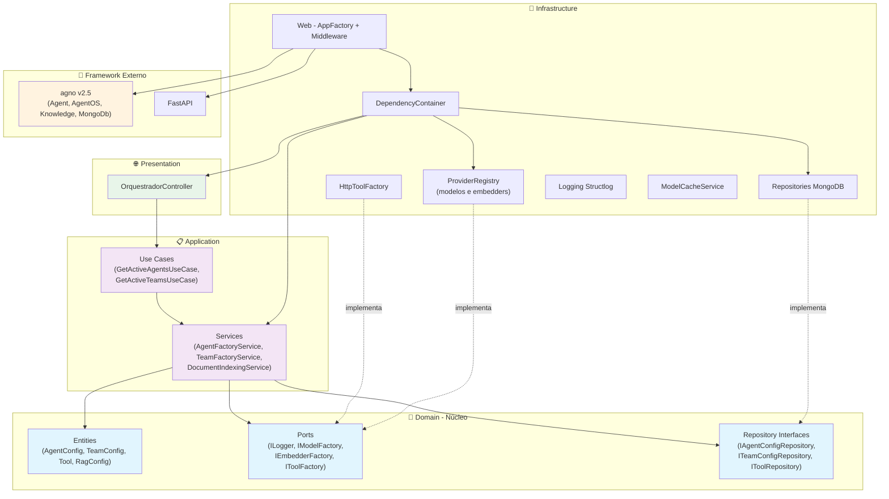
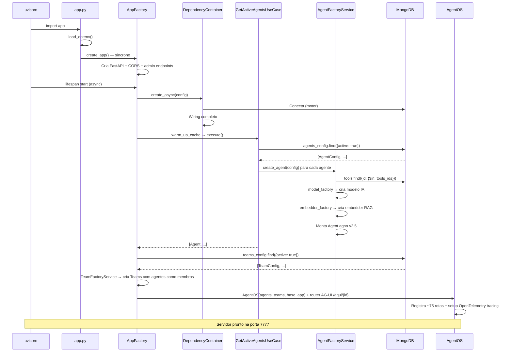
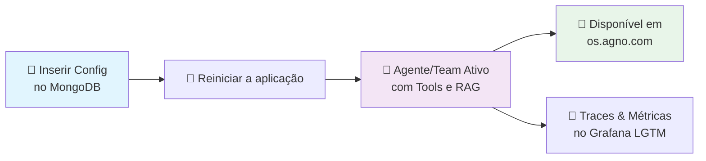
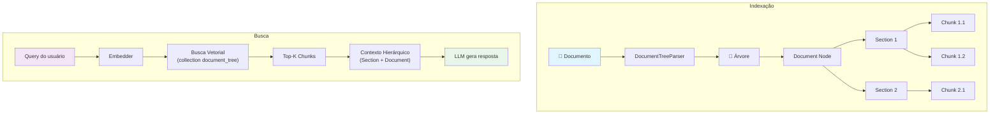
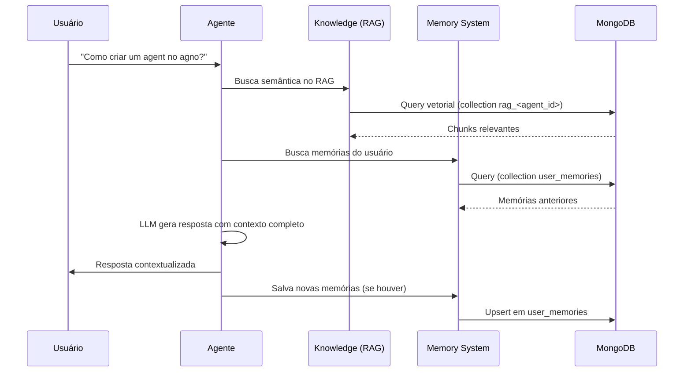

# 🤖 Orquestrador de Agentes IA

<div align="center">


[](https://app.codacy.com/gh/Mosfet04/orquestradorIAPythonArgo/dashboard?utm_source=gh&utm_medium=referral&utm_content=&utm_campaign=Badge_grade)
[](https://app.codacy.com/gh/Mosfet04/orquestradorIAPythonArgo/dashboard?utm_source=gh&utm_medium=referral&utm_content=&utm_campaign=Badge_coverage)


*Orquestrador de agentes de IA construído com arquitetura Onion (Clean Architecture), princípios SOLID e o framework **[agno v2.5](https://github.com/agno-agi/agno)***

[🇺🇸 English](README.en.md) | [🚀 Início Rápido](#-início-rápido) | [📚 Arquitetura](#-arquitetura)

</div>

---

## 📋 Índice

- [Visão Geral](#-visão-geral)
- [Início Rápido](#-início-rápido)
- [Arquitetura](#-arquitetura)
- [Funcionalidades](#-funcionalidades)
- [Configuração](#-configuração)
- [Autenticação](#-autenticação)
- [Endpoints da API](#-endpoints-da-api)
- [Frontend (os.agno.com)](#-frontend-osagnocom)
- [Banco de Dados (MongoDB)](#-banco-de-dados-mongodb)
- [Sistema de Memória e RAG](#-sistema-de-memória-e-rag)
- [Testes](#-testes)
- [Guia para Desenvolvedores](#-guia-para-desenvolvedores)
- [Troubleshooting](#-troubleshooting)
- [Contribuição](#-contribuição)

---

## 🎯 Visão Geral

O **Orquestrador de Agentes IA** é uma aplicação que gerencia e orquestra múltiplos agentes de inteligência artificial. Cada agente, suas ferramentas (tools) e configurações são definidos **exclusivamente no MongoDB** — sem alterar código para adicionar agentes, trocar modelos ou vincular ferramentas.

### Principais Características

| Característica | Descrição |
|---|---|
| **Configuração Zero-Code** | Agentes, teams, tools e RAG configuráveis apenas no MongoDB |
| **Multi-Agent Teams** | Teams multi-agente com modos route, coordinate, broadcast e tasks |
| **Multi-Provider** | Ollama, OpenAI, Anthropic, Gemini, Groq e Azure |
| **RAG integrado** | Retrieval-Augmented Generation com embeddings persistidos no MongoDB |
| **RAG Hierárquico** | Árvore de documentos com busca semântica + hierárquica (Strategy Pattern) |
| **Memória inteligente** | Memória de longo prazo com sumários automáticos e perfil de usuário |
| **Observabilidade via Grafana LGTM** | Traces, métricas e logs agora são enviados ao Grafana (Tempo, Loki, Prometheus) usando OpenTelemetry. O MongoDB não é mais utilizado para observabilidade.|
| **AgentOS + AG-UI** | Interface web via [os.agno.com](https://os.agno.com) com streaming SSE |
| **Arquitetura limpa** | Camadas Domain → Application → Infrastructure → Presentation |
| **Testes unitários, de contrato e golden** | Cobertura ~93% (branch) de todas as camadas |

---

## 🚀 Início Rápido

### Pré-requisitos

- **Python 3.11+** (recomendado; 3.9+ com limitações)
- **MongoDB 4.4+** (local ou Atlas)
- **Git**

### Instalação Local

```bash
# 1. Clone o repositório
git clone https://github.com/Mosfet04/orquestradorIAPythonArgo.git
cd orquestradorIAPythonArgo

# 2. Crie e ative o ambiente virtual
python -m venv .venv

# Windows PowerShell
.\.venv\Scripts\Activate.ps1

# Linux / macOS
source .venv/bin/activate

# 3. Instale as dependências (versões fixas, com verificação de hash)
pip install --require-hashes -r requirements.lock
# para desenvolvimento (testes, ruff, mypy, import-linter...):
# pip install --require-hashes -r requirements.lock -r requirements-dev.lock

# 4. Configure as variáveis de ambiente
cp .env.example .env   # ou crie manualmente (veja seção Configuração)

# 5. Inicie a aplicação
python app.py
```

#### Dependências e arquivos de lock

| Arquivo | Papel |
|---|---|
| `requirements.in` | Dependências diretas de runtime (`agno==2.5.8` exato) |
| `requirements.lock` | Gerado por `pip-compile --generate-hashes`; versões exatas + hashes |
| `requirements-dev.in` / `requirements-dev.lock` | Testes e ferramentas de qualidade (pytest, pytest-randomly, pytest-xdist, ruff, mypy, import-linter, bandit, pip-audit, diff-cover, respx, pip-tools) |
| `requirements.txt` | Só compatibilidade: `-r requirements.lock` |

- O lock é gerado em Linux/CPython 3.12 e validado para Linux CPython 3.11/3.12 (Docker e CI). No Windows nativo, se o `--require-hashes` falhar, use WSL/Docker ou regenere o lock localmente.
- `uvloop` só é instalado fora do Windows (`sys_platform != "win32"`); o `app.py` o importa com guarda e só o usa fora do Windows (no Windows, loop padrão).
- Extras opcionais, **não instalados por padrão** (fora do lock): `PyJWT` (auth JWT do AgentOS), `mcp` (tools MCP), `anthropic` e `groq` (providers de modelo). Para adotar um deles, acrescente-o ao `requirements.in` e regenere o lock. Sem o pacote, agente/team com aquele provider não carrega e o log diz qual pacote instalar (ex.: `pip install groq`).
- Nunca edite um `.lock` à mão. Comandos de regeneração: [CONTRIBUTING.md](CONTRIBUTING.md#dependencies-and-lock-files).

### Com Docker Compose

Nenhuma credencial fica nos arquivos compose: tudo vem do `.env`, e as variáveis obrigatórias (`${VAR:?}`) fazem o compose recusar subir se estiverem vazias.

```bash
git clone https://github.com/Mosfet04/orquestradorIAPythonArgo.git
cd orquestradorIAPythonArgo
cp .env.example .env   # preencha MONGO_CONNECTION_STRING, API_KEY_RUN e API_KEY_ADMIN (e MONGO_ROOT_*/MONGO_EXPRESS_* para o modo dev)

# Só a aplicação (porta 7777), com MongoDB/Ollama externos definidos no .env.
# Exige MONGO_CONNECTION_STRING, API_KEY_RUN e API_KEY_ADMIN (o container faz bind em 0.0.0.0).
docker compose up -d

# Desenvolvimento: aplicação + MongoDB + Ollama + mongo-express locais
docker compose -f docker-compose.yml -f docker-compose.dev.yml up -d
```

- O app no container recebe do `.env` as chaves de provider, `ENVIRONMENT`, `USE_TLS` etc. (repasse puro: variável ausente no `.env` fica ausente no container); `APP_HOST`/`APP_PORT` ficam com o Dockerfile.
- `docker-compose.yml` só tem o app, endurecido (`no-new-privileges`, `cap_drop: ALL`, `read_only` com `/tmp` em tmpfs, sem bind mount) e sem porta de banco.
- `docker-compose.dev.yml` acrescenta MongoDB (27017), Ollama (11434) e mongo-express (8081), com porta publicada só em `127.0.0.1`, e aponta o app do container para eles (`mongodb://...@mongodb:27017`, `OLLAMA_BASE_URL=http://ollama:11434`), independente do que o `.env` usa para rodar o app no host. `MONGO_ROOT_USERNAME`/`MONGO_ROOT_PASSWORD` entram numa URL: use valores URL-safe.
- `OLLAMA_BASE_URL` vazio deixa o cliente ollama/agno decidir (`OLLAMA_HOST`, `http://localhost:11434` ou Ollama Cloud com só a `OLLAMA_API_KEY`).
- A imagem (Python 3.12) instala só pelo `requirements.lock` com hash, roda como UID/GID 10001 sem privilégios, faz bind em `0.0.0.0` (`APP_HOST` do Dockerfile) e tem HEALTHCHECK em `/livez` (público, sem dependências). Fora do container o default de `APP_HOST` é `127.0.0.1`.
- O `.dockerignore` é uma allowlist: só `app.py`, `src/`, `docs/` (sem `docs/roadmap` e `docs/qa`) e `requirements.lock` entram no contexto de build (sem `.env*`, `*.env`, `.envrc`, `*.log` e `__pycache__`, inclusive em subpastas). Arquivo novo que a imagem precise tem de ser reincluído lá.
- O Grafana LGTM não faz parte deste compose: aponte `OTEL_EXPORTER_OTLP_ENDPOINT` para o seu coletor (ou `OTEL_ENABLED=false`).

### Verificação

Após iniciar, acesse (com chaves configuradas, todas exceto `/livez` pedem `Authorization: Bearer <chave>`; ver [Autenticação](#-autenticação)):

| URL | Descrição |
|---|---|
| http://localhost:7777/health | Health check (AgentOS nativo) |
| http://localhost:7777/docs | Documentação OpenAPI / Swagger (por padrão só com `ENVIRONMENT=development`; ver `ENABLE_DOCS`) |
| http://localhost:7777/config | Configuração do AgentOS (agentes, databases) |
| http://localhost:7777/agents | Lista de agentes ativos |
| http://localhost:3000 | UI Grafana (dashboards, traces, métricas, logs) |

---


## 📊 Observabilidade (Grafana LGTM)

Toda a observabilidade (traces, métricas, logs) agora é feita pela stack Grafana LGTM:

- **Grafana Tempo**: Traces
- **Grafana Loki**: Logs
- **Prometheus/Mimir**: Métricas
- **Grafana**: Dashboards (inclui Datadog-style)

O SDK OpenTelemetry é usado para exportar todos os dados de telemetria. O MongoDB não é mais utilizado para armazenar traces ou logs.

Métricas de run (`MetricsMiddleware`, só `POST /agents/{id}/runs` e `POST /teams/{id}/runs`; cada request conta no máximo um erro):

- `agent_errors_total{agent_id}` / `team_errors_total{team_id}`: run com falha. O Agno captura a exceção do run e o AgentOS responde 200, então o middleware também lê a resposta: evento SSE `RunError` (agente) ou `TeamRunError` (team; `RunError` de membro dentro do stream do team não conta), ou JSON (`stream=false`) com `status == "ERROR"` no topo. Exceção que escapa da rota e status >= 400 também contam. Cancelamento pelo cliente não é erro.
- `agent_requests_total{agent_id}` / `team_requests_total{team_id}`: requests de run, com `status="error"` quando o run falhou (senão `"success"`); resposta 4xx (ex.: id inexistente ou form inválido) é registrada como `unknown`.
- `agents_active{agent_id}`: runs de agente em andamento; sempre liberado ao fim do request, inclusive com exceção ou cancelamento.

Falha ao carregar agentes/teams do config store fica no log, não nessas métricas.

---

## 🏗️ Arquitetura

A aplicação segue a **Arquitetura Onion** (também chamada Clean Architecture / Hexagonal). A regra de ouro é: **dependências apontam para dentro** — camadas externas dependem das internas, nunca o contrário.


```mermaid
graph TB
    subgraph "🎯 Domain - Núcleo"
        E["Entities<br/>(AgentConfig, TeamConfig, Tool, RagConfig)"]
        RP["Ports<br/>(ILogger, IModelFactory,<br/>IEmbedderFactory, IToolFactory)"]
        RI["Repository Interfaces<br/>(IAgentConfigRepository,<br/>ITeamConfigRepository, IToolRepository)"]
    end

    subgraph "📋 Application"
        UC["Use Cases<br/>(GetActiveAgentsUseCase,<br/>GetActiveTeamsUseCase)"]
        AS["Services<br/>(AgentFactoryService, TeamFactoryService,<br/>DocumentIndexingService)"]
    end

    subgraph "🔧 Infrastructure"
        DB["Repositories MongoDB"]
        WEB["Web - AppFactory + Middleware"]
        HTTP["HttpToolFactory"]
        PROV["ProviderRegistry<br/>(modelos e embedders)"]
        LOG["Logging Structlog"]
        CACHE["ModelCacheService"]
        DI["DependencyContainer"]
    end

    subgraph "🌐 Presentation"
        CTRL["OrquestradorController"]
    end

    subgraph "🤖 Framework Externo"
        AGNO["agno v2.5<br/>(Agent, AgentOS, Knowledge, MongoDb)"]
        FAST["FastAPI"]
    end

    CTRL --> UC
    UC --> AS
    AS --> E
    AS --> RI
    AS --> RP
    DB -.->|implementa| RI
    HTTP -.->|implementa| RP
    PROV -.->|implementa| RP
    DI --> PROV
    DI --> CTRL
    DI --> AS
    DI --> DB
    WEB --> DI
    WEB --> FAST
    WEB --> AGNO

    style E fill:#e1f5fe
    style RP fill:#e1f5fe
    style RI fill:#e1f5fe
    style UC fill:#f3e5f5
    style AS fill:#f3e5f5
    style CTRL fill:#e8f5e9
    style AGNO fill:#fff3e0
```

### Estrutura de Pastas

```
orquestradorIAPythonArgo/
├── app.py                          # Ponto de entrada — cria o FastAPI app
├── pyproject.toml                  # Config. das ferramentas (ruff, mypy, pytest, coverage, import-linter, bandit)
├── requirements.in / .lock         # Dependências de runtime (lock com hashes)
├── requirements-dev.in / .lock     # Dependências de desenvolvimento (lock com hashes)
├── docker-compose.yml              # MongoDB + Ollama + Grafana LGTM + App
├── Dockerfile                      # Build da imagem Docker
├── .env                            # Variáveis de ambiente (NÃO commitado)
├── docs/                           # Documentos para RAG (ex: basic-prog.txt)
├── mongo-init/                     # Scripts de inicialização do MongoDB
│   └── init-db.js
├── logs/                           # Logs da aplicação
│
├── src/
│   ├── domain/                     # 🎯 CAMADA DE DOMÍNIO (sem dependências externas)
│   │   ├── entities/
│   │   │   ├── agent_config.py     #   Entidade: configuração de um agente
│   │   │   ├── team_config.py      #   Entidade: configuração de um team multi-agente
│   │   │   ├── tool.py             #   Entidade: ferramenta HTTP (Tool, ToolParameter)
│   │   │   ├── rag_config.py       #   Entidade: configuração de RAG + SearchStrategy
│   │   │   ├── document_node.py    #   Entidade: nó hierárquico (Document/Section/Chunk)
│   │   │   └── search_result.py    #   Entidade: resultado de busca RAG
│   │   ├── ports/                  #   Contratos (interfaces) para adaptadores
│   │   │   ├── logger_port.py      #     ILogger
│   │   │   ├── model_factory_port.py #   IModelFactory
│   │   │   ├── embedder_factory_port.py # IEmbedderFactory
│   │   │   ├── tool_factory_port.py #    IToolFactory
│   │   │   ├── agent_builder_port.py #   IAgentBuilder
│   │   │   ├── document_parser_port.py # IDocumentParser
│   │   │   ├── knowledge_search_port.py # IKnowledgeSearchStrategy
│   │   │   └── document_tree_repository_port.py # IDocumentTreeRepository
│   │   └── repositories/          #   Contratos de repositórios
│   │       ├── agent_config_repository.py  # IAgentConfigRepository
│   │       ├── team_config_repository.py   # ITeamConfigRepository
│   │       └── tool_repository.py          # IToolRepository
│   │
│   ├── application/                # 📋 CAMADA DE APLICAÇÃO (orquestração)
│   │   ├── services/
│   │   │   ├── agent_factory_service.py       # Cria agentes agno a partir de AgentConfig
│   │   │   ├── team_factory_service.py        # Cria teams agno a partir de TeamConfig
│   │   │   ├── knowledge_search_factory.py    # Factory de estratégias de busca RAG
│   │   │   ├── document_indexing_service.py   # Indexação de documentos hierárquicos
│   │   │   └── search_strategies/             # Strategy Pattern para busca RAG
│   │   │       ├── semantic_search_strategy.py    # Busca semântica (agno nativo)
│   │   │       └── hierarchical_search_strategy.py # Busca hierárquica (document tree)
│   │   └── use_cases/
│   │       ├── get_active_agents_use_case.py  # Busca configs ativas e cria agentes
│   │       └── get_active_teams_use_case.py   # Busca configs ativas e cria teams
│   │
│   ├── infrastructure/             # 🔧 CAMADA DE INFRAESTRUTURA (implementações)
│   │   ├── config/
│   │   │   └── app_config.py       #   AppConfig — carrega variáveis de ambiente
│   │   ├── cache/
│   │   │   └── model_cache_service.py # Cache de modelos já instanciados
│   │   ├── database/               #   (reservado para futuras conexões)
│   │   ├── http/
│   │   │   └── http_tool_factory.py #   Cria Functions agno a partir de configs HTTP
│   │   ├── providers/
│   │   │   ├── registry.py         #   ProviderRegistry: modelos e embedders por spec (IModelFactory/IEmbedderFactory)
│   │   │   └── builtins.py         #   Specs built-in: ollama, openai, anthropic, gemini, groq, azure, openai_compatible
│   │   ├── security/
│   │   │   └── ssrf.py             #   Guarda de destino: metadata/link-local sempre recusados
│   │   ├── logging/
│   │   │   ├── structlog_logger.py #   Configuração única do logging (structlog) + sanitização
│   │   │   ├── logger_adapter.py   #   Adapter: structlog → ILogger
│   │   │   └── decorators.py       #   Decorators de logging
│   │   ├── repositories/
│   │   │   ├── mongo_base.py       #   Classe base para repos MongoDB
│   │   │   ├── mongo_agent_config_repository.py  # IAgentConfigRepository → MongoDB
│   │   │   ├── mongo_team_config_repository.py   # ITeamConfigRepository → MongoDB
│   │   │   ├── mongo_tool_repository.py          # IToolRepository → MongoDB
│   │   │   └── mongo_document_tree_repository.py # IDocumentTreeRepository → MongoDB
│   │   ├── parsers/
│   │   │   └── text_document_parser.py #  Parser de documentos de texto → árvore
│   │   ├── tools/
│   │   │   └── hierarchical_search_tool.py # Tool de busca hierárquica (agno Toolkit)
│   │   ├── services/
│   │   │   └── llm_summary_generator.py #  Gerador de sumários de seção via LLM
│   │   ├── web/
│   │   │   └── app_factory.py      #   AppFactory — cria FastAPI + AgentOS + AG-UI por entidade
│   │   └── dependency_injection.py #   DependencyContainer — Composition Root
│   │
│   └── presentation/               # 🌐 CAMADA DE APRESENTAÇÃO
│       └── controllers/
│       └── orquestrador_controller.py # Cache inteligente de agentes/teams + warm-up
│
└── tests/
    ├── conftest.py                 # Fixtures compartilhadas; markers por diretório; --update-golden
    ├── fakes/                      # FakeChatModel, FakeEmbedder, repositórios em memória
    ├── golden/                     # Snapshot dos kwargs de Agent/Team (atualiza só com --update-golden)
    ├── contract/                   # Mesma suíte para toda implementação de uma porta
    └── unit/                       # Testes unitários
        ├── test_agent_config.py
        ├── test_agent_factory_service.py
        ├── test_agent_factory_extended.py
        ├── test_app_config.py
        ├── test_app_factory.py
        ├── test_app_factory_extended.py
        ├── test_app_integration.py
        ├── test_dependency_injection.py
        ├── test_document_indexing_service.py
        ├── test_document_node.py
        ├── test_builtin_providers.py
        ├── test_get_active_agents_use_case.py
        ├── test_get_active_teams_use_case.py
        ├── test_hierarchical_integration.py
        ├── test_hierarchical_search_strategy.py
        ├── test_hierarchical_search_tool.py
        ├── test_http_tool_factory.py
        ├── test_http_tool_factory_extended.py
        ├── test_knowledge_search_factory.py
        ├── test_logger_adapter.py
        ├── test_logging_decorators.py
        ├── test_logging_decorators_extended.py
        ├── test_metrics_middleware.py
        ├── test_model_cache_service.py
        ├── test_provider_matrix.py
        ├── test_provider_registry.py
        ├── test_mongo_agent_config_repository.py
        ├── test_mongo_base.py
        ├── test_mongo_team_config_repository.py
        ├── test_mongo_team_config_repository_extended.py
        ├── test_mongo_tool_repository_extended.py
        ├── test_orquestrador_controller.py
        ├── test_orquestrador_controller_extended.py
        ├── test_otel_setup.py
        ├── test_rag_config_strategy.py
        ├── test_search_result.py
        ├── test_structlog_logger.py
        ├── test_structlog_logger_extended.py
        ├── test_team_config.py
        ├── test_team_factory_service.py
        ├── test_telemetry.py
        ├── test_text_document_parser.py
        └── test_tool.py
```

### Fluxo de Inicialização


```mermaid
sequenceDiagram
    participant U as uvicorn
    participant A as app.py
    participant F as AppFactory
    participant DI as DependencyContainer
    participant UC as GetActiveAgentsUseCase
    participant AF as AgentFactoryService
    participant MDB as MongoDB
    participant OS as AgentOS

    U->>A: import app
    A->>A: load_dotenv()
    A->>F: create_app() — síncrono
    F->>F: Cria FastAPI + CORS + admin endpoints
    U->>F: lifespan start (async)
    F->>DI: create_async(config)
    DI->>MDB: Conecta (motor)
    DI->>DI: Wiring completo
    F->>UC: warm_up_cache → execute()
    UC->>MDB: agents_config.find({active: true})
    MDB-->>UC: [AgentConfig, ...]
    UC->>AF: create_agent(config) para cada agente
    AF->>MDB: tools.find({id: {$in: tools_ids}})
    AF->>AF: model_factory → cria modelo IA
    AF->>AF: embedder_factory → cria embedder RAG
    AF->>AF: Monta Agent agno v2.5
    UC-->>F: [Agent, ...]
    F->>MDB: teams_config.find({active: true})
    MDB-->>F: [TeamConfig, ...]
    F->>F: TeamFactoryService → cria Teams com agentes como membros
    F->>OS: AgentOS(agents, teams, base_app) + router AG-UI /agui/{id}
    OS->>OS: Registra ~75 rotas + setup OpenTelemetry tracing
    Note over U,OS: Servidor pronto na porta 7777
```

---

## ⚡ Funcionalidades

### Funcionalidades Principais

- ✅ **Multi-Agent** — Vários agentes IA rodando simultaneamente, cada um com modelo, tools e RAG próprios
- ✅ **Multi-Agent Teams** — Teams com modos `route` (roteamento inteligente), `coordinate` (coordenação), `broadcast` (envio a todos) e `tasks` (tarefas atribuídas)
- ✅ **Configuração Zero-Code** — Adicione agentes, teams, tools e bases RAG apenas no MongoDB
- ✅ **Multi-Provider** — Ollama, OpenAI, Anthropic, Gemini, Groq e Azure OpenAI
- ✅ **RAG (Retrieval-Augmented Generation)** — Documentos na pasta `docs/` são embedados e persistidos no MongoDB
- ✅ **Memória Inteligente** — Memória de usuário e sumários de sessão (configurável por agente/team)
- ✅ **Observabilidade via Grafana LGTM** — Traces, métricas e logs exportados ao Grafana (Tempo, Loki, Prometheus) via OpenTelemetry
- ✅ **Custom HTTP Tools** — Integre qualquer API HTTP como ferramenta do agente
- ✅ **AgentOS + AG-UI** — Interface web via [os.agno.com](https://os.agno.com) com streaming SSE em tempo real
- ✅ **Cache de Agentes** — TTL de 5 minutos com fallback para cache expirado em caso de erro
- ✅ **Health Check Detalhado** — Verifica MongoDB, memória do sistema, tempo de resposta
- ✅ **Logging Estruturado** — Structlog com sanitização de dados sensíveis
- ✅ **Docker Compose** — MongoDB + Ollama + Grafana LGTM + App em um comando

### Capacidades Dinâmicas


```mermaid
graph LR
    A["📝 Inserir Config<br/>no MongoDB"] --> B["🔄 Reiniciar a aplicação"]
    B --> C["🤖 Agente/Team Ativo<br/>com Tools e RAG"]
    C --> D["💬 Disponível em<br/>os.agno.com"]
    C --> E["📡 Traces & Métricas<br/>no Grafana LGTM"]

    style A fill:#e1f5fe
    style C fill:#f3e5f5
    style D fill:#e8f5e9
```

---

## ⚙️ Configuração

### Variáveis de Ambiente

Crie um arquivo `.env` na raiz do projeto:

```bash
# ═══ Obrigatório ═══
MONGO_CONNECTION_STRING=mongodb://localhost:27017/?directConnection=true
MONGO_DATABASE_NAME=agno

# ═══ Aplicação ═══
APP_TITLE="Orquestrador de Agentes IA"
APP_HOST=127.0.0.1
APP_PORT=7777
LOG_LEVEL=INFO

# ═══ Providers de Modelo (configure conforme necessário) ═══
OLLAMA_BASE_URL=http://localhost:11434

# Apenas se usar OpenAI:
# OPENAI_API_KEY=sk-...

# Apenas se usar Gemini:
# GEMINI_API_KEY=AI...

# Apenas se usar Anthropic:
# ANTHROPIC_API_KEY=sk-ant-...

# Apenas se usar Groq:
# GROQ_API_KEY=gsk_...

# Apenas se usar Azure OpenAI:
# AZURE_API_KEY=...
# AZURE_ENDPOINT=https://xxx.openai.azure.com/
# AZURE_VERSION=2024-02-01
# SECRETS_DIR=/run/secrets   # raiz dos api_key_ref "file:/..." (arquivo fora dela é recusado); relativo ou "/" impede o app de iniciar
# MODEL_BASE_URL_ALLOWLIST=llm.interno.example,10.0.0.5   # hosts aceitos em base_url dos documentos (só host); liste só hosts confiáveis para receber as chaves de provider do processo

# ═══ OpenTelemetry (opcional) ═══
OTEL_ENABLED=true
OTEL_EXPORTER_OTLP_ENDPOINT=http://localhost:4317   # Docker: http://grafana-lgtm:4317
OTEL_SERVICE_NAME=orquestrador-ia

# ═══ Borda HTTP ═══
# API_KEY_RUN=...              # chaves da borda (ver Autenticação); sem elas, só modo dev local (loopback + development/test)
# API_KEY_ADMIN=...
# ENVIRONMENT=development      # development | test | staging | production (outro valor: o app não inicia); ausente = development no host, production na imagem Docker
# ENABLE_DOCS=true             # /docs, /redoc, /openapi.json; vazio = ligado só em development
# CORS_ALLOWED_ORIGINS=https://os.agno.com,http://localhost:3000   # vírgula; vazio = default; cada item é http(s)://host[:porta] (sem barra final/path); "*" e null são recusados
# AGNO_TELEMETRY=false         # o app assume false se ausente (Agent/Team/AgentOS já usam telemetry=False)
```

> **CORS**: métodos `GET, POST, PUT, PATCH, DELETE, OPTIONS` e headers `Authorization, Content-Type, X-API-Key` (mais os CORS-safelisted); nenhum header de resposta é exposto. O AgentOS recebe a mesma lista de origens; o CORS do app é reaplicado depois da montagem (inclusive se ela falhar) e é sempre o middleware mais externo, então as origens padrão do Agno não entram.

> **Telemetria do Agno**: `AGNO_TELEMETRY=true` explícito religa a telemetria de Agent/Team (o Agno 2.5.8 deixa a variável sobrepor o `telemetry=False`); o AgentOS continua desligado. Resíduo conhecido: os evals criados pela rota `/eval-runs` do AgentOS (`agno/os/routers/evals/utils.py`) usam o default `telemetry=True` do Agno e ignoram `AGNO_TELEMETRY`; revisão prevista na F3 (Agno 3.x).

> **Convenção de API Keys**: o orquestrador busca automaticamente `{PROVIDER}_API_KEY` no ambiente. Exemplo: para `factoryIaModel: "gemini"`, busca `GEMINI_API_KEY`.

---

## 🔐 Autenticação

Toda rota exige chave de API, exceto `GET /livez` e o preflight CORS (`OPTIONS` com `Origin` e `Access-Control-Request-Method`). A regra é default-deny: rota que não está na lista de admin (inclusive rota que não existe, que só vira 404 depois da chave) exige a chave **run**.

- **Chaves**: `API_KEY_RUN` (uso dos agentes) e `API_KEY_ADMIN` (operação; vale também onde a run vale). As duas juntas, diferentes entre si, com ao menos 32 caracteres ASCII visíveis. Gere cada uma com `python -c "import secrets; print(secrets.token_urlsafe(32))"`.
- **Credencial**: `Authorization: Bearer <chave>` ou `X-API-Key: <chave>`. Com os dois headers vale o Bearer.
- **Rotas admin** (só `API_KEY_ADMIN`): `/admin/*`, `/metrics` e `/metrics/*`, `/databases/*`, `/eval-runs*`, `/components*`, `/schedules*`, `/registry*`, `POST /optimize-memories` (reescreve memórias de qualquer `user_id` com o modelo que o request escolher); `DELETE` em `/sessions*` e `/memories*`; `POST|PUT|PATCH|DELETE` em `/knowledge*` (inclusive `POST /knowledge/search`, que devolve o texto dos chunks de toda a base e gera custo de embedding); `/docs`, `/redoc` e `/openapi.json` fora de `ENVIRONMENT=development`.
- **Rotas run**: todo o resto (runs de agente/team, `/agui` e `/agui/{id}`, `/agents`, `/teams`, `/sessions`, `/memories` exceto `DELETE`, `/config`, `/health`, WebSocket `/workflows/ws`...).
- **Respostas**: `401 {"detail":"unauthorized"}` + `WWW-Authenticate: Bearer` sem credencial ou com chave inválida; `403 {"detail":"forbidden"}` com a chave run em rota admin. WebSocket sem chave válida é recusado no handshake (`websocket.close` 1008 antes do accept; o servidor responde 403). O WebSocket só autentica por header (`Authorization`/`X-API-Key`): navegador não manda header customizado no handshake, então com chaves configuradas o `/workflows/ws` só é usável por cliente não-navegador. O 401 de uma origem permitida leva os headers CORS.
- **Fail-closed**: sem nenhuma chave o app só inicia com `APP_HOST` em loopback (`127.0.0.0/8`, `::1`, `localhost`) **e** `ENVIRONMENT` `development` ou `test`; nesse modo dev local não há chave (aviso no log), mas cada request só passa se o cliente, o endereço local do servidor e o header `Host` (`localhost`, `127.x`, `[::1]`, porta opcional) forem loopback (socket UNIX não é suportado nesse modo) e se não vier de outro site no navegador: `Origin` presente precisa estar em `CORS_ALLOWED_ORIGINS` (origem permitida passa mesmo `cross-site`, como os.agno.com → localhost) e, sem `Origin`, `Sec-Fetch-Site: cross-site` é recusado. O resto recebe 401 (WebSocket: 1008). `/livez` segue público. Em qualquer outro caso (ex.: `0.0.0.0`, ou `production` no loopback) o app recusa iniciar com erro claro. Só uma das chaves também é erro.
- O `APP_HOST` decide se o app sobe sem chaves: rode por `python app.py` (que faz o bind nele). Se ele subir com `uvicorn app:app --host 0.0.0.0` direto, a guarda por request recusa quem vem de fora do loopback. **Atenção (risco residual do modo dev local):** um proxy reverso ou túnel (ngrok, `ssh -R`, port-forward) rodando no próprio host conecta pelo loopback e continua expondo o app sem chave; qualquer processo local também acessa tudo, e uma origem listada em `CORS_ALLOWED_ORIGINS` (ex.: os.agno.com) pode chamar o app pelo navegador do dev. Para expor ou restringir, configure as chaves.
- As chaves nunca são logadas (nem o header) e ficam fora do `repr` da configuração. Identidade por usuário e escopo por agente ficam para fases seguintes.

```bash
curl -H "Authorization: Bearer $API_KEY_RUN" http://localhost:7777/agents
curl -X POST -H "X-API-Key: $API_KEY_ADMIN" http://localhost:7777/admin/refresh-cache
```

---

## 🔗 Endpoints da API

Após o AgentOS montar as rotas, a aplicação expõe ~75 endpoints. Os principais:

### Rotas Nativas do AgentOS

| Método | Rota | Descrição |
|--------|------|-----------|
| `GET` | `/` | Info da API (nome, ID, versão) |
| `GET` | `/health` | Health check AgentOS (`{"status":"ok","instantiated_at":"..."}`) |
| `GET` | `/config` | Configuração do AgentOS (agentes, teams, databases) |
| `GET` | `/agents` | Lista todos os agentes ativos |
| `GET` | `/agents/{agent_id}` | Detalhes de um agente |
| `POST` | `/agents/{agent_id}/runs` | **Executa o agente** (resposta SSE streaming) |
| `GET` | `/teams` | Lista todos os teams ativos |
| `GET` | `/teams/{team_id}` | Detalhes de um team |
| `POST` | `/teams/{team_id}/runs` | **Executa o team** (resposta SSE streaming) |
| `POST` | `/agents/{agent_id}/runs/{run_id}/cancel` | Cancela um run de agente **em andamento**: 200 `{}`; run inexistente ou já encerrado = 404 (nada é guardado) |
| `POST` | `/teams/{team_id}/runs/{run_id}/cancel` | Idem para run de team |
| `GET` | `/sessions` | Lista sessões |
| `GET` | `/sessions/{session_id}` | Detalhes de uma sessão (histórico de mensagens) |
| `GET` | `/knowledge/content` | Lista conteúdos RAG indexados |
| `POST` | `/knowledge/search` | Busca semântica na base de conhecimento |
| `GET` | `/memories` | Lista memórias de usuário |
| `GET` | `/models` | Lista modelos disponíveis |

### Interface AG-UI (para os.agno.com)

| Método | Rota | Descrição |
|--------|------|-----------|
| `GET` | `/status` | Status da interface (`{"status":"available"}`) |
| `POST` | `/agui/{id}` | Executa o agente ou team `{id}` via protocolo AG-UI (SSE streaming); id inexistente = 404 |
| `POST` | `/agui` | **Deprecated** (sai no próximo release): alias da primeira entidade carregada (agentes antes de teams); a resposta traz `Deprecation: true` e `Link: </agui/{id}>; rel="successor-version"`. Use `/agui/{id}` |

Detalhes do AG-UI (F1-08):
- A resposta SSE não carrega header CORS próprio: vale o `CORS_ALLOWED_ORIGINS` do app (origem fora da lista não recebe `Access-Control-Allow-Origin`).
- Falha do run (erro do modelo/SDK, run recusado por guardrail, ex.: falta de `user_id`, ou run cancelado) termina com o evento `RUN_ERROR` no lugar do `RUN_FINISHED`. `code`: `input_check_error`/`output_check_error` (a `message` é a do guardrail, até 300 caracteres), `run_cancelled` ou `run_error` (mensagem genérica; o texto da exceção só vai para o log, pelo tipo).
- `runId` do cliente só é aceito com 1 a 64 caracteres em `[A-Za-z0-9_-]` (cabe um UUID). Vazio ou fora disso, o servidor gera um UUID4 e devolve no `RUN_STARTED`/`RUN_FINISHED`: use o `runId` dos eventos, não o enviado. `runId` ausente do corpo segue sendo 422 (o campo é obrigatório no protocolo).
- `user_id` continua vindo de `forwardedProps.user_id` (ver [Memória Inteligente](#memória-inteligente)); valor que não seja string é descartado (o run segue sem `user_id`; entidade com memória de usuário o recusa).
- `GET /config` não lista o AG-UI (a lista `interfaces` vem vazia): use `POST /agui/{id}` com os ids de `GET /agents` e `GET /teams`.
- Cancelar um run AG-UI: `POST /agents/{id}/runs/{runId}/cancel` (ou `/teams/...`) enquanto ele está em andamento. Antes de começar ou depois de terminar, a resposta é 404 e o pedido não fica guardado: cancelar antes do início não pré-cancela um run futuro com aquele `runId`. Um `runId` que já é o de um run em andamento é trocado por um UUID do servidor (use o `runId` dos eventos); dois pedidos simultâneos com o mesmo `runId` ainda podem colidir. Ainda não há dono do run: qualquer chave run cancela um run em andamento cujo `runId` conheça (amarrar à credencial fica para a F5).
- No navegador, `Deprecation` e `Link` são os únicos headers de resposta expostos pelo CORS.

### Rotas Administrativas (customizadas)

Exceto `/livez` (público), exigem a chave admin.

| Método | Rota | Descrição |
|--------|------|-----------|
| `GET` | `/livez` | Liveness público (sem chave) e mínimo (`{"status":"ok"}`), sem dependências; alvo do HEALTHCHECK |
| `GET` | `/admin/health` | Health check detalhado (MongoDB + memória + OTLP): 200 se `healthy`, **503** se algo está `unhealthy`/`error`; o corpo nunca traz texto de exceção (o detalhe fica no log, pelo tipo) |
| `GET` | `/metrics/cache` | Estatísticas do cache de agentes |
| `POST` | `/admin/refresh-cache` | Recarrega do MongoDB o cache interno de agentes e teams (o de `/metrics/cache`); documento inválido vira log de erro. **Não** muda o que o AgentOS e o AG-UI servem: agente/team novo, alterado ou removido só vale depois de reiniciar a aplicação (hot reload fora do escopo) |

### Documentação Interativa

Acesse **http://localhost:7777/docs** para a documentação Swagger completa com todas as rotas. `/docs`, `/redoc` e `/openapi.json` só existem com `ENABLE_DOCS` ligado (default: só em `ENVIRONMENT=development`); fora de development exigem a chave admin.

---

## 🌐 Frontend (os.agno.com)

A aplicação é projetada para funcionar com o frontend **[os.agno.com](https://os.agno.com)** da Agno.

### Como configurar

1. Inicie o servidor local (`python app.py`)
2. Acesse [os.agno.com](https://os.agno.com)
3. Em **Settings**, configure:
   - **AgentOS Name**: nome livre (ex: `coding_agent`)
   - **Endpoint URL**: `http://localhost:7777`
4. O frontend se conecta automaticamente e mostra os agentes disponíveis

Com `API_KEY_RUN`/`API_KEY_ADMIN` configuradas, o frontend precisa mandar a chave run em `Authorization: Bearer`; no modo dev local (host em loopback, sem chaves) nada muda.

### Como funciona

- O frontend chama `GET /health` e `GET /status` para verificar se o servidor está ativo
- Lista os agentes via `GET /config` e `GET /agents`
- Envia mensagens via `POST /agents/{agent_id}/runs` (SSE streaming nativo) ou `POST /agui/{id}` (protocolo AG-UI; `POST /agui` é alias deprecated da primeira entidade)
- Gerencia sessões via `GET/DELETE /sessions/{session_id}` (o `DELETE` exige a chave admin)

---

## 🗄️ Banco de Dados (MongoDB)

O MongoDB é o coração da configuração. Todas as collections estão no database definido por `MONGO_DATABASE_NAME` (padrão: `agno`).

### Collections

| Collection | Gerenciada por | Descrição |
|---|---|---|
| `agents_config` | **Você** (manual) | Configuração de cada agente |
| `teams_config` | **Você** (manual) | Configuração de cada team multi-agente |
| `tools` | **Você** (manual) | Definição de ferramentas HTTP |
| `rag_<agent_id>` | **agno** (automático) | Chunks embedados dos documentos do RAG semântico, uma collection por agente (ver [RAG](#rag-retrieval-augmented-generation)) |
| `document_tree` | **Aplicação** (automático) | Árvore hierárquica de documentos para RAG hierárquico |
| `agno_sessions` | **agno** (automático) | Sessões, histórico de runs |
| `agno_memories` | **agno** (automático) | Memórias de longo prazo por usuário |
| `agno_traces` | **agno** (automático) | Traces de execução do agente (interno agno, não OTel) |
| `agno_spans` | **agno** (automático) | Spans de operações do agente (interno agno, não OTel) |

### Collection: `agents_config`

Esta é a collection que você gerencia. Cada documento define um agente:

```json
{
  "id": "coding_agent",
  "nome": "Coding Agent",
  "factoryIaModel": "gemini",
  "model": "gemini-3-flash-preview",
  "descricao": "Assistente de programação de agentes de IA com o Agno.",
  "prompt": [
    "Você deve agir como um assistente de remoção de dúvidas sobre Agentes de IA e Agno."
  ],
  "tools_ids": ["get-python-package-info"],
  "rag_config": {
    "active": true,
    "doc_name": "basic-prog.txt",
    "model": "gemini-embedding-001",
    "factoryIaModel": "gemini",
    "search_strategy": "hierarchical"
  },
  "user_memory_active": false,
  "summary_active": false,
  "active": true
}
```

**Campos:**

| Campo | Tipo | Obrigatório | Descrição |
|---|---|---|---|
| `id` | string | ✅ | Identificador único do agente |
| `nome` | string | ✅ | Nome de exibição |
| `factoryIaModel` | string | ✅ | Provider do modelo: `ollama`, `openai`, `anthropic`, `gemini`, `groq`, `azure`, `openai_compatible` |
| `model` | string | ✅ | ID do modelo (ex: `gpt-4`, `llama3.2:latest`, `gemini-3-flash-preview`) |
| `descricao` | string | ✅ | Descrição do agente (visível no frontend) |
| `prompt` | string[] | ✅ | Instruções do sistema (aceita array de strings) |
| `tools_ids` | string[] | ❌ | IDs das tools vinculadas (da collection `tools`) |
| `rag_config` | object | ❌ | Configuração de RAG (veja abaixo) |
| `user_memory_active` | bool | ❌ | Ativa memória de longo prazo do usuário (o run passa a exigir `user_id`; ver [Memória Inteligente](#memória-inteligente)) |
| `summary_active` | bool | ❌ | Ativa sumários automáticos de sessão |
| `active` | bool | ✅ | Se `false`, o agente é ignorado na inicialização |
| `model_params` | object | ❌ | Parâmetros do modelo, chave texto → texto/número/booleano (ex.: `{"temperature": 0.2}`) |
| `base_url` | string | ❌ | Endpoint do provider: `http(s)://host[:porta][/caminho]`, até 2048 caracteres, sem credencial, query, fragmento, espaço ou `\`; host só em ASCII (IDN em punycode) e sem `%`; porta, se houver, de 1 a 65535 |
| `api_key_ref` | string | ❌ | Referência da chave: `env:<PROVEDOR>_API_KEY` (só variáveis em maiúsculas terminadas em `_API_KEY`, ex.: `env:OPENAI_API_KEY`; `API_KEY_RUN`, `API_KEY_ADMIN`, `MONGO_*` e qualquer outra são recusadas: quem grava a config não escolhe que segredo do processo ler) ou `file:/caminho/absoluto` (dentro de `SECRETS_DIR`, default `/run/secrets`; só em Linux, que confere o arquivo aberto em `/proc/self/fd`: em outro sistema, use `env:`). Nunca a chave em si |

`model_params`, `base_url` e `api_key_ref` (também em `rag_config` e em `teams_config`, sempre em snake_case; a grafia camelCase `modelParams`/`baseUrl`/`apiKeyRef` é ignorada com um aviso no log que cita só o id e os nomes das chaves) são opcionais: documento sem eles continua igual (chave `{PROVIDER}_API_KEY` do ambiente, `OLLAMA_BASE_URL` no Ollama). Valor fora do formato torna o documento inválido (ver [Documento inválido](#documento-inválido)) e a mensagem nunca traz o valor. Na criação do modelo (registry de providers, F2-02):

- `model_params`: só as chaves permitidas para o provider/classe (ex.: `temperature`, `top_p`, `max_tokens`, `seed`; no Ollama `temperature`/`top_k`/`num_ctx`/`num_predict`... vão para `options`), números finitos; outra chave recusa o modelo e o erro lista as permitidas.
- `base_url`: aceita só o host do próprio provider (ex.: `api.openai.com`, e só com `https`, mesmo que também esteja na allowlist), um host de `MODEL_BASE_URL_ALLOWLIST` ou, no modo dev local (sem `API_KEY_*`, `APP_HOST` em loopback, `ENVIRONMENT` development/test), loopback literal (esses dois aceitam `http`; IP com ponto final, como `127.0.0.1.`, é nome DNS e não conta). Vale com ou sem `api_key_ref` (os SDKs leem chave do ambiente sozinhos). A allowlist vale para todos os providers: o documento escolhe o provider e o `api_key_ref`, então um host listado pode receber qualquer `<PROVEDOR>_API_KEY` do processo; liste só hosts confiáveis para receber as chaves de provider do processo. Metadata de nuvem e link-local (`169.254.0.0/16`, `fe80::/10`, inclusive formas como `2852039166` ou `[::ffff:169.254.169.254]`, ou um nome que resolva para eles) são sempre recusados. `anthropic`, `gemini` e `azure` não aceitam `base_url` (no Azure o endpoint vem só de `AZURE_ENDPOINT`: a chave vai no header `api-key`, que o cliente HTTP não remove num redirect para outra origem).
- `api_key_ref`: lida só depois de destino, `model_params` e SDK conferidos; substitui a `{PROVIDER}_API_KEY`.
- `factoryIaModel: openai_compatible` (servidor compatível com a API da OpenAI: vLLM, LM Studio, gateways): exige `base_url`; a chave vem só do `api_key_ref` (sem ele, nenhuma chave é enviada; nunca a `OPENAI_API_KEY`).

Modelo recusado vira `Agente não carregado`/`Team não carregado` com `reason` (ver [Documento inválido](#documento-inválido)); os outros sobem.

**`rag_config`:**

| Campo | Descrição |
|---|---|
| `active` | `true` para ativar RAG |
| `doc_name` | Caminho relativo de um arquivo regular dentro da pasta `docs/` (ex: `basic-prog.txt`). Caminho absoluto, `..`, diretório e symlink para fora de `docs/` são recusados: o agente sobe sem RAG e um erro é logado |
| `model` | Modelo de embedding (ex: `gemini-embedding-001`, `text-embedding-3-small`) |
| `factoryIaModel` | Provider do embedder: `gemini`, `openai`, `ollama`, `azure`, `openai_compatible` |
| `search_strategy` | Estratégia de busca: `semantic` (padrão, agno nativo) ou `hierarchical` (árvore de documentos) |
| `model_params`, `base_url`, `api_key_ref` | Opcionais do embedder, como no agente. Com algum deles, `model` e `factoryIaModel` precisam estar no documento, não vazios (os defaults `ollama`/`nomic-embed-text:latest` valem só para `rag_config` sem campos novos) |

### Collection: `tools`

Cada documento define uma ferramenta HTTP que agentes podem usar:

```json
{
  "id": "get-python-package-info",
  "name": "Get Python Package Info",
  "description": "Busca informações de um pacote Python no PyPI",
  "route": "https://pypi.org/pypi/{package_name}/json",
  "http_method": "GET",
  "parameters": [
    {
      "name": "package_name",
      "type": "string",
      "description": "Nome do pacote Python",
      "required": true
    }
  ],
  "instructions": "Use esta ferramenta para consultar informações de pacotes Python.",
  "headers": {},
  "active": true
}
```

- O modelo recebe um JSON Schema gerado de `parameters`: `name`, `type` (`string`, `integer`, `float` → `number`, `boolean`, `object`, `array`), `description` e `required` (com `additionalProperties: false`). Antes do request a tool confere os argumentos do modelo: só os declarados, obrigatórios presentes (`null` em opcional conta como ausente) e tipo básico pelo `type` (booleano não vale como `integer`/`float`). Em violação nada é enviado e o modelo recebe um erro curto, ex.: `argumento não declarado: admin`, `argumento obrigatório ausente: cep`, `tipo inválido para pagina: esperado integer`. Não é validação completa de JSON Schema (sem `enum`, formato ou itens de array). O agno 2.5.8 converte antes da tool as strings `"true"`/`"false"` em booleano e `"null"`/`"none"` em `null` (e tira espaços das pontas): em parâmetro `string`, `true`/`false` voltam como `"true"`/`"false"` (minúsculas), mas `"null"`/`"none"` literais são indistinguíveis de `null`.
- `{nome}` na `route` é trocado pelo argumento `nome` (valor percent-encoded; `.` e `..` são recusados); todo `{nome}` da rota precisa ser parâmetro declarado com `required: true`, senão a tool é recusada na carga (log de erro com `tool_id` e os placeholders). Os demais argumentos vão na query (`GET`/`DELETE`) ou no corpo JSON (`POST`/`PUT`/`PATCH`).
- `instructions` vão para o system message do agente (prefixadas pelo `id` da tool); a `route` não vai para o prompt.
- Só tools com `active: true` são carregadas. Tool listada em `tools_ids` e ausente, inativa ou inválida não derruba o agente, mas gera log de erro com `agent_id` e `tool_id`.
- Nunca declare API key/token como parâmetro (o LLM veria e repassaria o segredo) nem grave segredo em `headers`: headers secretos por referência (`env:VAR`) chegam na F5-05.
- A função da tool é assíncrona: use `Agent.arun` (o AgentOS já usa). No `Agent.run` síncrono o agno recusa o run com erro explícito.

### Collection: `teams_config`

Cada documento define um team multi-agente:

```json
{
  "id": "doubt_router",
  "nome": "Roteador de Dúvidas",
  "factoryIaModel": "ollama",
  "model": "qwen3",
  "descricao": "Team que roteia perguntas para o agente especialista mais adequado.",
  "prompt": "Analise a pergunta do usuário e delegue para o membro mais adequado. Use member_id com hífens (ex: coding-agent).",
  "member_ids": ["coding_agent", "general_assistant"],
  "mode": "route",
  "user_memory_active": true,
  "summary_active": false,
  "active": true
}
```

**Campos:**

| Campo | Tipo | Obrigatório | Descrição |
|---|---|---|---|
| `id` | string | ✅ | Identificador único do team |
| `nome` | string | ✅ | Nome de exibição |
| `factoryIaModel` | string | ✅ | Provider do modelo líder: `ollama`, `openai`, `gemini`, etc. |
| `model` | string | ✅ | ID do modelo líder (ex: `qwen3`, `gpt-4`) |
| `descricao` | string | ✅ | Descrição do team (visível no frontend) |
| `prompt` | string | ❌ | Instruções do sistema para o líder do team |
| `member_ids` | string[] | ✅ | IDs dos agentes membros (da collection `agents_config`) |
| `mode` | string | ✅ | Modo de operação: `route`, `coordinate`, `broadcast`, `tasks` |
| `user_memory_active` | bool | ❌ | Ativa memória de longo prazo (o run passa a exigir `user_id`; ver [Memória Inteligente](#memória-inteligente)) |
| `summary_active` | bool | ❌ | Ativa sumários automáticos de sessão |
| `active` | bool | ✅ | Se `false`, o team é ignorado na inicialização |
| `model_params`, `base_url`, `api_key_ref` | | ❌ | Opcionais do modelo líder, como no agente |

Formato canônico: o do exemplo (`factoryIaModel` e o resto em snake_case), o mesmo dos agentes e do seed (`mongo-init/init-db.js`). Documentos antigos com `memberIds`, `userMemoryActive` e `summaryActive` (camelCase) continuam sendo lidos; com as duas grafias no mesmo documento vale a snake_case. Use o canônico em documento novo.

**Modos de Team:**

| Modo | Descrição |
|---|---|
| `route` | O líder analisa a pergunta e delega para o membro mais adequado |
| `coordinate` | O líder coordena múltiplos membros para resolver a tarefa |
| `broadcast` | A mensagem é enviada para todos os membros simultaneamente |
| `tasks` | Cada membro recebe uma tarefa específica definida pelo líder |

> **⚠️ Nota sobre IDs**: O agno converte underscores para hífens nos IDs internamente. Se um agente tem `id: "coding_agent"`, no prompt do team use `coding-agent` ao delegar.

### Documento inválido

Um documento inválido em `agents_config` ou `teams_config` não derruba o startup: ele é ignorado com log de erro (`Documento de agente inválido ignorado` / `Documento de team inválido ignorado`, com `agent_id`/`team_id` quando o `id` é texto, `mongo_id` quando o `_id` é ObjectId e `error_type`; nunca o conteúdo do documento) e os demais carregam. Inválido = `id`, `nome`, `model` ou `factoryIaModel` ausente, vazio ou que não seja texto; `descricao` que não seja texto (pode faltar ou ser `null`); `rag_config` que não seja objeto; `search_strategy` ou `mode` fora dos valores aceitos; team sem membros; `model_params`, `base_url` ou `api_key_ref` fora do formato descrito nos campos (no `rag_config`, também presentes sem `model`/`factoryIaModel`). Dois documentos ativos com o mesmo `id` (dois agentes ou dois teams): vale o mais antigo (menor `_id`; a leitura é ordenada por `_id`) e o outro vira log de erro (`Agente com id repetido ignorado` / `Team com id repetido ignorado`). Agente ou team válido que falha na criação (ex.: modelo recusado pela factory, team sem nenhum membro carregado) também vira log de erro (`Agente não carregado` / `Team não carregado`, com o id e `error_type`; modelo recusado pelo registry de providers traz também `reason`, texto nosso sem valor de segredo, ex.: `Tipo 'xyz' não suportado para modelo. Suportados: ...` ou `modelo do provider 'openai_compatible': host da base_url não é do provider nem está em MODEL_BASE_URL_ALLOWLIST`) sem afetar os outros.

### Adicionando um Novo Agente (sem alterar código)

```javascript
// No MongoDB Shell ou Compass
db.agents_config.insertOne({
  "id": "python-expert",
  "nome": "Python Expert",
  "factoryIaModel": "openai",
  "model": "gpt-4",
  "descricao": "Especialista em Python com 10+ anos de experiência",
  "prompt": ["Você é um expert em Python. Responda de forma clara e com exemplos de código."],
  "tools_ids": [],
  "active": true,
  "user_memory_active": true,
  "summary_active": true
});
```

Depois, reinicie a aplicação: as rotas (`/agents/{id}`, `/agui/{id}`...) e as instâncias servidas são montadas no startup. O mesmo vale para alterar ou desativar um agente/team. `POST /admin/refresh-cache` só recarrega o cache interno (`/metrics/cache`) e não aplica a mudança ao que está sendo servido (hot reload fora do escopo).

---

## 🧠 Sistema de Memória e RAG

### RAG (Retrieval-Augmented Generation)

O RAG permite que agentes consultem uma base de conhecimento antes de responder. O sistema suporta duas estratégias de busca, selecionáveis via `search_strategy` no `rag_config`.

#### Estratégia Semântica (padrão)

Utiliza o knowledge base nativo do agno com busca vetorial direta.

**Como funciona:**
1. Coloque um arquivo de texto na pasta `docs/` (ex: `docs/basic-prog.txt`)
2. No `agents_config`, configure `rag_config` com `active: true` e `doc_name: "basic-prog.txt"`
3. Na inicialização, o documento é embedado e persistido na collection do próprio agente no MongoDB, `rag_<agent_id>` (um agente nunca busca nos documentos de outro, e embedders de dimensões diferentes nunca dividem um índice). `id` em `[a-z0-9-]` (até 64 caracteres) é usado como está (`rag_suporte-n1`); qualquer outro `id` vira `rag_<slug>_<12 hex do sha256(id)>`, então ids diferentes nunca dividem collection
4. A cada mensagem, o agente busca trechos relevantes para compor a resposta

**Nota de operação (atualização para o F1-07):** antes do F1-07 todos os agentes dividiam a collection `rag`. No primeiro startup depois da atualização cada agente reembeda o seu documento em `rag_<agent_id>` (o `skip_if_exists` é checado por collection), o que custa uma passada de embedding por agente. A collection legada `rag` deixa de ser lida e escrita e não é apagada automaticamente; remova-a (`db.rag.drop()`) depois que as novas collections estiverem populadas. No MongoDB Atlas, cada collection nova precisa do próprio índice de busca vetorial (criado pelo agno como o antigo).

#### Estratégia Hierárquica

Constrói uma árvore de documentos (Document → Section → Chunk) e realiza busca em múltiplos níveis, retornando resultados com contexto hierárquico preservado.

**Como funciona:**
1. Coloque um arquivo de texto na pasta `docs/`
2. Configure `rag_config` com `search_strategy: "hierarchical"`
3. Na inicialização, o documento é parseado em nós hierárquicos (Document → Section → Chunk), cada nó é embedado e persistido na collection `document_tree`. Cada nó interno (documento/seção) recebe um sumário gerado pelo modelo de sumário (padrão `ollama` / `llama3.2:latest`, ligado em `dependency_injection.py`), uma chamada por nó com timeout de 60 s; em erro, timeout ou resposta vazia o sumário cai para os primeiros 200 caracteres do nó (warning no log só com o tipo do erro); depois do primeiro timeout, os demais nós daquele documento nem chamam o modelo. A árvore é indexada uma vez por `doc_name`, mesmo quando vários agentes com o mesmo arquivo sobem ao mesmo tempo
4. O agente recebe uma tool `search_knowledge` que faz busca vetorial nos chunks e retorna os resultados com o contexto da seção pai; resultados com similaridade cosseno abaixo de 0.3 são descartados (um log `debug` registra quantos foram descartados, o melhor score e o limiar)

**Vantagens:**
- Preserva a estrutura do documento (seções, subseções)
- Resultados incluem o caminho hierárquico (ex: `Document > Introdução > Chunk 3`)
- Melhor relevância para documentos longos e estruturados


```mermaid
graph TB
    subgraph "Indexação"
        DOC["📄 Documento"] --> PARSER["DocumentTreeParser"]
        PARSER --> TREE["🌳 Árvore"]
        TREE --> D["Document Node"]
        D --> S1["Section 1"]
        D --> S2["Section 2"]
        S1 --> C1["Chunk 1.1"]
        S1 --> C2["Chunk 1.2"]
        S2 --> C3["Chunk 2.1"]
    end

    subgraph "Busca"
        Q["Query do usuário"] --> EMB["Embedder"]
        EMB --> VS["Busca Vetorial<br/>(collection document_tree)"]
        VS --> RANK["Top-K Chunks"]
        RANK --> CTX["Contexto Hierárquico<br/>(Section + Document)"]
        CTX --> LLM["LLM gera resposta"]
    end

    style DOC fill:#e1f5fe
    style Q fill:#f3e5f5
    style LLM fill:#e8f5e9
```

**Embedders suportados:** Ollama, OpenAI, Gemini, Azure

### Memória Inteligente

Quando ativada (`user_memory_active: true`), a memória:

- **Extrai**: Informações relevantes do usuário mencionadas nas conversas (nome, profissão, preferências)
- **Persiste**: Na collection `agno_memories`, associada ao `user_id`
- **Recupera**: A cada nova conversa, o contexto acumulado é injetado nas instruções do agente

**`user_id` é obrigatório** em agente ou team com memória de usuário (`user_memory_active: true`; no team, também quando algum membro a tem): envie no campo `user_id` do form de `POST /agents/{id}/runs` / `POST /teams/{id}/runs`, ou em `forwardedProps.user_id` no AG-UI. O `user_id` deve ser string não vazia, com ao menos um caractere visível, e diferente de `default` (o usuário de fallback do Agno para memória sem `user_id`); não é normalizado (`" ana "` e `ana` são usuários diferentes). Não há usuário fixo nem default: sem `user_id` válido (ausente, vazio, em branco ou só invisível, `default`, ou não-string, ex.: número em `forwardedProps`) o run é recusado antes de ler memória ou chamar o modelo, então chamadores anônimos nunca compartilham memórias. O AgentOS responde 200 com `status: "ERROR"` e mensagem citando `user_id` (`stream=false`) ou evento SSE `RunError` (`stream=true`); no AG-UI o run recusado termina com o evento `RUN_ERROR` (`code: input_check_error`) e a mesma mensagem. Entidades sem memória de usuário continuam aceitando run sem `user_id`.

**Nota de operação (atualização para o F1-06):** antes do F1-06 todo agente e team rodava com `user_id: "ava"` fixo, então memórias e sessões gravadas com `user_id: "ava"` são um pool legado compartilhado por todos os chamadores. Revise e apague: liste com `GET /memories?user_id=ava` e apague com `DELETE /memories` (chave admin; corpo `{"memory_ids": [...], "user_id": "ava"}`) ou direto no MongoDB: `db.agno_memories.deleteMany({user_id: "ava"})` (e `db.agno_sessions.deleteMany({user_id: "ava"})`, se não quiser manter esse histórico).

Quando ativado (`summary_active: true`), sumários:

- **Resumem**: Cada sessão é sumarizada automaticamente ao final
- **Persistem**: Na collection `storage`, dentro do campo `memory.summaries`
- **Contextualizam**: Sessões futuras recebem o contexto das anteriores

### Fluxo de Memória


```mermaid
sequenceDiagram
    participant U as Usuário
    participant A as Agente
    participant K as Knowledge (RAG)
    participant M as Memory System
    participant DB as MongoDB

    U->>A: "Como criar um agent no agno?"
    A->>K: Busca semântica no RAG
    K->>DB: Query vetorial (collection rag_<agent_id>)
    DB-->>K: Chunks relevantes
    A->>M: Busca memórias do usuário
    M->>DB: Query (collection user_memories)
    DB-->>M: Memórias anteriores
    A->>A: LLM gera resposta com contexto completo
    A->>U: Resposta contextualizada
    A->>M: Salva novas memórias (se houver)
    M->>DB: Upsert em user_memories
```

---

## 🧪 Testes

### Executando Testes

```bash
# Todos os testes
pytest

# Suíte padrão em paralelo, como na CI (um worker por núcleo físico, pytest-xdist)
pytest -m "not live" -n auto

# Com output verboso
pytest -v

# Apenas testes unitários
pytest tests/unit/ -v

# Teste específico
pytest tests/unit/test_agent_factory_service.py -v

# Com cobertura
pytest --cov=src --cov-report=html
# Relatório em htmlcov/index.html
```

### Estrutura de Testes

Os testes estão organizados espelhando a estrutura do `src/`:

```
tests/
├── conftest.py                            # Fixtures compartilhadas
└── unit/
    ├── test_agent_config.py               # Domain: validação de AgentConfig
    ├── test_team_config.py                # Domain: validação de TeamConfig
    ├── test_tool.py                       # Domain: validação de Tool/ToolParameter
    ├── test_document_node.py              # Domain: DocumentNode hierárquico
    ├── test_search_result.py              # Domain: SearchResult
    ├── test_rag_config_strategy.py        # Domain: RagConfig + SearchStrategy enum
    ├── test_agent_factory_service.py      # Application: criação de agentes
    ├── test_agent_factory_extended.py     # Application: criação de agentes (extended)
    ├── test_team_factory_service.py       # Application: criação de teams
    ├── test_knowledge_search_factory.py   # Application: factory de estratégias de busca
    ├── test_document_indexing_service.py  # Application: indexação de documentos
    ├── test_hierarchical_search_strategy.py # Application: busca hierárquica
    ├── test_hierarchical_integration.py   # Application: integração hierárquica
    ├── test_get_active_agents_use_case.py # Application: use case de agentes
    ├── test_get_active_teams_use_case.py  # Application: use case de teams
    ├── test_app_config.py                 # Infrastructure: configuração
    ├── test_app_factory.py                # Infrastructure: AppFactory
    ├── test_app_factory_extended.py       # Infrastructure: AppFactory (extended)
    ├── test_app_integration.py            # Infrastructure: integração FastAPI
    ├── test_dependency_injection.py       # Infrastructure: container DI
    ├── test_provider_registry.py          # Infrastructure: registry de providers (specs fake)
    ├── test_provider_matrix.py            # Infrastructure: matriz de providers built-in
    ├── test_builtin_providers.py          # Infrastructure: comportamento dos built-ins
    ├── test_ssrf.py                       # Infrastructure: guarda de destino (SSRF)
    ├── test_http_tool_factory.py          # Infrastructure: HTTP tools
    ├── test_http_tool_factory_extended.py  # Infrastructure: HTTP tools (extended)
    ├── test_hierarchical_search_tool.py   # Infrastructure: tool de busca hierárquica
    ├── test_text_document_parser.py       # Infrastructure: parser de documentos
    ├── test_model_cache_service.py        # Infrastructure: cache
    ├── test_mongo_agent_config_repository.py # Infrastructure: repo agentes
    ├── test_mongo_team_config_repository.py  # Infrastructure: repo teams
    ├── test_mongo_team_config_repository_extended.py # Infrastructure: repo teams (extended)
    ├── test_mongo_tool_repository_extended.py # Infrastructure: repo tools
    ├── test_mongo_base.py                 # Infrastructure: repo base MongoDB
    ├── test_logging_decorators.py         # Infrastructure: logging decorators
    ├── test_logging_decorators_extended.py # Infrastructure: logging (extended)
    ├── test_logger_adapter.py             # Infrastructure: logger adapter
    ├── test_structlog_logger.py           # Infrastructure: structlog
    ├── test_structlog_logger_extended.py   # Infrastructure: structlog (extended)
    ├── test_metrics_middleware.py          # Infrastructure: middleware de métricas
    ├── test_otel_setup.py                 # Infrastructure: OpenTelemetry setup
    ├── test_telemetry.py                  # Infrastructure: telemetria
    └── test_orquestrador_controller.py    # Presentation: controller
```

---

## 👨‍💻 Guia para Desenvolvedores

### Como a Aplicação Funciona (Resumo)

1. **`app.py`** carrega `.env` e chama `create_app()` (síncrono)
2. **`AppFactory.create_app()`** cria o FastAPI com CORS e endpoints admin
3. No **lifespan** (async), o `DependencyContainer` é criado — ele conecta ao MongoDB e faz o wiring de todas as dependências
4. O `OrquestradorController.warm_up_cache()` executa o `GetActiveAgentsUseCase`, que:
   - Busca no MongoDB as configs de agentes ativos
   - Para cada config, o `AgentFactoryService` cria um `agno.Agent` com modelo, tools, knowledge e memória
   - Em seguida, o `GetActiveTeamsUseCase` busca configs de teams ativos e o `TeamFactoryService` cria `agno.Team` com os agentes como membros
5. Os agentes criados são passados junto com os teams para `AgentOS(agents, teams, base_app)`, que registra as rotas REST + SSE no FastAPI; em seguida o app monta o router AG-UI próprio (`POST /agui/{id}` por entidade, `src/infrastructure/web/agui_router.py`)
6. O servidor fica pronto na porta 7777

### Padrões Implementados

| Padrão | Onde | Propósito |
|---|---|---|
| **Onion Architecture** | Toda a aplicação | Separação de responsabilidades por camadas |
| **Dependency Injection** | `dependency_injection.py` | Composition Root — todas as dependências são criadas e injetadas em um único ponto |
| **Repository Pattern** | `domain/repositories/` → `infrastructure/repositories/` | Abstração de acesso a dados (interface → implementação MongoDB) |
| **Factory Pattern** | `ProviderRegistry`, `AgentFactoryService`, `TeamFactoryService` | Criação de objetos complexos sem expor a lógica de construção |
| **Registry / Strategy** | `ProviderSpec` em `infrastructure/providers/`, `search_strategies/` | Cada provider de modelo é uma spec registrada; cada estratégia de busca RAG é intercambiável |
| **Ports & Adapters** | `domain/ports/` | Interfaces que a infraestrutura implementa |
| **Cache-Aside** | `OrquestradorController` | Cache de agentes com TTL + fallback |

### Adicionando um Novo Provider de Modelo

Provider é uma `ProviderSpec` registrada no `ProviderRegistry` (`src/infrastructure/providers/`); `domain` e `application` não mudam. Para um built-in, acrescente a spec em `builtins.py` e em `BUILTIN_PROVIDERS`:

```python
NOVO = ProviderSpec(
    id="novo",                         # valor de factoryIaModel (sem caixa)
    sdk_package="novo-sdk",            # citado no erro quando o SDK não está instalado
    aliases=("novo-ai",),
    chat=ClassSpec(
        class_path="agno.models.novo.chat.NovoChat",  # caminho conferido no agno instalado
        params={"temperature": "temperature", "max_tokens": "max_tokens"},  # allowlist de model_params
        base_url_kwarg="base_url",     # None = o provider não aceita base_url
    ),
    embedder=None,                     # ou ClassSpec(...) do embedder
    default_hosts=frozenset({"api.novo.example"}),  # hosts do próprio provider (base_url sem allowlist)
    api_key_env="NOVO_API_KEY",        # chave do ambiente quando o documento não tem api_key_ref
)
```

Teste com a matriz (`tests/unit/test_provider_matrix.py`: instancia a classe real ou falha nomeando o pacote) e documente a variável no `.env.example`. Plugins de terceiros (entry point `orquestrador.providers`) chegam no F2-03, pelo mesmo `register`.

### Adicionando uma Nova Tool (sem alterar código)

Basta inserir no MongoDB:

```javascript
db.tools.insertOne({
  "id": "minha-tool",
  "name": "Minha Tool",
  "description": "Faz algo útil",
  "route": "https://api.exemplo.com/endpoint",
  "http_method": "GET",
  "parameters": [
    { "name": "query", "type": "string", "description": "Texto de busca", "required": true }
  ],
  "active": true
});
```

Depois vincule ao agente:
```javascript
db.agents_config.updateOne(
  { "id": "meu-agente" },
  { $push: { "tools_ids": "minha-tool" } }
);
```

### VS Code: Debug Local

O projeto inclui configuração de debug em `.vscode/launch.json`. Pressione **F5** para iniciar o debugger (usa `debugpy` + `uvicorn`).

> **Nota**: O debug não usa `--reload` (incompatível com debugger). Para desenvolvimento com hot-reload, use o terminal: `python app.py`.

---

## 🛠️ Troubleshooting

### Problemas Comuns

#### Porta 7777 ocupada
```powershell
# Windows — encontrar e matar processo na porta
Get-NetTCPConnection -LocalPort 7777 | ForEach-Object { Stop-Process -Id $_.OwningProcess -Force }
```
```bash
# Linux/macOS
lsof -ti:7777 | xargs kill -9
```

#### MongoDB não conecta
```bash
# Verificar se o MongoDB está rodando
mongosh --eval "db.adminCommand('ping')"

# Testar a connection string do .env
python -c "
from pymongo import MongoClient
client = MongoClient('SUA_CONNECTION_STRING')
print(client.admin.command('ping'))
"
```

#### Provider de modelo não funciona
- Verifique se a API key está no `.env` com o nome correto (`{PROVIDER}_API_KEY`)
- Para Ollama, verifique se o servidor está rodando: `curl http://localhost:11434/api/tags`
- Verifique os logs em `logs/` ou no terminal para mensagens de erro detalhadas

#### os.agno.com mostra "AgentOS not active"
- Verifique se o servidor está rodando: `curl http://localhost:7777/health`
- A resposta deve ser: `{"status":"ok","instantiated_at":"..."}`
- Verifique se `GET /status` retorna: `{"status":"available"}`
- Confira se o Endpoint URL no os.agno.com está correto (`http://localhost:7777`)

#### Erro 429 (Rate Limit)
- Providers como Gemini/OpenAI têm limites de requisições por minuto
- Aguarde alguns minutos e tente novamente
- Considere usar um modelo local (Ollama) para desenvolvimento

### Logs de Debug

```bash
# Ativar logs detalhados
LOG_LEVEL=DEBUG python app.py
```

---

## 🤝 Contribuição

1. **Fork** o projeto
2. **Crie** uma branch: `git checkout -b feature/minha-feature`
3. **Commit** com conventional commits: `git commit -m 'feat: adiciona suporte a Mistral'`
4. **Push**: `git push origin feature/minha-feature`
5. Abra um **Pull Request**

### Antes de submeter

```bash
# Execute os testes (todos devem passar)
pytest

# Verifique a cobertura
pytest --cov=src --cov-report=term-missing
```

### Guidelines

- Siga a arquitetura Onion — não importe infraestrutura no domínio
- Mantenha cobertura de testes > 80%
- Documente funções públicas com docstrings
- Use conventional commits (`feat:`, `fix:`, `refactor:`, `docs:`)

---

## 📄 Licença

MIT — veja [LICENSE](LICENSE).

---

<div align="center">

Feito com ❤️ por [Mateus Meireles Ribeiro](https://github.com/Mosfet04)

</div>
